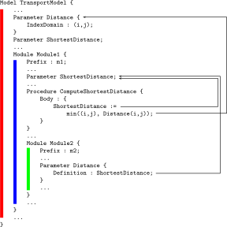
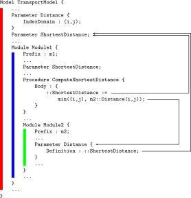

.. _sec:module.module:

``Module`` Declaration and Attributes
=====================================

.. _module:

.. rubric:: ``Module`` declaration and attributes

``Module`` nodes create a subtree of the model tree along with a
separate namespace for all identifier declarations in that subtree. Like
``Section`` nodes, the model contents associated with a ``Module`` node
can be stored in a separate source file. A ``Module`` node is always a
child of the main ``Model`` node, of a ``Section`` node, or of another
``Module`` node. The attributes of ``Module`` nodes are listed in
:ref:`this table <table:module.attr-module>`.

.. _table:module.attr-module:

.. table:: 

	============== ================= =============================================================
	Attribute      Value-type        See also page
	============== ================= =============================================================
	``SourceFile`` *string*          :ref:`The SourceFile attribute <attr:module.source-file>`
	``Property``   ``NoSave``        :ref:`The Property attribute <attr:module.property>`
	``Prefix``     *identifier*         
	``Public``     *identifier-list*    
	``Protected``  *identifier-list*    
	``Comment``    *comment string*  :ref:`The Text and Comment attributes <attr:prelim.comment>`
	============== ================= =============================================================
	
.. _module.source_file:

.. rubric:: The ``SourceFile`` attribute

Like with ordinary ``Section`` nodes, the contents of a ``Module`` node
can also be stored in a separate source file, dynamically linked into a
``Module`` node in your model through the use of the ``SourceFile``
attribute.

.. rubric:: Modules and namespaces

The distinguishing feature of modules is that each module is supplied
with a separate namespace. This means that all identifiers, procedures
and functions declared within a module are, without using the module
prefix, only visible within that module. In addition, within a module it
is possible to redeclare identifier names that have already been
declared outside the module.

.. rubric:: Nested modules

Modules in an AIMMS model can be nested. This implies that with each
AIMMS model containing one or more ``Module`` nodes, one can associate a
corresponding tree of nested namespaces. This tree of namespaces starts
with the global namespace of the ``Model`` node as the root node. As a
consequence, you can associate a path of namespaces with every
identifier, procedure or function declaration in the model tree. This
path of namespaces starts with the global namespace down to the
namespace associated with the module in which the declaration is
contained.

.. rubric:: Scoping rules

When AIMMS encounters an identifier reference during the compilation of
a procedure or function body or in one of the attributes of an
identifier declaration, AIMMS will search for a declaration of the
identifier at hand in the following order.

-  If the referenced identifier is declared in the namespace associated
   with the ``Module`` (or ``Model``) in which the procedure, function
   or identifier is contained, AIMMS will use that particular
   declaration.

-  If the referenced identifier cannot be found, AIMMS will repeatedly
   search the next higher namespace until a declaration for the
   identifier is found.

.. rubric:: Consequences

As a result of these scoping rules, whenever the corresponding
identifier name is referenced within a module, AIMMS has will always to
refer to the identifier declaration within the same module rather than
to a possibly contradicting declaration for an identifier with the same
name anywhere higher up, or sideways, in the model tree. This feature
enables multiple developers to work truly independently on different
modules used within a model.

.. rubric:: Example

Consider the following model with two (nested) modules, called
``Module1`` and ``Module2``.

The following can be concluded by applying the scoping rules listed
above.

-  The reference to ``ShortestDistance`` in the procedure
   ``ComputeShortestDistance`` in the module ``Module1`` refers to the
   declaration ``ShortestDistance`` within that module, and *not* to the
   declaration ``ShortestDistance`` in the main model.

-  The reference to ``Distance`` in the procedure
   ``ComputeShortestDistance`` in the module ``Module1`` refers to the
   declaration ``Distance(i,j)`` in the main model, and *not* to the
   scalar declaration ``Distance`` within the nested module ``Module2``.

-  The reference to ``ShortestDistance`` in the module ``Module2``
   refers to the declaration ``ShortestDistance`` within the module
   ``Module1``, and *not* to the declaration ``ShortestDistance`` in the
   main model.

-  The parameter ``Distance`` in the module ``Module2`` does not
   conflict with the declaration of ``Distance(i,j)`` in the main model,
   because the former is only visible within the scope of the module
   ``Module2``.

.. rubric:: Accessing protected identifiers

The separate namespace of every module actively prevents identifiers
within a module from being "seen" outside the module. For this reason,
identifiers declared within a module are also referred to as *protected*
identifiers. AIMMS, however, still allows you to reference protected
identifiers anywhere else in your model through the use of the
*namespace resolution operator* ``::``. In combination with a
module-specific prefix, the ``::`` operator accurately lets you indicate
that you are referring to a protected identifier declared in the
particular module associated with the prefix.

.. _module.prefix:

.. rubric:: The ``Prefix`` attribute

With the *mandatory* ``Prefix`` attribute of a ``Module`` node, you must
specify a module-specific prefix to be used in conjunction with the
``::`` operator. The value of the ``Prefix`` attribute should be a
unique name within the namespace of the surrounding module (or main
model), and will subsequently be added to this namespace. In conjunction
with the ``::`` operator the prefix unambiguously identifies the
namespace from which a particular identifier should be taken.

.. rubric:: The ``::`` namespace resolution operator

With the *namespace resolution operator* ``::`` you instruct AIMMS to
look for the identifier directly following the ``::`` operator within
the module associated with the prefix in front it. The ``::`` operator
may be optionally surrounded with spaces. By stacked use of the ``::``
operator you can indicate that you want to refer to an identifier
declared in a nested module. Each next prefix should refer to the
``Prefix`` attribute of the module declared directly within the module
associated with the previous prefix.

.. rubric:: Using global identifiers in ``ModuleS``

If you want to refer to an identifier in the main model, that is also
declared elsewhere along the path from the current module to the main
model, you can use the ``::`` operator *without a prefix*. This
indicates to AIMMS that you are interested in an identifier declared in
the global namespace associated with the main model.

.. rubric:: Examples

Consider the model outlined in the example above.

-  Within the main model, a reference ``m1::ShortestDistance`` would
   refer to the parameter ``ShortestDistance`` declared within the
   module ``Module1``, and not to the parameter ``ShortestDistance``
   declared in the main model itself.

-  Within the main model, a reference ``m1::m2::Distance`` would refer
   to the parameter ``Distance`` declared in the module ``Module2``
   nested within the module ``Module1``.

-  Within the module ``Module1``, a reference to ``::ShortestDistance``
   would refer to the parameter ``ShortestDistance`` declared in the
   main model, and not to the parameter ``ShortestDistance`` declared in
   ``Module1``.

-  Within the module ``Module2``, a reference to ``::Distance`` would
   refer to the parameter ``Distance`` declared in the main model, and
   not to the parameter ``Distance`` declared in ``Module2``.

The following model outline, which is a variation of the model outline
of the previous example, further illustrates the consequences of the use
of the ``::`` operator.

.. _module.public:

.. rubric:: The ``Public`` attribute

Through the ``Public`` attribute you can indicate that a set of
identifiers declared within the module is public. These identifiers can
then be referenced without the ``::`` operator within the importing
module (or main model). The value of the ``Public`` attribute must be a
constant set expression. You might consider the identifiers specified in
the ``Public`` attribute as the public interface of a module. As a
result, AIMMS will effectively add the names of these identifiers to the
namespace of the importing module, as if they were declared within the
importing module itself.

.. rubric:: Example

Consider the model outline of the first example, and assume that the
declaration of module ``Module2`` is augmented as follows.

.. code-block:: aimms

	Module Module2 {
	    Prefix : m2;
	    Public : {
	        data { Distance }
	    }
	    ...
	    Parameter Distance {
	        Definition : ShortestDistance;
	    }
	    ...
	}

As a result of the ``Public`` attribute, ``Distance`` will be added to
the namespace of ``Module1``, and the compilation of the procedure
``ComputeShortestDistance`` will fail because ``Distance`` will now
refer the scalar declaration in ``Module2`` rather than to the
2-dimensional declaration in the main model. In addition, it is
possible, within the main model, to refer to the parameter ``Distance``
in ``Module2`` through the expression ``m1::Distance``, because
``Distance`` has been effectively added to the namespace of module
``Module1``.

.. rubric:: Propagation of public identifiers

When an identifier is added to the ``Public`` attribute of an imported
module, it is, as explained above, effectively added to the namespace of
the importing module. This creates the possibility to add a public
identifier of an imported module to the ``Public`` attribute of the
importing module as well. In this way you can propagate the public
character of such an identifier to the next outer namespace. For
example, by adding the identifier ``Distance`` in the example above, to
the ``Public`` attribute of the module ``Module1`` as well, it would
also become public in the main model. Obviously, in this case, adding
``Distance`` to the ``Public`` attribute of ``Module1`` would cause a
name clash with the global identifier ``Distance(i,j)``.

.. _module.protected:

.. rubric:: The ``Protected`` attribute

Once you import a module into an existing AIMMS application, one or more
identifiers in the public interface of the imported module can cause
name clashes with existing identifiers in the application, like
``Distance`` in the example of previous paragraph. When you run into
such a problem, AIMMS allows you to override the ``Public`` status of
one or more identifiers of a module through its ``Protected`` attribute.
The value of the ``Protected`` attribute must be a constant set
expression, and its contents must be a subset of the set of identifiers
specified in the ``Public`` attribute. By adding an identifier to the
``Protected`` attribute, it is, again, only accessible outside of the
module by using the ``::`` operator.

.. rubric:: ``Public`` versus ``Protected`` responsibilities

The responsibilities for specifying the ``Public`` and ``Protected``
attributes are substantially different, and result in a different
storage of the values of these attributes. This is similar to the
``SouceFile``-related attributes discussed earlier in this chapter. The
following rules apply.

-  The ``Public`` attribute is intended for the *developer* of a module
   to define a public interface to the module. If the module is stored
   in a separate ``.amb`` file, to be imported by other AIMMS
   applications, the contents of the ``Public`` attribute is stored
   inside the module-specific ``.amb`` file.

-  The ``Protected`` attribute is intended for the *user* of a module to
   override the public character of certain identifiers as specified by
   the developer of the module. As the contents of the ``Protected``
   attribute is not an integral part of the module, but may be specified
   differently by every user of the module, it is never stored in a
   module-specific ``.amb`` file, but rather in the importing module or
   main model.

.. rubric:: Unique global representation

For each identifier in an AIMMS model, there is a unique global
representation. If the identifier is contained in the global namespace
of the main model, the global representation is the identifier name
itself. If an identifier is only contained in the namespace of a
particular module, its unique representation based on the namespace
``Prefix`` of the module and the ``::`` operator. Thus, for the first
example of this section (without ``Public`` attributes), the unique
global representations of all identifiers are:

-  ``Distance(i,j)``

-  ``ShortestDistance``

-  ``m1::ShortestDistance``

-  ``m1::ComputeShortestDistance``

-  ``m1::m2::Distance``

With the ``Public`` attribute of ``Module2`` defined as in the previous
example, the unique global representation of the parameter ``Distance``
in ``Module2`` becomes ``m1::Distance``, as it effectively causes
``Distance`` to be contained in the namespace of ``Module1``.

.. rubric:: Display and data transfer

Whenever AIMMS is requested to ``DISPLAY`` or ``WRITE`` the contents of
one or more identifiers in your model, it will use the unique global
representation discussed in the previous paragraph. Also, when you
``READ`` data from a file, AIMMS expects all identifiers for which data
is provided in the file to be identified by their unique global
representation.