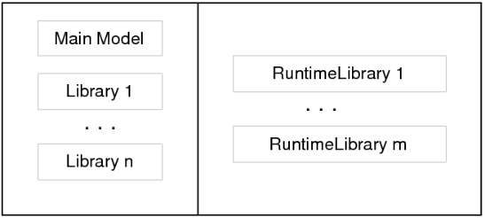

.. _sec:module.runtime:

Runtime Libraries and the Model Edit Functions
==============================================

Runtime libraries and the AIMMS Model Edit Functions permit applications
to adapt to modern flexibility requirements of the model; at runtime you
can create identifiers and subsequently use them. A few use cases, in
which the need for flexibility in the model grows, are briefly outlined
below.

.. rubric:: Use case: automating modeling tasks

You may want to improve the maintainability of your application by

-  Generating similar statements that act on dynamic selections of
   identifiers, or

-  Generate necessary parameters and database table identifiers with
   their mapping attributes by querying a relational database schema
   when setting up a database link with your model.

.. rubric:: Use case: Cooperative model development

Another example, in cooperative model development, a model is developed
together with the users of that model. For instance, an existing
application framework is demonstrated to the users and, subsequently,
the suggestions from these users are taken into account. A suggestion
might be to add structural nodes or arcs, or might be to add a
particular restriction on existing nodes and arcs.

.. rubric:: Use case: Proprietary user knowledge

Further, not all structural information may be available at the time of
model development; some users may need to add their proprietary
knowledge to the model at runtime. Examples of such proprietary
knowledge are:

-  Pricing rules for the valuation of portfolios.

-  Blending rules for the prediction of property values of blends.

.. rubric:: Use case: ad hoc user queries

A final example of a modern flexibility requirement is a user who has
additional questions only when the results are actually presented. Such
a user wants to question the model in order to understand a particular
result. This person is only able to formulate the question after the
unexpected result presents itself.

.. rubric:: Runtime editing of identifiers

In the above use cases, applications create, manipulate, check, use, and
destroy AIMMS identifiers at runtime. Such operations are performed by
the Model Edit Functions. Such applications need to:

#. Have a place to store these AIMMS identifiers and to retrieve them
   from. Such a place is called an AIMMS runtime library.

#. Have functions and procedures available to create, modify, check, and
   destroy these AIMMS identifiers. Together, these functions and
   procedures form the Model Edit Functions.

#. Have a way to use these identifiers inside the model.

#. *And be able to continue execution in the presence of errors*. This
   fourth requirement is an essential aspect of all the other
   requirements and is central to the design of the AIMMS Runtime
   libraries and AIMMS Model Edit Functions. Global and local error
   handling is described in :ref:`sec:exec.error.handling`.

.. rubric:: Runtime identifiers and libraries

The identifiers created, modified, checked, used, and destroyed at
runtime are called runtime identifiers. These runtime identifiers are
declared within a runtime library. A runtime library is itself also a
runtime identifier: it can also be created, modified, checked, used, and
destroyed at runtime. A runtime identifier can have any AIMMS type,
except for quantity.

.. rubric:: Separation between main application and runtime libraries

Model edit functions are only allowed to operate on runtime identifiers.
Runtime identifiers exist at runtime but do not yet exist at compile
time. The names of runtime identifiers can only be used in the main model in procedures specificaly designated for this, by specifying the 'Uses runtime libs' attribute. Such procedures will be compiled runtime, and recompiled upon change in the runtime libraries specified. Such procedures are not allowed to use model editing functionality themselves. This enforces a separation between identifiers in the main
application and runtime identifiers as depicted in
:numref:`fig:module.runtime.library`. On the left side of this
architecture there is a main application consisting of a main model and
zero, one or more libraries. On the right there are zero, one or more
runtime libraries. Compilation errors can occur within runtime libraries
at runtime. The identifiers inside the main application are not affected
by such an error; that is, provided it has local error handling, any
procedure inside the main application can continue execution in the
presence of compilation errors on identifiers in a runtime library. This
is an important advantage of the separation: for several of the use
cases presented above, this separation enables continuation in the
presence of errors.

   Separation between main application and runtime libraries

.. rubric:: Example of using a runtime identifier directly

In this example, a runtime identifier is used directly. This yields the same
result as the next example. This usage is far less flexible however and somewhat compromises the separation of the runtime data.     

.. code-block:: aimms

	Procedure DisplayDataOfRuntimeIdentifierTabular {
		Uses runtime libs: mr1;
		Body {
			display { mr1::P }
		}

.. rubric:: Example of creating an identifier

In this example, a runtime procedure ``rp`` is created and its body
specified. This procedure is created in the runtime library
``MyRuntimeLibrary1`` with prefix ``mrl``. The purpose of the runtime
procedure ``rp`` is to write out the runtime parameter ``P`` declared in
the same runtime library. This example assumes that both the runtime
library ``MyRuntimeLibrary1`` and the runtime parameter ``P`` already
exist.

.. code-block:: aimms

	Procedure DisplayDataOfRuntimeIdentifierTabular {
	    ElementParameter erp {
	        Default    : 'MainExecution';
	        Range      : AllIdentifiers;
	    }
	    StringParameter str;
	    ElementParameter err {
	        Range      : errh::PendingErrors;
	    }
	    ElementParameter err2 {
	        Range      : errh::PendingErrors;
	    }
	    Body {
	 1      block
	 2          erp := me::Create("rp", 'procedure', 'MyRuntimeLibrary1', 0);
	 3          me::SetAttribute(erp, 'body', "display { P } ;");
	 4          me::Compile(erp);
	 5          me::Compile('MyRuntimeLibrary1');
	 6          Apply(erp);
	 7          me::Delete(erp);
	 8      onerror err do
	 9          if erp then
	10              block
	11                  me::Delete(erp);
	12              onerror err2 do
	13                  if errh::Severity(err2) = 'Severe' then
	14                      DialogMessage(errh::Message(err2) +
	15                          "; not prepared to handle severe errors " +
	16                          "and halting execution");
	17                      halt ;
	18                  else
	19                      errh::MarkAsHandled(err2) ;                
	20                  endif ;
	21              endblock ;
	22              erp := '' ;
	23          endif ;
	24          errh::MarkAsHandled(err);
	25          DialogMessage("Creating and executing rp failed; " + errh::Message(err) );
	26      endblock ;
	    }

A line by line explanation of this example follows below.

Lines 1, 8, 25
   In order to handle the errors during a group of model edit actions, a
   ``BLOCK`` statement with an ``ONERROR`` clause is used.

Lines 2 - 7
   Contain the calls to the model edit functions. Note that these are
   formulated without any concern for errors because these errors are
   handled in line 9 - 25.

Line 2
   Create the procedure ``rp`` as the final procedure in the runtime
   library ``MyRuntimeLibrary1``. The prefix of the library will be
   prefixed to the name of the identifier created; and after this
   statement the value of the element parameter ``erp`` is
   ``'mrl::rp'``.

Line 3
   Sets the contents of the body of that procedure. Here it is to
   display the parameter ``P`` in tabular format.

Line 4
   Checks the procedure ``mrl::rp`` for errors.

Line 5
   Compiles the entire runtime library ``MyRuntimeLibrary1`` which will
   make the procedures inside that library runnable.

Line 6
   Executes the procedure just created.

Line 7
   Delete the procedure just created.

Lines 9 - 23
   Try to delete ``erp`` (``mrl::rp``) if it has not already been
   deleted.

Lines 13 - 20
   Ignore all errors during the deletion except for severe internal
   errors.

Line 24
   Mark the error ``err2`` as handled.

Line 25
   Finally notifies the application user that something has gone wrong.

.. rubric:: Model Edit Functions

Model editing is available from within the language itself with
intrinsic functions and procedures to view, create, modify, move,
rename, compile, and delete identifiers. An intrinsic function or
procedure that modifies the application is called a Model Edit Function.
These functions and procedures reside in the predeclared module
``ModelEditFunctions`` with the prefix ``me``. The table below lists the
Model Edit Functions and briefly describes them.

.. _me::Compile-LR:

.. _me::IsRunnable-LR:

.. _me::Move-LR:

.. _me::Rename-LR:

.. _me::AllowedAttribute-LR:

.. _me::SetAttribute-LR:

.. _me::GetAttribute-LR:

.. _me::TypeChange:

.. _me::TypeChangeAllowed:

.. _me::ChildTypeAllowed-LR:

.. _me::Children-LR:

.. _me::Parent-LR:

.. _me::ExportNode-LR:

.. _me::ImportNode-LR:

.. _me::ImportLibrary-LR:

.. _me::Delete-LR:

.. _me::Create-LR:

.. _me::CreateLibrary-LR:

.. _table:me.library:

.. table:: Model Edit Functions for runtime libraries

   +-----------------------------------------------------------------------------------------------+
   | :any:`me::CreateLibrary`\ (*libraryName*, *prefixName*)\ :math:`\to`\ :any:`AllIdentifiers`   |
   +-----------------------------------------------------------------------------------------------+
   | :any:`me::Create`\ (*name*, *newType*, *parentId*, *pos*)\ :math:`\to`\ :any:`AllIdentifiers` |
   +-----------------------------------------------------------------------------------------------+
   | :any:`me::Delete`\ (*runtimeId*)                                                              |
   +-----------------------------------------------------------------------------------------------+
   | :any:`me::ImportLibrary`\ (*filename*\ [, *password*])\ :math:`\to`\ :any:`AllIdentifiers`    |
   +-----------------------------------------------------------------------------------------------+
   | :any:`me::ImportNode`\ (*esection*, *filename*\ [, *password*])                               |
   +-----------------------------------------------------------------------------------------------+
   | :any:`me::ExportNode`\ (*esection*, *filename*\ [, *password*])                               |
   +-----------------------------------------------------------------------------------------------+
   | :any:`me::Parent`\ (*runtimeId*)\ :math:`\to`\ :any:`AllIdentifiers`                          |
   +-----------------------------------------------------------------------------------------------+
   | :any:`me::Children`\ (*runtimeId*, *runtimeChildren(i)*)                                      |
   +-----------------------------------------------------------------------------------------------+
   | :any:`me::ChildTypeAllowed`\ (*runtimeId*, *newType*)                                         |
   +-----------------------------------------------------------------------------------------------+
   | ``me::TypeChangeAllowed``\ (*runtimeId*, *newType*)                                           |
   +-----------------------------------------------------------------------------------------------+
   | ``me::TypeChange``\ (*runtimeId*, *newType*)                                                  |
   +-----------------------------------------------------------------------------------------------+
   | :any:`me::GetAttribute`\ (*runtimeId*, *attr*)                                                |
   +-----------------------------------------------------------------------------------------------+
   | :any:`me::SetAttribute`\ (*runtimeId*, *attr*, *txt*)                                         |
   +-----------------------------------------------------------------------------------------------+
   | :any:`me::AllowedAttribute`\ (*runtimeId*, *attr*)                                            |
   +-----------------------------------------------------------------------------------------------+
   | :any:`me::Rename`\ (*runtimeId*, *newname*)                                                   |
   +-----------------------------------------------------------------------------------------------+
   | :any:`me::Move`\ (*runtimeId*, *parentId*, *pos*)                                             |
   +-----------------------------------------------------------------------------------------------+
   | :any:`me::IsRunnable`\ (*runtimeId*)                                                          |
   +-----------------------------------------------------------------------------------------------+
   | :any:`me::Compile`\ (*runtimeId*)                                                             |
   +-----------------------------------------------------------------------------------------------+

.. rubric:: Creating and deleting

:ref:`this table <table:me.library>` lists the Model Edit Functions. A new runtime
library can be created using the function :any:`me::CreateLibrary`. if
successful this function returns the library as an element in
:any:`AllSymbols`. The function :any:`me::Create` creates a new node or
identifier with name ``name`` of type ``type`` in section ``ep_sec`` at
position ``pos``. The return value is an element in :any:`AllSymbols`. If
inserted at position :math:`i` (:math:`i>0`), the declarations
previously at positions :math:`i` .. :math:`n` are moved to positions
:math:`i+1` .. :math:`n+1`. If inserted at position 0, the identifier is
placed at the end. The procedure :any:`me::Delete` can be used to delete
both a runtime library and a runtime identifier in a library. All
subnodes of ``ep`` in the runtime library are also deleted.

.. rubric:: Reading and writing

The procedure :any:`me::ImportNode` reads a section, module, or library
into node ``ep``. If ``ep`` is a runtime library, an entire library is
read, replacing the existing prefix. :any:`me::ExportNode` writes the
contents of the model editor tree referenced by ``ep`` to a file. These
two procedures use the text ``.ams`` file format.

.. rubric:: Inspecting the tree

The function ``me::Parent(ep)`` returns the parent of ``ep``, or the
empty element if ``ep`` is a root. The function
``me::Children(ep, epc(i))`` returns the children of ``ep`` in
``epc(i)`` in which ``i`` is an index over a subset of :any:`Integers`.

.. rubric:: Node types

The function ``me::ChildTypeAllowed(ep, et)`` returns 1 if an identifier
of type ``et`` is allowed as a child of ``ep``. The function
``me::TypeChangeAllowed(ep, et)`` returns 1 if the identifier ``ep`` is
allowed to change into type ``et``. The procedure
``me::TypeChange(ep,et)`` performs a type change while attempting to
retain as many attributes as possible.

.. rubric:: Attributes

The function ``me::GetAttribute(ep, attr)`` returns the contents of the
attribute ``attr`` of identifier or node ``ep``. The complementary
procedure ``me::SetAttribute (ep,attr,str)`` specifies these contents.
The function ``me::AllowedAttribute(ep, attr)`` returns 1 if attribute
``attr`` of identifier ``ep`` is allowed to have text.

.. rubric:: Changing name or location

The procedure ``me::Rename(ep, newname)`` gives ``ep`` a new name
``newname``. The text inside the library is adapted, but a corresponding
entry in the namechange file is not created. The procedure
``me::Move(ep, ep_p, pos)`` moves an identifier from one location to
another. When an identifier changes its namespace, this is a change of
name, and the text in the runtime library is adapted correspondingly,
but no entry in the namechange file is created. Runtime identifiers can
not be moved from one runtime library to another.

.. rubric:: Querying runtime library status

The function ``me::IsRunnable(ep)`` returns 1 if ``ep`` is inside a
succesfully compiled runtime library.

.. rubric:: Compilation

The function ``me::Compile(ep)`` compiles the node ``ep`` and all its
subnodes. If ``ep`` is the empty element, all runtime libraries are
compiled. See also :ref:`sec:data.allidentifiers` on working with
:any:`AllIdentifiers`.

.. rubric:: Runtime identifiers are like data

To the main application, runtime identifiers are like data. Data
operations such as creation, modification, destruction, read, and write
are also applicable to runtime identifiers. When saving a project, the
runtime libraries are **not** saved. Runtime libraries, including the
data of runtime identifiers, can be saved in two ways: as separate files
or in cases.

.. rubric:: Storing runtime libraries in separate files

The runtime libraries themselves can be saved in text or binary model
files using the function :any:`me::ExportNode`. They can subsequently be
read back using the functions :any:`me::ImportLibrary` and
:any:`me::ImportNode` (see the function reference for more details on these
functions). The data of the runtime identifiers can be written using a
``write to file`` statement and be read back using a ``read from file``
statement, see also :ref:`sec:rw.example.simple`.

.. rubric:: Storing runtime libraries in cases

When saving a case, a snapshot of the data in a model, or a selection
thereof (casetype), is saved. The data of a model include the runtime
libraries. However, the names of the runtime identifiers can vary and
therefore they cannot be part of a casetype. Whether runtime libraries
are saved in a case is controlled by a global option, named
``Case contains runtime libraries``. When loading a case saved with this
option switched on, the previously created runtime libraries will be
first destroyed and then the stored runtime libraries will be recreated,
both their structure and data. When loading a case saved while this
option was off, or a case saved with AIMMS 3.10 or earlier, any existing
runtime libraries will be left intact. Datasets never contain runtime
libraries.

.. rubric:: The ``NoSave`` property

When the ``NoSave`` property is specified for a runtime library, this
runtime library will not be saved in cases.

.. rubric:: The AIMMS model explorer

To the AIMMS model explorer, the runtime libraries are read only; it can
copy runtime identifiers into the main application, but it cannot modify
runtime identifiers. This is because, if the AIMMS model explorer could
modify runtime identifiers, the state information maintained by the main
application regarding the runtime identifiers might become inconsistent
with the actual state of these runtime identifiers.

.. rubric:: Visualizing the data of runtime identifiers

When AIMMS is in developer mode, data pages of the runtime identifiers
can be opened, just like data pages of ordinary identifiers. The data of
runtime identifiers can also be visualized on the AIMMS pages in the
following two ways:

-  The safest way is to create a subset of containing the selected
   runtime identifiers, and use this subset as "implicit identifiers" in
   a pivot table. If the runtime identifiers referenced in this set do
   not yet exist, they will simply not be displayed.

-  The runtime identifiers can also be directly visualized in other page
   objects. Care should then be taken that the visualized runtime
   identifiers are created with the proper index domain before a page is
   opened containing these identifiers; if an identifier does not exist,
   a page containing a reference to such an identifier will not open
   correctly. In order to avoid the inadvertent use of runtime
   identifiers on pages, they are not selectable using point and click
   in the identifier selector, but the identifier selector accepts them
   when typed in.

.. _rubric:runtime.usesruntimelibs:

.. rubric:: Access to Runtime Identifiers in non-runtime Procedures

Starting from the version `AIMMS 4.82 <https://documentation.aimms.com/release-notes.html#aimms-4-82>`_, procedures, with an exception of 
:doc:`predefined procedures <creating-and-managing-a-model/the-model-explorer/creating-and-managing-models>`, have a new attribute: :ref:`procedure.usesruntimelibs`. 

A procedure with this attribute specified enables developers to use 
runtime identifiers in their models without the need to having them 
explicitly already available during modeling; 
If this attribute is not specified, a compilation error will occur making this impossible. 

This attribute is intended to enable a procedure persistent in a model 
code to refer to identifiers from runtime libraries that do not exist 
at model compile-time. 
Thus, this new attribute is not required for runtime procedures referring 
to identifiers from other runtime libraries.

.. rubric:: Limitations

The following limitations apply:

-  Local declarations are not supported; only global identifiers
   corresponding to elements in :any:`AllIdentifiers`.

-  Quantities are not supported.

-  The ``source file``, ``module code`` and ``user data`` attributes are
   not supported.

-  The current maximum number of runtime identifiers is 30000.