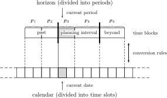

.. _sec:time.intro:

Introduction
============

.. rubric:: Time and models

Time plays an important role in various real-life modeling applications.
Typical examples are found in the areas of planning, scheduling, and
control. The time scale in control models is typically seconds and
minutes. Scheduling models typically refer to hours and days, while the
associated time unit in planning models is usually expressed in terms of
weeks, months, or even years. To facilitate time-based modeling, AIMMS
provides a number of tools to relate model time and calendar time.

.. rubric:: Use of time periods

Time-dependent data in a model is usually associated with time periods.
Some data items associated with a period index can be interpreted as
taking place *during* the period, while others take place *at a
particular moment*. For instance, the stock in a tank is usually
measured at, and associated with, a specific moment in a period, while
the flow of material into the tank is usually associated with the entire
period.

.. rubric:: Use of time as a continuous quantity

Time-dependent data in a model can also represent continuous time
values. For instance, consider a parameter containing the starting times
of a number of processes. Even though this representation is not ideal
for constructing most time-based optimization models, it allows time to
be expressed to any desired accuracy.

.. rubric:: Calendar periods versus model periods

A large portion of the data in time-dependent models originates from the
real world where quantities are specified relative to some calendar.
Optimization models usually refer to abstract model periods such as
:math:`p_1`, :math:`p_2`, :math:`p_3`, etc., allowing the optimization
model to be formulated independent of real time. This common distinction
makes it essential that quantities associated with real calendar time
can be converted to quantities associated with model periods and vice
versa.

.. rubric:: Rolling horizon

In many planning and scheduling applications, time-dependent models are
solved repeatedly as time passes. Future data becomes present data and
eventually becomes past data. Such a moving time span is usually
referred to as a "*rolling horizon*". By using the various features
discussed in this chapter, it is fairly straightforward to implement
models with a rolling horizon.

.. rubric:: ``Calendars`` and ``Horizons``

AIMMS offers two special data types for time-based modeling
applications, namely ``Calendar`` and ``Horizon``. Both are index sets
with special features for dealing with time. ``Calendars`` allow you to
create a set of time slots of fixed length in real time, while
``Horizons`` enable you to distinguish past, planning and beyond periods
in your model.

.. rubric:: Timetables

In addition, AIMMS offers support for automatically creating
*timetables* (represented through indexed sets) which link model periods
in a ``Horizon`` to time slots in a ``Calendar`` in a flexible manner.
Based on a timetable, AIMMS provides functions to let you *aggregate*
data defined over a ``Calendar`` to data defined over the corresponding
``Horizon`` and vice versa. :numref:`fig:time.timetable` illustrates an
example of a timetable relating a horizon and a calendar.

   Timetable relating calendar and horizon

.. rubric:: Explanation

The horizon consists of periods divided into three time blocks, namely a
past, the planning interval, and beyond. There is a current period in
the horizon which can be linked to a current date in the calendar. The
calendar consists of time slots and its range is defined by a begin date
and an end date. When you construct your mathematical program, it will
typically be in terms of periods in the planning interval of the
horizon. However, the input data of the model will typically be in terms
of calendar periods. The conversion of calendar data into horizon data
and vice versa is done on request by AIMMS in accordance with
pre-specified conversion rules.