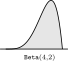
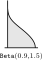
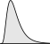
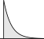
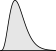
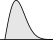
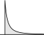
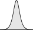
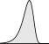

.. _app:distribution.cont:

Continuous Distributions
========================

.. rubric:: Continuous distributions

In this section we discuss the set of continuous distributions available
in AIMMS.

The three distributions with both lower and upper bound are

-  the :any:`Uniform` distribution,

-  the :any:`Triangular` distribution, and

-  the :any:`Beta` distribution.

The five distributions with only a lower bound are

-  the :any:`LogNormal` distribution,

-  the :any:`Exponential` distribution,

-  the :any:`Gamma` distribution,

-  the :any:`Weibull` distribution, and

-  the :any:`Pareto` distribution.

The three unbounded distributions are

-  the :any:`Normal` distribution,

-  the :any:`Logistic` distribution, and

-  the ``Extreme Value`` distribution.

.. rubric:: Parameters of continuous distributions

Every parameter of a continuous distributions can be characterized as
either a *shape* parameter :math:`\beta`, a *location* parameter
:math:`l`, or a *scale* parameter :math:`s`. While the presence and
meaning of a shape parameter is usually distribution-dependent, location
and scale parameters find their origin in the common transformation

.. math:: x \mapsto \frac{x-l}{s}

to shift and stretch a given distribution. By choosing :math:`l=0` and
:math:`s=1` the standard form of a distribution is obtained. If a
certain distribution has :math:`n` shape parameters (:math:`n \geq 0`),
these shape parameters will be passed as the first :math:`n` parameters
to AIMMS. The shape parameters are then followed by two optional
parameters, with default values 0 and 1 respectively. For double-bounded
distributions these two optional parameters can be interpreted as a
lower and upper bound (the value of the location parameter :math:`l` for
these distributions is equal to the lower bound and the value of the
scale parameter :math:`s` is equal to the difference between the upper
and lower bound). For single-bounded distributions the bound value is
often used as the location parameter :math:`l`. In this section,
whenever the location parameter can be interpreted as a mean value or
whenever the scale parameter can be interpreted as the deviation of a
distribution, these more meaningful names are used to refer to the
parameters. Note that the :any:`LogNormal`, :any:`Gamma` and :any:`Exponential`
distributions are distributions that will mostly be used with location
parameter equal to 0.

.. rubric:: Transformation to standard form

When transforming a distribution to standard form, distribution
operators change. :ref:`app:scaleoperator.stat` (scaling of statistical
operators) gives the relationships between distribution operators
working on random variables :math:`X(l,s)` and :math:`X(0,1)`.

.. rubric:: Units of measurement

When a random variable representing some real-life quantity with a given
unit of measurement (see also :ref:`chap:units`) is distributed
according to a particular distribution, some parameters of that
distribution are also naturally expressed in terms of this same unit
while other parameters are expected to be unitless. In particular, the
location and scale parameters of a distribution are measured in the same
unit of measurement as the corresponding random variable, while shape
parameters (within AIMMS) are implemented as unitless parameters.

.. rubric:: Unit notation in this appendix

When you use a distribution function, AIMMS will perform a unit
consistency check on its parameters and result, whenever your model
contains one or more ``QUANTITY`` declarations. In the description of
the continuous distributions below, the expected units of the
distribution parameters are denoted in square brackets. Throughout the
sequel, [:math:`x`] denotes that the parameter should have the same unit
of measurement as the random variable :math:`X` and [-] denotes that a
parameter should be unitless.

.. rubric:: A commonly used distribution

In practice, the :any:`Normal` distribution is used quite frequently. Such
widespread use is due to a number of pleasant properties:

-  the :any:`Normal` distribution has no shape parameters and is
   symmetrical,

-  random values are more likely as they are closer to the mean value,

-  it can be directly evaluated for any given mean and standard
   deviation because it is fully specified through the mean and standard
   deviation parameter,

-  it can be used as a good approximation for distributions on a finite
   interval, because its probability density is declining fast enough
   (when moving away from the mean),

-  the mean and sum of any number of uncorrelated :any:`Normal`
   distributions are :any:`Normal` distributed themselves, and thus have
   the same shape, and

-  the mean and sum of a large number of uncorrelated distributions are
   always approximately :any:`Normal` distributed.

.. rubric:: Distributions for double bounded variables

For random variables that have a known lower and upper bound, AIMMS
provides three continuous distributions on a finite interval: the
:any:`Uniform`, :any:`Triangular` and :any:`Beta` distribution. The :any:`Uniform`
(no shape parameters) and :any:`Triangular` (one shape parameter)
distributions should be sufficient for most experiments. For all
remaining experiments, the user might consider the highly configurable
:any:`Beta` (two shape parameters) distribution.

.. rubric:: Distributions for single bounded variables

When your random variable only has a single bound, you should first
check whether the :any:`Gamma` distribution can be used or whether the
:any:`Normal` distribution is accurate enough. The :any:`LogNormal`
distribution should be considered if the most likely value is near but
not at the bound. The :any:`Weibull` or :any:`Gamma` distribution
(:math:`\beta>1`), or even the :any:`ExtremeValue` distribution are
alternatives, while the :any:`Weibull` or :any:`Gamma` distribution
(:math:`\beta \leq 1`) or :any:`Pareto` distribution should be considered
if the bound is the most likely value.

.. rubric:: The :any:`Gamma` distribution

The :any:`Gamma` (and as a special case thereof the :any:`Exponential`)
distribution is widely used for its special meaning. It answers the
question: how long does it take for a success to occur, when you only
know the average number of occurrences (like in the :any:`Poisson`
distribution). The :any:`Exponential` distribution gives the time to the
first occurrence, and its generalization, the :any:`Gamma`\ (:math:`\beta`)
distribution gives the time to the :math:`\beta`-th occurrence. Note
that the sum of a :any:`Gamma`\ (:math:`\beta_1,l_1,s`) and
:any:`Gamma`\ (:math:`\beta_2,l_2,s`) distribution has a
:any:`Gamma`\ (:math:`\beta_1+\beta_2,l_1+l_2,s`) distribution.

.. rubric:: The :any:`LogNormal` distribution

If you assume the logarithm of a variable to be :any:`Normal` distributed,
the variable itself is :any:`LogNormal`-distributed. As a result, it can be
shown that the chance of an outcome in the interval
:math:`[x \!\cdot\! c_1,x \!\cdot\!
c_2]` is equal to the chance of an outcome in the interval
:math:`[x/c_2,x/c_1]` for some :math:`x`. This might be a reasonable
assumption in price developments, for example.

.. rubric:: The :any:`Uniform` distribution

.. _uniform-LR:

The :any:`Uniform`\ (min,max) distribution:

.. table:: 

	================ ===============================================
	Input parameters *min* [:math:`x`], *max* [:math:`x`]
	Input check      :math:`{min} < {max}`
	Permitted values :math:`\{ x \; | \; {min} \leq x \leq {max} \}`
	Standard density :math:`f_{(0,1)}(x) = 1`
	Mean             :math:`1/2`
	Variance         :math:`1/12`
	================ ===============================================

In the :any:`Uniform` distribution all values of the random variable occur
between a fixed minimum and a fixed maximum with equal likelihood. It is
quite common to use the :any:`Uniform` distribution when you have little
knowledge about an uncertain parameter in your model except that its
value has to lie anywhere within fixed bounds. For instance, after
talking to a few appraisers you might conclude that their single
appraisals of your property vary anywhere between a fixed pessimistic
and a fixed optimistic value.

.. rubric:: The :any:`Triangular` distribution

.. _triangular-LR:

The :any:`Triangular`\ (:math:`\beta`,min,max) distribution:

.. table:: 

	+------------------+---------------------------------------------------------------------------------------------------------------------------------------------------------+
	| Input parameters | shape :math:`\beta` [:math:`-`],\ *min* [:math:`x`], *max* [:math:`x`]                                                                                  |
	+------------------+---------------------------------------------------------------------------------------------------------------------------------------------------------+
	| Input check      | :math:`{min} < {max }, \; 0 < \beta < 1`                                                                                                                |
	+------------------+---------------------------------------------------------------------------------------------------------------------------------------------------------+
	| Permitted values | :math:`\{ x \; | \; {min} \leq x \leq {max} \}`                                                                                                         |
	+------------------+---------------------------------------------------------------------------------------------------------------------------------------------------------+
	| Standard density | :math:`f_{(\beta,0,1)}(x) = \begin{cases} 2 x / \beta & \text{for $0 \leq x \leq \beta$} \\ 2 (1-x)/(1-\beta) & \text{for $\beta<x \leq1$} \end{cases}` |
	+------------------+---------------------------------------------------------------------------------------------------------------------------------------------------------+
	| Mean             | :math:`(\beta+1)/3`                                                                                                                                     |
	+------------------+---------------------------------------------------------------------------------------------------------------------------------------------------------+
	| Variance         | :math:`(1-\beta+\beta^2)/18`                                                                                                                            |
	+------------------+---------------------------------------------------------------------------------------------------------------------------------------------------------+
	| Remarks          | The shape parameter :math:`\beta` indicates the position of the peak in relation to the range, i.e. :math:`\beta = \frac{{peak}-{min}}{{max}-{min}}`    |
	+------------------+---------------------------------------------------------------------------------------------------------------------------------------------------------+

In the :any:`Triangular` distribution all values of the random variable
occur between a fixed minimum and a fixed maximum, but not with equal
likelihood as in the Uniform distribution. Instead, there is a most
likely value, and its position is not necessarily in the middle of the
interval. It is quite common to use the :any:`Triangular` distribution when
you have little knowledge about an uncertain parameter in your model
except that its value has to lie anywhere within fixed bounds and that
there is a most likely value. For instance, assume that a few appraisers
each quote an optimistic as well as a pessimistic value of your
property. Summarizing their input you might conclude that their quotes
provide not only a well-defined interval but also an indication of the
most likely value of your property.

.. rubric:: The :any:`Beta` distribution

.. _beta-LR:

The :any:`Beta`\ (:math:`\alpha`,\ :math:`\beta`,min,max) distribution:

.. table:: 

	+------------------+--------------------------------------------------------------------------------------------------------------------------------------------------------+
	| Input parameters | shape :math:`\alpha` [-], shape :math:`\beta` [-], min [:math:`x`], max [:math:`x`]                                                                    |
	+------------------+--------------------------------------------------------------------------------------------------------------------------------------------------------+
	| Input check      | :math:`\alpha > 0, \beta > 0, {min} < {max}`                                                                                                           |
	+------------------+--------------------------------------------------------------------------------------------------------------------------------------------------------+
	| Permitted values | :math:`\{x \; | \; {min} < x < {max} \}`                                                                                                               |
	+------------------+--------------------------------------------------------------------------------------------------------------------------------------------------------+
	| Standard density | :math:`f_{(\alpha,\beta,0,1)}(x) = \frac{1}{B(\alpha,\beta)} x^{\alpha - 1} (1-x)^{\beta - 1}, \; \text{where $B(\alpha,\beta)$ is the Beta function}` |
	+------------------+--------------------------------------------------------------------------------------------------------------------------------------------------------+
	| Mean             | :math:`\alpha/(\alpha+\beta)`                                                                                                                          |
	+------------------+--------------------------------------------------------------------------------------------------------------------------------------------------------+
	| Variance         | :math:`\alpha\beta(\alpha+\beta)^{-2}(\alpha+\beta+1)^{-1}`                                                                                            |
	+------------------+--------------------------------------------------------------------------------------------------------------------------------------------------------+
	| Remarks          | :math:`{$\texttt{Beta}$}(1,1,{min},{max})={$\texttt{Uniform}$}({min},{max})`                                                                           |
	+------------------+--------------------------------------------------------------------------------------------------------------------------------------------------------+

The :any:`Beta` distribution is a very flexible distribution whose two
shape parameters allow for a good approximation of almost any
distribution on a finite interval. The distribution can be made
symmetrical, positively skewed, negatively skewed, etc. It has been used
to describe empirical data and predict the random behavior of
percentages and fractions. Note that for :math:`\alpha<1` a singularity
occurs at :math:`x=\text{{min}}` and for :math:`\beta<1` at
:math:`x=\text{{max}}`.

.. rubric:: The :any:`LogNormal` distribution

.. _lognormal-LR:

The :any:`LogNormal`\ (:math:`\beta`,min,s) distribution:

.. table:: 

	+------------------+----------------------------------------------------------------------------------------------------------------------------------+
	| Input parameters | shape :math:`\beta` [-], lowerbound min [:math:`x`] and scale :math:`s` [:math:`x`]                                              |
	+------------------+----------------------------------------------------------------------------------------------------------------------------------+
	| Input check      | :math:`\beta > 0 \; \mbox{and} \; s > 0`                                                                                         |
	+------------------+----------------------------------------------------------------------------------------------------------------------------------+
	| Permitted values | :math:`\{ x \; | \; {min} < x < \infty \}`                                                                                       |
	+------------------+----------------------------------------------------------------------------------------------------------------------------------+
	| Standard density | :math:`f_{(\beta,0,1)}(x) = \frac{1} { \sqrt{2 \pi} x \ln(\beta^2+1) } e^{ \frac{ -(\ln(x^2(\beta^2+1)) } {2 \ln(\beta^2+1) } }` |
	+------------------+----------------------------------------------------------------------------------------------------------------------------------+
	| Mean             | :math:`1`                                                                                                                        |
	+------------------+----------------------------------------------------------------------------------------------------------------------------------+
	| Variance         | :math:`\beta^2`                                                                                                                  |
	+------------------+----------------------------------------------------------------------------------------------------------------------------------+

If you assume the logarithm of the variable to be
:any:`Normal`\ (:math:`\mu,\sigma`)-distributed, then the variable itself
is
:any:`LogNormal`\ (:math:`\sqrt{e^{\sigma^2}\!\! - \!\! 1},0,e^{\mu - \sigma^2/2}`)-distributed.
This parameterization is used for its simple expressions for mean and
variance. A typical example is formed by real estate prices and stock
prices. They all cannot drop below zero, but they can grow to be very
high. However, most values tend to stay within a particular range. You
usually can form some expected value of a real estate price or a stock
price, and estimate the standard deviation of the prices on the basis of
historical data.

.. rubric:: The :any:`Exponential` distribution

.. _exponential-LR:

The :any:`Exponential`\ (min,\ :math:`s`) distribution:

.. table:: 

	+------------------+--------------------------------------------------------------------------------------------------------------------------------------------------+
	| Input parameters | lowerbound min [:math:`x`] and scale :math:`s` [:math:`x`]                                                                                       |
	+------------------+--------------------------------------------------------------------------------------------------------------------------------------------------+
	| Input check      | :math:`s > 0`                                                                                                                                    |
	+------------------+--------------------------------------------------------------------------------------------------------------------------------------------------+
	| Permitted values | :math:`\{ x \; | \; {min} \leq x < \infty \}`                                                                                                    |
	+------------------+--------------------------------------------------------------------------------------------------------------------------------------------------+
	| Standard density | :math:`f_{(0,1)}(x) = \lambda e^{-x}`                                                                                                            |
	+------------------+--------------------------------------------------------------------------------------------------------------------------------------------------+
	| Mean             | :math:`1`                                                                                                                                        |
	+------------------+--------------------------------------------------------------------------------------------------------------------------------------------------+
	| Variance         | :math:`1`                                                                                                                                        |
	+------------------+--------------------------------------------------------------------------------------------------------------------------------------------------+
	| Remarks          | :any:`Exponential` (min, :math:`s`) = :any:`Gamma` (1, min, :math:`s`), :any:`Exponential` (min, :math:`s`) = :any:`Weibull` (1, min, :math:`s`) |
	+------------------+--------------------------------------------------------------------------------------------------------------------------------------------------+
	
Assume that you are observing a sequence of independent events with a
constant chance of occurring in time, with s being the average time
between occurrences. (in accordance with the :any:`Poisson` distribution)
The :any:`Exponential`\ (:math:`0,s`) distribution gives answer to the
question: how long a time do you need to wait until you observe the
first occurrence of an event. Typical examples are time between failures
of equipment, and time between arrivals of customers at a service desk
(bank, hospital, etc.).

.. rubric:: The :any:`Gamma` distribution

.. _gamma-LR:

The :any:`Gamma`\ (:math:`\beta`,min,\ :math:`s`) distribution:

.. table:: 

	+------------------+--------------------------------------------------------------------------------------------------------------------------------------------+
	| Input parameters | shape :math:`\beta` [-], lowerbound min [:math:`x`] and scale :math:`s` [:math:`x`]                                                        |
	+------------------+--------------------------------------------------------------------------------------------------------------------------------------------+
	| Input check      | :math:`s > 0 \; \mbox{and} \; \beta > 0`                                                                                                   |
	+------------------+--------------------------------------------------------------------------------------------------------------------------------------------+
	| Permitted values | :math:`\{x \; | \; {min} < x < \infty\}`                                                                                                   |
	+------------------+--------------------------------------------------------------------------------------------------------------------------------------------+
	| Standard density | :math:`f_{(\beta,0,1)}(x) = x^{\beta - 1} e^{-x} / {\Gamma ( \beta )} \\ \mbox{where} \; \Gamma ( \beta ) \; \mbox{is the Gamma function}` |
	+------------------+--------------------------------------------------------------------------------------------------------------------------------------------+
	| Mean             | :math:`\beta`                                                                                                                              |
	+------------------+--------------------------------------------------------------------------------------------------------------------------------------------+
	| Variance         | :math:`\beta`                                                                                                                              |
	+------------------+--------------------------------------------------------------------------------------------------------------------------------------------+

The :any:`Gamma` distribution gives answer to the question: how long a time
do you need to wait until you observe the :math:`\beta`-th occurrence of
an event (instead of the first occurrence as in the :any:`Exponential`
distribution). Note that it is possible to use non-integer values for
:math:`\beta` and a location parameter. In these cases there is no
natural interpretation of the distribution and for :math:`\beta<1` a
singularity exists at :math:`x={min}`, so one should be very careful in
using the :any:`Gamma` distribution this way.

.. rubric:: The :any:`Weibull` distribution

.. _weibull-LR:

The :any:`Weibull`\ (:math:`\beta`,min,\ :math:`s`) distribution:

.. table:: 

	+------------------+-------------------------------------------------------------------------------------+
	| Input parameters | shape :math:`\beta` [-], lowerbound min [:math:`x`] and scale :math:`s` [:math:`x`] |
	+------------------+-------------------------------------------------------------------------------------+
	| Input check      | :math:`\beta > 0 \; \mbox{and} \; s > 0`                                            |
	+------------------+-------------------------------------------------------------------------------------+
	| Permitted values | :math:`\{x \; | \; {min} \leq x < \infty\}`                                         |
	+------------------+-------------------------------------------------------------------------------------+
	| Standard density | :math:`f_{(\beta,0,1)}(x) = \beta x^{\beta - 1} e^{-x^\beta}`                       |
	+------------------+-------------------------------------------------------------------------------------+
	| Mean             | :math:`\Gamma(1+1/\beta)`                                                           |
	+------------------+-------------------------------------------------------------------------------------+
	| Variance         | :math:`\Gamma(1+2/\beta)-\Gamma^2(1+1/\beta)`                                       |
	+------------------+-------------------------------------------------------------------------------------+

The :any:`Weibull` distribution is another generalization of the
:any:`Exponential` distribution. It has been successfully used to describe
failure time in reliability studies, and the breaking strengths of items
in quality control testing. By using a value of the shape parameter that
is less than 1, the :any:`Weibull` distribution becomes steeply declining
and could be of interest to a manufacturer testing failures of items
during their initial period of use. Note that in that case there is a
singularity at :math:`x={min}`.

.. rubric:: The :any:`Pareto` distribution

.. _pareto-LR:

The :any:`Pareto`\ (:math:`\beta`,\ :math:`l`,\ :math:`s`) distribution:

.. table:: 

	+------------------+--------------------------------------------------------------------------------------------+
	| Input parameters | shape :math:`\beta` [-], location :math:`l` [:math:`x`] and scale :math:`s` [:math:`x`]    |
	+------------------+--------------------------------------------------------------------------------------------+
	| Input check      | :math:`s > 0 \; \mbox{and} \; \beta > 0`                                                   |
	+------------------+--------------------------------------------------------------------------------------------+
	| Permitted values | :math:`\{ x \; | \; l+s < x < \infty \}`                                                   |
	+------------------+--------------------------------------------------------------------------------------------+
	| Standard density | :math:`f_{(\beta,0,1)}(x) = \beta / x^{\beta + 1}`                                         |
	+------------------+--------------------------------------------------------------------------------------------+
	| Mean             | :math:`\mbox{for } \beta>1:\; \beta/(\beta-1), \infty \text{ otherwise}`                   |
	+------------------+--------------------------------------------------------------------------------------------+
	| Variance         | :math:`\mbox{for } \beta>2:\; \beta(\beta-1)^{-2}(\beta-2)^{-1}, \infty \text{ otherwise}` |
	+------------------+--------------------------------------------------------------------------------------------+

The :any:`Pareto` distribution has been used to describe the sizes of such
phenomena as human population, companies, incomes, stock fluctuations,
etc.

.. rubric:: The :any:`Normal` distribution

.. _normal-LR:

The :any:`Normal`\ (:math:`\mu`,\ :math:`\sigma`) distribution:

.. table:: 

	+------------------+--------------------------------------------------------------------------------+
	| Input parameters | Mean :math:`\mu` [:math:`x`] and standard deviation :math:`\sigma` [:math:`x`] |
	+------------------+--------------------------------------------------------------------------------+
	| Input check      | :math:`\sigma > 0`                                                             |
	+------------------+--------------------------------------------------------------------------------+
	| Permitted values | :math:`\{ x \; | \; -\infty < x < \infty \}`                                   |
	+------------------+--------------------------------------------------------------------------------+
	| Standard density | :math:`f_{(0,1)}(x) = e^{-x^2/2}/\sqrt{2 \pi}`                                 |
	+------------------+--------------------------------------------------------------------------------+
	| Mean             | :math:`0`                                                                      |
	+------------------+--------------------------------------------------------------------------------+
	| Variance         | :math:`1`                                                                      |
	+------------------+--------------------------------------------------------------------------------+
	| Remarks          | Location :math:`\mu`, scale :math:`\sigma`                                     |
	+------------------+--------------------------------------------------------------------------------+

The :any:`Normal` distribution is frequently used in practical applications
as it describes many phenomena observed in real life. Typical examples
are attributes such as length, IQ, etc. Note that while the values in
these examples are naturally bounded, a close fit between such data
values and normally distributed values is quite common in practice,
because the likelihood of extreme values away from the mean is
essentially zero in the :any:`Normal` distribution.

.. rubric:: The :any:`Logistic` distribution

.. _logistic-LR:

The :any:`Logistic`\ (:math:`\mu`,\ :math:`s`) distribution:

.. table:: 

	+------------------+--------------------------------------------------------------+
	| Input parameters | mean :math:`\mu` [:math:`x`] and scale :math:`s` [:math:`x`] |
	+------------------+--------------------------------------------------------------+
	| Input check      | :math:`s > 0`                                                |
	+------------------+--------------------------------------------------------------+
	| Permitted values | :math:`\{x \; | \; -\infty < x < \infty \}`                  |
	+------------------+--------------------------------------------------------------+
	| Standard density | :math:`f_{(0,1)}(x) = ( e^x + e^{-x} + 2 )^{-1}`             |
	+------------------+--------------------------------------------------------------+
	| Mean             | :math:`0`                                                    |
	+------------------+--------------------------------------------------------------+
	| Variance         | :math:`\pi^2/3`                                              |
	+------------------+--------------------------------------------------------------+

The :any:`Logistic` distribution has been used to describe growth of a
population over time, chemical reactions, and similar processes. Extreme
values are more common than in the somewhat similar :any:`Normal`
distribution

.. rubric:: The ``Extreme Value`` distribution

.. _extremevalue-LR:

The ``Extreme Value``\ (:math:`l`,\ :math:`s`) distribution:

.. table:: 

	+------------------+----------------------------------------------------------------+
	| Input parameters | Location :math:`l` [:math:`x`] and scale :math:`s` [:math:`x`] |
	+------------------+----------------------------------------------------------------+
	| Input check      | :math:`s > 0`                                                  |
	+------------------+----------------------------------------------------------------+
	| Permitted values | :math:`\{ x \; | \; -\infty < x < \infty \}`                   |
	+------------------+----------------------------------------------------------------+
	| Standard density | :math:`f_{(0,1)}(x) = e^x e^{-e^x}`                            |
	+------------------+----------------------------------------------------------------+
	| Mean             | :math:`\gamma=0.5772\dots\mbox{ (Euler's constant)}`           |
	+------------------+----------------------------------------------------------------+
	| Variance         | :math:`\pi^2/6`                                                |
	+------------------+----------------------------------------------------------------+
	| Remarks          | ``Extreme Value``                                              |
	+------------------+----------------------------------------------------------------+
	
distributions have been used to describe the largest values of phenomena
observed over time: water levels, rainfall, etc. Other applications
include material strength, construction design or any other application
in which extreme values are of interest. In literature the
``Extreme Value`` distribution that is provided by AIMMS is known as a
type 1 Gumbel distribution.