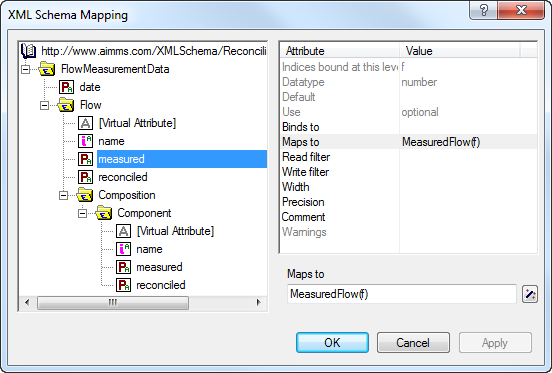

.. _sec:xml.user-defined:

Reading and Writing User-Defined XML Data
=========================================

.. rubric:: Writing userdefined XML

If you already have a given XML data format to which you want your AIMMS
application to adhere, the simple XML generation functions discussed in
the previous section will not work. This section discusses the tools and
functions provided by AIMMS to help you read and write XML data in a
given format, on the explicit assumption that your XML data format is
formally described through an XML schema file. If you do not have a
schema file for your XML data format, you are advised to use one of the
XML schema editors available on the market to construct an XML schema
file corresponding to your XML data format.

.. rubric:: Mapping XML schema to AIMMS identifiers

Once you do have an XML schema file corresponding to your XML data
format, you must create a mapping between the tree structure described
by the XML schema, and the identifiers in your AIMMS model that will
hold the corresponding data. This mapping is described using another XML
format (as illustrated later in this section), which, in principle, can
be edited manually. However, to create such a mapping, you can also use
the **Tools-XML Schema Mapping** menu. This will ask you to select an
XML schema file (with an ``.xsd`` extension), and will open the **XML
Schema Mapping** dialog box for the corresponding schema, as illustrated
in :numref:`fig:xml.schema-mapping`.

   The **XML Schema Mapping** dialog box

If there is already an **A**\ imms **X**\ ML **M**\ apping file (with an
``.axm`` extension) corresponding to the XML schema file, AIMMS will
also read the information in that file, and adapt the attributes of the
nodes in the XML mapping tree accordingly.

.. rubric:: Binding indices

The mapping between an XML schema and AIMMS is based on the principle
that any element that occurs multiple times in an XML data stream can be
associated with an index in your AIMMS model. If an index is bound for a
particular element, it is also considered to be bound for all attributes
and child elements of the element at hand. These can then be mapped onto
multidimensional AIMMS identifiers defined over all indices bound at a
particular level in the XML tree.

.. rubric:: Index value

The element values of such an index associated with an element occurring
multiple times in the XML tree can come from several sources:

-  a *required* (i.e. non-optional) attribute of the element,

-  the data of a direct data-only child element (i.e. without any child
   elements of its own) which occurs *exactly* once, or

-  if there is no such attribute or child element, an element name
   generated by AIMMS as if there were an attribute containing the
   generated name.

.. rubric:: Examples

In the example of :ref:`sec:xml.aimms`, the index ``f`` is bound to the
element ``Flow`` through the value of its attribute ``name``.

.. code-block:: aimms

	<Flow name="Inflow" measured="111.98" reconciled="117.03">
	    ...
	</Flow>

Equally, the index ``f``, associated with the ``Flow`` element, could
have obtained its value from the data-only child element ``FlowName``,
as illustrated below.

.. code-block:: aimms

	<Flow>
	   <FlowName>Inflow</FlowName>
	   <MeasuredValue>111.98</MeasuredValue>
	   <ReconciledValue>117.03</ReconciledValue>
	    ...
	</Flow>

Consider the following XML logging format.

.. code-block:: aimms

	<LogEntries>
	   <Log date="2008-03-31 12:07:31" severity="error">No value for 'Inflow'</Log>
	   <Log date="2008-03-31 12:07:35" severity="warning">Error for 'Inflow'</Log>
	</LogEntries>

None of the attributes nor the element value can uniquely identify a
:any:`Log` element. Rather the ``LogEntries`` element contains a sequence
of :any:`Log` entries. The log date, severity and message can perfectly be
stored in parameters ``LogDate(l)``, ``LogSeverity(l)`` and
``LogMessage(l)``, where the values of index ``l`` into the set
``LogEntries`` are numbered elements generated by AIMMS when reading the
XML file, and ignored when writing.

.. rubric:: Mapped data

In addition to binding indices, the values of attributes and data-only
elements can also be mapped to multidimensional identifiers in your
model. Such multidimensional identifiers can be defined over a subset
of, or all, indices bound at the level of the attribute or element to be
mapped. Attributes mapped to multidimensional identifiers may be
optional, corresponding to the mapped identifier holding a default value
in the AIMMS model.

.. rubric:: Example

In the example above, the attributes ``measured`` and ``reconciled`` are
mapped to the multidimensional identifiers ``MeasuredFlow(f)`` and
``Flow(f)``, respectively. This is a valid mapping since the index ``f``
is bound at the level of the element ``Flow`` and hence also to all its
child attributes and elements. Similarly, the identifiers
``MeasuredFlow(f)`` and ``Flow(f)`` could have been mapped to the
data-only elements ``MeasuredValue`` and ``ReconciledValue`` in the
second part of the example above.

.. rubric:: Mapping tree nodes

The **XML Schema Mapping** dialog box displays an XML mapping tree based
on the information available in the schema file. The XML mapping tree
consists of the following components.

-  A single root node ``AimmsXMLSchemaMapping``, which contains the
   single ``ElementMapping`` node for the root element defined in the
   XML schema to be mapped. In the **XML Schema Mapping** tree, the
   ``AimmsXMLSchemaMapping`` node is displayed by the |xml-root| icon.

-  ``ElementMapping`` nodes, each of which will have zero or more
   ``AttributeMapping``, ``VirtualAttributeMapping`` and
   ``ElementMapping`` child nodes. In the **XML Schema Mapping** tree, a
   data-only ``ElementMapping`` node is displayed by either the
   |xml-elem-data-only| icon, or the |xml-elem-bound| icon when a data-only element is
   bound to an index, or the |xml-elem-mapped| icon when a data-only element
   is mapped to multidimensional data. ``ElementMapping`` nodes with
   children are displayed by the |xml-elem| icon.

-  ``AttributeMapping`` nodes, which do not have child nodes. In the
   tree, an ``AttributeMapping`` node is displayed by either the
   |xml-attrib| icon, or the |xml-attrib-bound| icon when the attribute is bound
   to an index, or the |xml-attrib-mapped| icon when the attribute is mapped to
   multidimensional data.

-  ``VirtualAttributeMapping`` nodes, which basically behave like
   ``AttributeMapping`` nodes, but have no counterpart in the XML
   schema. In the tree, a ``VirtualAttributeMapping`` node is displayed
   by either the |xml-virtual-attrib| icon, or the |xml-virtual-attrib-bound| icon when the
   virtual attribute is bound to an index. ``VirtualAttributeMapping``
   nodes are automatically inserted by AIMMS underneath elements that
   can occur multiple times, and can only be bound to an index. They can
   be used to let AIMMS generate element names for an index that cannot
   be bound to a real attribute or child element.

.. rubric:: Mapping attributes

To each node type in the mapping tree, a number of possibly
node-specific attributes are associated. Some of these attributes are
based on the information in the schema file and cannot be edited, while
others define the actual mapping between the XML schema and identifiers
in your model, and can naturally be edited. When creating a mapping
tree, AIMMS will look for an ``.axm`` file corresponding to the schema
file you selected, and read the actual mapping attributes from the
mapping file.

.. rubric:: ``AimmsXMLSchemaMapping`` attributes

The ``AimmsXMLSchemaMapping`` node supports the attributes listed in
:numref:`table:xml.attr-AimmsXMLSchemaMapping`.

.. _table:xml.attr-AimmsXMLSchemaMapping:

.. table:: 

	===================== ======== ======== ====== ===============
	Attribute             Use      Editable Stored Value-type
	===================== ======== ======== ====== ===============
	``MappedNameSpace``   info     no       yes    *namespace-URI*
	``AimmsModel``        optional yes      yes    *string*
	``default-width``     optional yes      yes    *integer*
	``default-precision`` optional yes      yes    *integer*
	``comment``           optional yes      yes    *string*
	===================== ======== ======== ====== ===============
	
.. rubric:: The ``MappedNameSpace`` attribute

The ``MappedNameSpace`` attribute contains the namespace URI
(**U**\ niversal **R**\ esource **I**\ dentifier) by which the XML
schema is identified. AIMMS will retrieve it from the XML schema,
whenever the schema contains a namespace URI, or will generate an
artificial namespace URI
``"http://tempuri.org/AIMMS/auto-generated- namespace"`` if the XML
schema does not contain this information.

.. rubric:: The ``AimmsModel`` attribute

Using the ``AimmsModel`` attribute you can indicate the AIMMS model for
which the mapping is intended. The information you enter here is solely
for your own use, and is ignored by AIMMS when reading or writing XML
data according to this mapping.

.. rubric:: The ``defaultwidth`` and ``-precision`` attributes

Using the ``default-width`` and ``default-precision`` attributes you can
specify the width and precision with which you want AIMMS to write
numerical data, when writing an XML file subject to this mapping. These
attributes override the AIMMS options ``XML_number_width`` and
``XML_number_precision`` discussed in :ref:`sec:xml.aimms-generated`,
and use the same semantics.

.. rubric:: ``ElementMapping`` attributes

An ``ElementMapping`` node supports the attributes listed in
:numref:`table:xml.attr-ElementMapping`.

.. _table:xml.attr-ElementMapping:

.. table:: 

	================ ======== ========= ======== ====== =================
	Attribute        Use      Data-only Editable Stored Value-type
	================ ======== ========= ======== ====== =================
	``name``         required no        no       yes    *string*
	``occurrence``   info     yes       no       no     *string*
	``datatype``     info     yes       no       no     *string*
	``default``      info     yes       no       yes    *string*
	``binds-to``     optional yes       yes      yes    *index-reference*
	``maps-to``      optional yes       yes      yes    *reference*
	``width``        optional yes       yes      yes    *integer*
	``precision``    optional yes       yes      yes    *integer*
	``read-filter``  optional no        yes      yes    *expression*
	``write-filter`` optional no        yes      yes    *expression*
	``comment``      optional no        yes      yes    *string*
	================ ======== ========= ======== ====== =================
	
Some attributes used in an element mapping do not apply to all
``ElementMapping`` nodes. Binding the contents of an element to an
index, or mapping the contents to a multidimensional identifier in your
model, is only useful if the element is a data-only element, and not
when the element contains child elements. When reading an XML schema
file, AIMMS distinguishes between these two types of elements, and omits
the attributes for mapping data-only elements whenever appropriate. If
the schema file indicates that an element can have a mixed content
(i.e. both character data and child elements), AIMMS will ignore the
character data.

.. rubric:: XML schema-based attributes

The ``occurrence``, ``datatype`` and ``default`` attributes of an
``ElementMapping`` node contain information about the element that is
obtained from the XML schema. The values of these attributes cannot be
edited, and are displayed in the **XML Schema Mapping** dialog box
solely for your information.

.. rubric:: The ``occurrence`` attribute

The ``occurrence`` attribute of an element can hold the values
``optional/once``, ``optional/many``, ``never``, ``once``, or ``many``.
If you try to bind an index to an optional data-only element, AIMMS will
issue a warning, since this can potentially cause problems when reading
an XML file.

.. rubric:: The ``datatype`` attribute

In the ``datatype`` attribute, AIMMS displays the datatypes as either
``unspecified``, ``number``, ``integer``, ``string``, or ``any``,
whichever is nearest to the datatype of the element specified in the XML
schema. You can use this information to determine to which AIMMS
identifiers a particular element can be mapped.

.. rubric:: The ``default`` attribute

In the ``default`` attribute, AIMMS displays the default value of a
data-only element as specified in the XML schema file (if any). If there
is a default value, this information is also stored in the mapping file,
as this information is used by AIMMS to interpret the value of
non-existent elements when reading an XML file.

.. rubric:: The ``binds-to`` attribute

With the ``binds-to`` attribute you can indicate that AIMMS must bind
the contents of a data-only element to a particular index in your model.
The value of the ``binds-to`` attribute must be a reference to an index
in your AIMMS model. As explained at the start of this section, the
binding propagates to the direct parent of the element, and recursively
to any of the child attributes and elements of the parent. Those indices
that are bound at a particular level of the tree, are displayed in the
**XML Schema Mapping** dialog box in the attribute
``Indices bound at this level``, which is automatically updated by AIMMS
if you change the value of a ``binds-to`` attribute.

.. rubric:: The ``maps-to`` attribute

With the ``maps-to`` attribute you can indicate that the contents of a
data-only element must be mapped to a multidimensional identifier in
your model (including subsets). The value of this attribute must be a
reference to an AIMMS identifier in your model, and can refer to the
indices that are bound at the level of the ``ElementMapping`` in
question (or a subset thereof). Note that you might obtain unexpected
results when reading XML data if the ``maps-to`` attribute does not
refer to all indices bound at this level. If there are multiple
instances of the element (corresponding to indices not used in the
identifier), only the value of the most recent instance will be
registered. The expression that you specify for this attribute can be a
slice of a higher-dimensional identifier, and the indices may also be
permuted.

.. rubric:: ``maps-to`` in the presence of ``binds-to``

Even if you have specified a ``binds-to`` attribute for a node in the
tree, you are also allowed to specify the ``maps-to`` attribute as well,
which will then be used when reading and writing an XML file in the
given XML data format. If, in that situation, the ``maps-to`` attribute
contains a reference to a multidimensional identifier, AIMMS will assign
a value of 1.0 to that identifier, or if the ``maps-to`` attribute
contains a reference to a, possibly multidimensional, subset, AIMMS will
add the corresponding tuple to the subset. When writing an XML file,
AIMMS will always write out the element if the identifier contained in
the ``maps-to`` attribute contains non-default data, even if there is no
other data to be written that is defined over the index associated with
the ``binds-to`` attribute.

.. rubric:: The ``read-filter`` attribute

Using the ``read-filter`` attribute you can specify an AIMMS expression
to use as a filter when reading an XML data file. The value of the
``read-filter`` attribute must be a reference to a multidimensional
identifier in your model, similar to the ``maps-to`` attribute, or can
be 0 or 1 (the default). If the value is 0, the element and all its
child attributes and elements are ignored when reading an XML file. If
the value is a reference to an AIMMS identifier, the element, along with
its child attributes and elements, is skipped if the identifier at hand
does not contain a nonzero value for the index tuple bound at that
particular position in the XML file. If the ``read-filter`` attribute
refers to an identifier that is also read from the XML file, AIMMS will
use the value for that identifier as contained in the XML file, provided
that this value is read before the corresponding reference to the
``read-filter`` is evaluated.

.. rubric:: The ``writefilter`` attribute

With the ``write-filter`` attribute you can specify an AIMMS expression
to use as a filter when writing an XML data file. The value of the
``write-filter`` attribute must be a reference to a multidimensional
identifier in your model, similar to the ``maps-to`` attribute, or can
be 0 or 1. If the value is 0, the element and all its child attributes
and elements are ignored when writing an XML file. If the value is 1,
the element is always written, regardless of whether there are any
nondefault data within your model for that particular element. If there
is no nondefault data, AIMMS will write the corresponding default value.
If the value is a reference to an AIMMS identifier, the element, along
with its child attributes and elements, is skipped if the identifier at
hand does not contain a nonzero value for the index tuple bound at that
particular position in the XML file.

.. rubric:: The ``width`` and ``precision`` attributes

Using the ``width`` and ``precision`` attributes of a data-only element
you can override the values of the ``default-width`` and
``default-precision`` attributes of the ``AimmsXMLSchemaMapping`` node
(or, eventually, of the AIMMS options ``XML_number_ width`` and
``XML_number_precision``) for the element in question. The attributes
will only be used if a ``maps-to`` attribute has also been specified.
With these options you can determine, for each individual element type,
how numerical data will be formatted when writing an XML file.

.. rubric:: ``AttributeMapping`` attributes

``AttributeMapping`` nodes support the attributes listed in
:numref:`table:xml.attr-AttributeMapping`.

.. _table:xml.attr-AttributeMapping:

.. table:: 

	================ ======== ======== ====== =================
	Attribute        Use      Editable Stored Value-type
	================ ======== ======== ====== =================
	``name``         required no       yes    *string*
	``datatype``     info     no       no     *string*
	``default``      info     no       yes    *string*
	``use``          info     no       no     *namespace-URI*
	``binds-to``     optional yes      yes    *index-reference*
	``maps-to``      optional yes      yes    *reference*
	``width``        optional yes      yes    *integer*
	``precision``    optional yes      yes    *integer*
	``read-filter``  optional yes      yes    *expression*
	``write-filter`` optional yes      yes    *expression*
	``comment``      optional yes      yes    *string*
	================ ======== ======== ====== =================
	
.. rubric:: The ``use`` attribute

The ``use`` attribute contains the value of the attribute of the same
name obtained from the XML schema, and indicates whether an XML
attribute is ``optional``, ``required`` or ``prohibited``. If you try to
bind an optional attribute to a index in your AIMMS model, AIMMS will
issue a warning, since such bindings may cause problems when reading an
XML file in which the optional attribute is not present.

.. rubric:: Other attributes similar to element attributes

The remaining attributes of an ``AttributeMapping`` node have identical
interpretations to those of an ``ElementMapping`` node. For information
about these attributes refer to the documentation for the corresponding
attributes of ``ElementMapping`` nodes above.

.. rubric:: Example

The following XML data fragment shows the mapping between the XML data
file, illustrated in :ref:`sec:xml.aimms`, and the identifiers

-  ``MeasuredFlow(f)``,

-  ``Flow(f)``,

-  ``MappedMeasuredComposition(f,c)``, and

-  ``MappedComposition(f,c)``

which contain the corresponding data in the *Data Reconciliation*
project.

.. code-block:: aimms

	<AimmsXMLSchemaMapping xmlns="http://www.aimms.com/XMLSchema/AimmsXMLMappingSchema"
	            MappedNameSpace="http://www.aimms.com/Reconciliation"
	            default-width=16 default-precision=2>
	  <ElementMapping name="FlowMeasurementData">
	    <AttributeMapping name="date" maps-to="ReconciliationDate"/>
	    <ElementMapping name="Flow">
	      <AttributeMapping name="measured" maps-to="MeasuredFlow(f)"/>
	      <AttributeMapping name="name" binds-to="f"/>
	      <AttributeMapping name="reconciled" maps-to="Flow(f)"/>
	      <ElementMapping name="Composition">
	        <ElementMapping name="Component">
	          <AttributeMapping name="measured" maps-to="MappedMeasuredComposition(f,c)"/>
	          <AttributeMapping name="name" binds-to="c"/>
	          <AttributeMapping name="reconciled" maps-to="MappedComposition(f,c)"/>
	        </ElementMapping>
	      </ElementMapping>
	    </ElementMapping>
	  </ElementMapping>
	</AimmsXMLSchemaMapping>

.. rubric:: ``VirtualAttributeMapping`` attributes

``VirtualAttributeMapping`` nodes support the attributes listed in
:numref:`table:xml.attr-VirtualAttributeMapping`.

.. _table:xml.attr-VirtualAttributeMapping:

.. table:: 

	======================== ======== ======== ====== =================
	Attribute                Use      Editable Stored Value-type
	======================== ======== ======== ====== =================
	``binds-to``             required yes      yes    *index-reference*
	``maps-to``              optional yes      yes    *reference*
	``read-filter``          optional yes      yes    *expression*
	``write-filter``         optional yes      yes    *expression*
	``assume-element-value`` required yes      yes    ``Yes / No``
	``element-prefix``       optional yes      yes    *string*
	``comment``              optional yes      yes    *string*
	======================== ======== ======== ====== =================
	
The ``VirtualAttributeMapping`` allows you to associate an index with an
element that occurs multiple times in your XML file, but which has no
unique attribute or child element in the XML schema to which you can
bind this index. A ``VirtualAttributeMapping`` allows you to still
associate such elements with an index, as if there were a virtual,
hidden attribute to which you bind. When reading an XML file, the
element names associated with that index are then generated by AIMMS
either numbered on the basis of a given prefix, or by retrieving the
names from the element contents itself. When writing an XML file, the
element names associated with an index bound to a
``VirtualAttributeMapping`` attribute are ignored.

.. rubric:: ``VirtualAttributeMapping`` attributes

The ``binds-to``, ``maps-to``, ``read-filter`` and ``write-filter`` have
the exact same interpretation as for a normal ``AttributeMapping``.
Through the ``assume-element-value`` attribute you can indicate whether
AIMMS should generate element values when reading, or, when the parent
element is a data-only element, whether the element content should be
taken as the element value for the index. The default value of the
``assume-element-value`` attribute is ``No``. Element names generated by
AIMMS are numbered starting from 1, with the prefix specified in the
``element-prefix`` attribute.

.. rubric:: ``binds-to`` is mandatory

Note that the ``binds-to`` attribute is required for a
``VirtualAttributeMapping`` attribute. The ``VirtualAttributeMapping``
node and all changes you made to any of its other attributes in the
**XML Schema Mapping** dialog box will be ignored when saving the
mapping, unless the ``binds-to`` attribute has a value.

.. rubric:: Example

Consider the XML logging format discussed above

.. code-block:: aimms

	<LogEntries>
	   <Log date="2008-03-31 12:07:31" severity="error">No value for 'Inflow'</Log>
	   <Log date="2008-03-31 12:07:35" severity="warning">Error for 'Inflow'</Log>
	</LogEntries>

The following schema mapping maps the contents of this XML file to
identifiers ``LogDate(l)``, ``LogSeverity(l)`` and ``LogMessage(l)``,
where ``l`` is an index into a set ``LogEntries``.

.. code-block:: aimms

	<AimmsXMLSchemaMapping xmlns="http://www.aimms.com/XMLSchema/AimmsXMLMappingSchema"
	            MappedNameSpace="http://www.aimms.com/LoggingData"
	            default-width=16 default-precision=2>
	  <ElementMapping name="LogEntries">
	    <ElementMapping name="Log" maps-to="LogMessage(l)">
	      <VirtualAttributeMapping binds-to="l" assume-element-value="No"
	                               element-prefix="logentry-"/>
	      <AttributeMapping name="date" maps-to="LogDate(l)"/>
	      <AttributeMapping name="severity" maps-to="LogSeverity(l)"/>
	    </ElementMapping>
	  </ElementMapping>
	</AimmsXMLSchemaMapping>

When reading the XML file, AIMMS will create two elements
``'logentry-1'`` and ``'logentry-2'`` into the set ``LogEntries``. When
writing the XML file, AIMMS will write :any:`Log` elements whenever there
is non-default data for ``LogDate(l)``, ``LogSeverity(l)`` or
``LogMessage(l)``, regardless of the specific format of the elements in
the set ``LogEntries``.

.. rubric:: A second example

Consider the following XML file

.. code-block:: aimms

	<Flows>
	   <Flow>Inflow</Flow>
	   <Flow>Mix</Flow>
	   <Flow>NH3-Mix</Flow>
	   <Flow>NH3-Flow</Flow>
	   <Flow>Residue</Flow>
	   <Flow>Ar-Flow</Flow>
	   <Flow>Feedback</Flow>
	</Flows>

This XML format can be used to represent an AIMMS set ``Flows`` with an
index ``f``. The following schema mapping accomplishes this.

.. code-block:: aimms

	<AimmsXMLSchemaMapping xmlns="http://www.aimms.com/XMLSchema/AimmsXMLMappingSchema"
	            MappedNameSpace="http://www.aimms.com/FlowsExample"
	            default-width=16 default-precision=2>
	  <ElementMapping name="Flows">
	    <ElementMapping name="Flow">
	      <VirtualAttributeMapping binds-to="f" maps-to="Flows"
	                               assume-element-value="Yes"/>
	    </ElementMapping>
	  </ElementMapping>
	</AimmsXMLSchemaMapping>

In this mapping, the element values of the ``Flow`` elements are taken
as the value of a virtual attribute bound to the index ``f``. The
``maps-to`` attribute is added to ensure that on reading the set
``Flows`` is filled with the encountered flow names, and on writing a
``Flow`` element is written out for every element in the set ``Flows``.

.. rubric:: Checking and saving the mapping file

On pressing the **OK** button in the **XML Schema Mapping** dialog box,
AIMMS checks the validity of your mapping, and reports any errors it
encounters. If there are no errors, AIMMS will save (or update) the
mapping file associated with the XML schema file (``.xsd`` extension)
that you selected when opening the dialog box. The mapping file will be
saved as an ``.axm`` file, with the same base name as the ``.xsd`` file.

.. _WriteXML-LR:

.. _ReadXML-LR:

.. rubric:: Obtaining user-defined XML

Once you have created a mapping file between a given XML schema and the
appropriate identifiers in your model, you can use the functions

-  :any:`WriteXML`\ (*XMLFile*,\ *MappingFile*\ [,\ *merge*])

-  :any:`ReadXML`\ (*XMLFile*,\ *MappingFile*\ [,\ *merge*][,\ *SchemaFile*])

to read data from, and write data to, an XML data file in the specified
format.

.. rubric:: The function :any:`WriteXML`

The function :any:`WriteXML` lets AIMMS generate XML data and write it into
the file *XMLFile* based on the mapping file *MappingFile*. The optional
*merge* argument (default 0) indicates whether you want to merge the
generated XML data into another XML document, in which case AIMMS will
omit the XML header from the generated XML file. This allows you to
merge the contents of the generated file into another XML file. Note
that setting the *merge* argument to 1 does not result in the generated
XML data being appended to the specified file, its contents are
completely overwritten. All data in the XML file are represented with
respect to the currently active unit convention (see also
:ref:`sec:units.convention`). The function will return 1 if successful,
or 0 if not.

.. rubric:: Adding a namespace

If your XML schema file defines a namespace, reflected in the
``MappedNameSpace`` attribute of the root node in the corresponding
``.axm`` file, AIMMS will add this namespace to the XML file written by
:any:`WriteXML` through the ``xmlns`` attribute the root node of that file.
If your XML schema file does not define a namespace, the
``MappedNameSpace`` attribute in the ``.axm`` file contains an
artificial namespace URI
``"http://tempuri.org/AIMMS/auto-generated-namespace"``, which will not
be added as the ``xmlns`` attribute to the root node of the file being
written

.. rubric:: The function :any:`ReadXML`

Using the function :any:`ReadXML` you can let AIMMS read the XML data
contained in the file *XMLFile* into the AIMMS identifiers specified in
the mapping file *MappingFile*. If the mapping file contains a valid
(i.e. not generated by AIMMS) namespace URI of the corresponding XML
schema, AIMMS requires the root element of the XML data file to be also
associated with the namespace through the ``xmlns`` attribute. With the
optional *merge* argument (default 0), you may indicate whether you want
to merge the data included in the XML file with the existing data, or
overwrite any existing data (default). All data in the XML file will be
interpreted in accordance with the currently active unit convention (see
also :ref:`sec:units.convention`). The function will return 1 if
successful, or 0 if not.

.. rubric:: Schema validation

If you specify an optional *SchemaFile*, the XML parser used by AIMMS
will validate the contents of the XML data contained in your XML file
against this schema. This will only work, however, if the specified
schema file defines a namespace matching the ``xmlns`` attribute of the
root node of your XML file.

