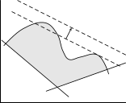

Basic Algorithm
===============

.. rubric:: Algorithm in words

The algorithm solves an alternating sequence of mixed-integer linear
models and nonlinear models.

#. First, the entire model is solved as a nonlinear program with all the
   integer variables relaxed as continuous variables between their
   bounds.

#. Then a linearization is carried out around the optimal solution, and
   the resulting constraints are added to the linear constraints that
   are already present. This new linear model is referred to as the
   master MIP model.

#. The master MIP problem is solved as an mixed-integer linear program.

#. The integer part of the resulting optimal solution is then
   temporarily fixed, and the original MINLP model with fixed integer
   variables is solved as a nonlinear subproblem.

#. Again, a linearization around the optimal solution is constructed and
   the new linear constraints are added to the master MIP problem. To
   prevent cycling, one or more constraints are added to cut off the
   previously-found integer solution of the master problem.

#. Steps 3-5 are repeated until one of the termination criteria is
   satisfied.

A more detailed description of the general Outer Approximation algorithm
can be found in :cite:`bib:DG86`.

.. rubric:: Convexity and convergence

As linearizations are added to the master MIP problem, the model becomes
an improved approximation of the original MINLP model. Using the usual
convexity assumption regarding the nonlinear subproblem, convergence to
a global optimum occurs when the objective function value of the master
MIP problem is worse than the value associated with the NLP subproblem.

.. rubric:: Termination :math:`\ldots`

Several termination criteria are used in practice. These criteria can be
used in isolation or in some logical combination. Three of them are
discussed in the following paragraphs.

.. rubric:: :math:`\ldots` iteration limit

Perhaps the most frequently-used criterion is the iteration limit. One
reason is that a good solution is usually found during the first few
iterations. Another reason for using an iteration limit is that the size
of the underlying master MIP problem tends to grow significantly each
time linearization constraints are added, causing an increase in
computation time.

.. rubric:: :math:`\ldots` objective worsening

A second criterion is the worsening of the objective function value of
two successive nonlinear subproblems. This worsening occurs quite
frequently, even if the NLP subproblem is convex. The underlying reason
is that the master MIP problem will not always select binary solutions
that lead to successively improving NLPs. This criterion seems
appropriate when the worsening is persistent over several iterations.

.. rubric:: :math:`\ldots` crossover

A third termination criterion is insufficient improvement in the
objective function value of the master MIP problem in relation to the
objective function value of the previously solved NLP subproblem. The
difference between these two values represents the optimality gap, since
the master MIP problem represents an outer approximation (thus a
relaxation) of the original MINLP model. When the gap is closed at
crossover, the optimal solution has been found provided the NLP
subproblem is convex.

.. rubric:: Final solution

Upon termination of the algorithm, the known best solution (also
referred to as the incumbent solution) is declared as the final
solution. In many practical applications, this solution is not
necessarily optimal due to termination based on an iteration limit. In
addition, it is often not possible to verify that the NLP subproblem is
convex.

.. rubric:: Linearizations

The term 'outer approximation' refers to the linear approximation of the
convex nonlinear constraints at selected points along the boundary of
the convex solution region. The accumulation of such inequality
constraints forms an outer approximation of the solution region, and
this approximation can be used in the optimization rather than the
nonlinear constraints from which it was derived. The formula for the
linearization of a scalar nonlinear inequality :math:`g(x,y) \leq 0`
around the point :math:`(x,y) = (x^0,y^0)` is as follows.

.. math::

   g(x^0,y^0) + \bigtriangledown g(x^0,y^0)^T
   \begin{bmatrix}
   x - x^0 \\
   y - y^0
   \end{bmatrix}
   \leq 0

.. rubric:: The nonconvex case

The linear approximation ceases to be an outer approximation if the
solution region is not convex. In this situation there is the
possibility that portions of the solution region are cut off as
illustrated in :ref:`fg:aoa:nonconvex`.

   Effect of loosening a linearization

.. rubric:: Loosening inequalities

In practical implementations of the outer approximation algorithm, the
linearizations are allowed to move away from the feasible region. Such
heuristic flexibility allows solutions to be found that would otherwise
have been cut off. The implementation allows deviations through the use
of artificial nonnegative variables and then penalizing them while
solving the master problem.

.. rubric:: Open solver approach

The basic outer approximation algorithm that is part of the AOA module
has been completely implemented using functionality provided by the GMP
library.

-  From the math program instance representing the original MINLP model,
   a new math program instance representing the initial master MIP
   problem can be created using the function
   :any:`GMP::Instance::CreateMasterMIP`.

-  The functions from the ``GMP::Linearization`` namespace can be used
   to add linearizations of the nonlinear constraints of the original
   MINLP model to the master MIP, in a customizable manner.

-  Using the :any:`GMP::Instance::FixColumns` procedure, the integer
   columns of the nonlinear subproblem can fixed to the current integer
   solution of the master MIP.

-  Using the :any:`GMP::Instance::AddIntegerEliminationRows` procedure,
   prior integer solutions of the master MIP are excluded from
   subsequent solves.