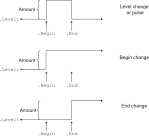
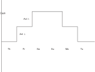

.. _sec:cp.scheduling.problems:

Scheduling Problems
===================

.. rubric:: Introduction

Resource-constrained scheduling is a key application area of constraint
programming. Most constraint programming systems contain special
syntactical constructs to formulate such problems, allowing the use of
specialized inference algorithms. In :ref:`cp:ss:global` we have already
seen two examples of global constraints for scheduling:
:any:`cp::SequentialSchedule` and :any:`cp::ParallelSchedule`. For more
complex scheduling problems that contain, for example,
sequence-dependent setup times between activities, or specific
precedence relations, the use of more advanced scheduling algorithms is
advisable. These algorithms cannot be offered by the stand-alone global
constraints :any:`cp::SequentialSchedule` and :any:`cp::ParallelSchedule`, but
can be accessed by formulating the problem using *activities* and
*resources* in AIMMS.

.. rubric:: Activities

Activities correspond to the execution of objects in scheduling
problems, e.g., processing an order, working a shift, or performing a
loading operation. They can be viewed as the variables of a scheduling
problem, since we must decide on their position in the schedule. Common
attributes associated to an activity are its begin, end, length, and
size. Further, it is often convenient to distinguish mandatory and
optional activities, which allows to consider the presence of an
activity. In AIMMS, the properties begin, end, length, size, and
presence of an activity can be used as variables in other parts of the
model. It is also possible to build models using nested activities,
where meta-activities group together a number of sub-activities, for
example in the context of project planning.

.. rubric:: Resources

Resources correspond to the assets that are available to execute the
activities, e.g., the capacity of a machine, the volume of a truck, or
the number of available employees. Resources can be viewed as the
constraints of a scheduling problem. The main attributes of a resource
are its capacity, its activity level, and the set of activities that
require the resource in order to be executed. That is, during the
execution of the schedule, we must ensure that the resource activity
level is always within its capacity. Note that while a resource depends
on a set of activities, an activity can impact on one or more resources
at the same time.

.. rubric:: An activity changes the resource activity level

A resource starts with a default activity level of 0, corresponding to
full available capacity, or a user-specified initial value. During the
execution of the schedule, activities will influence the resource
activity level. The viewpoint chosen in AIMMS is that an activity
changes the activity level of a resource when it begins, and/or when it
ends. This enables one to model many common situations. For example,
when an activity corresponds to a loading operation, and the resource
corresponds to a truck load, the activity will change the activity level
of the resource with the volume of the load at its start, but there is
no change in the resource activity level when finishing this activity.
For sequential resources the capacity is :math:`1`, and each activity
will change the resource activity level by :math:`+1` when it begins,
and by :math:`-1` when it ends. For example, when an activity
corresponds to a visit operation, and the resource corresponds to a
truck, the activity level of the resource will be decreased by 1 at the
beginning of the visit, and increased by 1 at the end.

.. rubric:: Schedule domains

The timeline on which activities are scheduled, is the so-called
*schedule domain*. A schedule domain is a finite set of timeslots. Each
activity and resource has its own schedule domain.

.. rubric:: The problem schedule domain

The schedule domain of the entire problem, the *problem schedule
domain*, is a named superset of each of these schedule domains. Unless
overridden, it is based on the schedule domains of the activities and
resources.

.. rubric:: Handling schedule domains

An activity is only considered active during a timeslot :math:`t` if
:math:`t` is in the schedule domain of that activity, and it is in the
schedule domain of each resource for which it is scheduled. Thus, for
each individual activity, AIMMS passes the intersection of these
schedule domains to the constraint programming solver.

.. rubric:: Additional restrictions

Most scheduling problems contain several side constraints in addition to
the resource constraints. Examples include precedence relations between
activities, release dates or deadlines, and sequence-dependent setup
times. Such constraints can be specified using global scheduling
constraints or in the attribute forms of activities and resources.
Constraint programming solvers can take an extra algorithmic advantage
of such constraints when they are presented in this manner.

.. _sec:constraint.programming.scheduling.activities:

Activity
--------

.. _activity:

On the one hand, an activity can be seen as consisting of five variables
that can be accessed by the suffixes: ``.Begin``, ``.End``, ``.Length``,
``.Size`` and ``.Present``. These variables represent the begin, end,
length (difference between end and begin), size (number of active slots)
and presence of an activity. These variables can be used inside
constraints, for example ``myActivity.End <= myDeadLine+1``. On the
other hand, an activity is defined using its attributes as presented in
:ref:`this table <table:cp.attr-activity>`. We will first discuss the attributes
of an activity, and then these suffixes in more detail.

.. _table:cp.attr-activity:

.. table:: 

	+--------------------+---------------------------+-------------------------------------+
	| Attribute          | Value-type                | See also page                       |
	+====================+===========================+=====================================+
	| ``IndexDomain``    | *index-domain*            |  :ref:`attr:var.index-domain`       |
	+--------------------+---------------------------+-------------------------------------+
	| ``ScheduleDomain`` | *set range or expression* |                                     |
	+--------------------+---------------------------+-------------------------------------+
	| ``Property``       | ``Optional``, ``NoSave``  |                                     |
	+--------------------+---------------------------+-------------------------------------+
	| ``Length``         | *expression*              |                                     |
	+--------------------+---------------------------+-------------------------------------+
	| ``Size``           | *expression*              |                                     |
	+--------------------+---------------------------+-------------------------------------+
	| ``Priority``       | *reference*               |  :ref:`attr:var.priority`           |
	+--------------------+---------------------------+-------------------------------------+
	| ``Text``           | *string*                  |  :ref:`attr:prelim.text`            |
	+--------------------+---------------------------+-------------------------------------+
	| ``Comment``        | *comment string*          |  :ref:`attr:prelim.comment`         |
	+--------------------+---------------------------+-------------------------------------+
	
.. _activity.schedule_domain:

.. rubric:: The ``ScheduleDomain`` attribute
   :name: attr:activity.schedule-domain

The activity is scheduled in time slots in the ``ScheduleDomain``. This
is an expression resulting in a one-dimensional set, or a set-valued
range. The resulting set need not be a subset of the predeclared set
:any:`Integers`; it can be any one-dimensional set, for instance a
``Calendar``, see :ref:`sec:time.calendar`. Consider the following
examples of the attribute ``schedule domain``:

.. code-block:: aimms

	Activity a {
	    ScheduleDomain  :  yearCal;
	    Comment         : {
	        "a can be scheduled during any period 
	        in the calendar yearCal"
	    }
	}
	Activity b {
	    IndexDomain     :  i;
	    ScheduleDomain  :  possiblePeriods(i);
	    Comment         : {
	        "b(i) can be scheduled only during the 
	        periods possiblePeriods(i)"
	    }
	}
	Activity c {
	    IndexDomain     :  i;
	    ScheduleDomain  : {
	        {ReleaseDate(i)..PastDeadline(i)}
	    }
	    Comment         : {
	        "c(i) must start on or after ReleaseDate(i)
	         c(i) must finish before PastDeadline(i)"
	    }
	}

The ``ScheduleDomain`` attribute is mandatory.

.. rubric:: Singleton schedule domain
   :name: cp.singleton.prescheduled.activity

An activity with a singleton schedule domain and a length of 1 can be
used to model an event. Such an activity is scheduled during the single
element in the schedule domain. Because the schedule domain is a single
element, the value of the suffixes ``.Begin`` and ``.End`` of the
activity will be set to that single element and the element thereafter
respectively in a feasible solution. Note that this is possible for all
elements except for the last element in the problem schedule domain; a
nonzero length would then require the ``.End`` to be after the problem
schedule domain. Consider the following example:

.. code-block:: aimms

	Activity weekendActivities {
	    IndexDomain     : {
	        d | ( TimeslotCharacteristic( d, 'weekday' ) = 6 or
	        TimeslotCharacteristic( d, 'weekday' ) = 7    ) and
	        d <> last( dayCalendar )
	    }
	    ScheduleDomain  : {
	        { d .. d }
	    }
	    Length          :  1;
	    Comment         :  "d is an index in a calendar";
	}

Scheduling the activity ``weekendActivities`` in a sequential resource
will block other activities for that resource during the weekend.

.. _activity.property:

.. _Optional:

.. _Contiguous:

.. rubric:: The ``Property`` attribute

An activity can have the properties ``Optional``, ``Contiguous`` and
``NoSave``.

``Optional``
   When an activity has the property ``Optional``, it may or may not be
   scheduled. If the property ``Optional`` is not specified, then the
   activity will always be scheduled.

``Contiguous``
   When an activity has the property ``Contiguous``, all elements from
   ``.Begin`` up to but not including ``.End`` in the problem schedule
   domain must be in its own schedule domain.

``NoSave``
   When an activity has the property ``NoSave``, it will not be saved in
   cases.

This attribute is not mandatory.

.. _activity.length:

.. _activity.size:

.. rubric:: The ``Length`` and ``Size`` attributes

When an activity is present, the ``Length`` attribute defines the length
of the activity, and the ``Size`` attribute defines its size. The length
of an activity is the difference between its end and its begin. The size
of an activity is the number of periods, in which that activity is
active from begin up to but not including its end. For example, a
non-contiguous activity which ``.Begin``\ s on Friday, ``.End``\ s on
Tuesday, and is not active during the weekend has a

-  ``.Length`` of 4 days, and

-  ``.Size`` of 2 days.

The numeric expressions entered at the ``Length`` and ``Size``
attributes may involve other discrete variables. These attributes are
not mandatory.

For a contiguous activity we have that the ``.Length`` is equal to the
``.Size``. Conversely, with a constraint ``a.Length=a.Size`` we have
that ``a`` is contiguous, but the propagation may be less efficient.

.. _activity.priority:

.. rubric:: The ``Priority`` attribute

The ``Priority`` attribute applies to all the discrete variables defined
by an activity. To these variables it has the same meaning as for
integer variables, see page :ref:`attr:var.priority`. This attribute is
not mandatory.

.. rubric:: The suffixes of activities

An activity is made up of the following suffixes ``.Begin``, ``.End``,
``.Length``, ``.Size`` and ``.Present``. Each of these suffixes is a
discrete variable and can be used in constraints.

.. rubric:: The suffixes ``.Begin`` and ``.End``

The suffixes ``.Begin`` and ``.End`` are element valued variables. When
scheduled, the activity takes place from period ``.Begin`` up to but not
including period ``.End``. For a present activity ``a``, in a feasible
solution:

-  ``a.Begin`` is an element in the schedule domain of the activity. The
   range of this element variable is the *smallest* named set
   encompassing the activity schedule domain.

-  ``a.End`` is an element in the schedule domain of the problem, and,
   depending on the ``.Length`` of ``a``, with the following additional
   requirement:

   -  When the length of activity ``a`` is zero, ``a.End=a.Begin``
      holds, and they are both in the activity schedule domain.

   -  When the length of activity ``a`` is greater than 0, the element
      before ``a.End`` is in the activity schedule domain.

   The range of this element variable is the *root* set of the activity
   schedule domain.

Comparison of the ``.Begin`` and ``.End`` suffixes of two activities
``a`` and ``b`` inside a constraint definition will take place on the
problem schedule domain, for instance in a constraint like
``a.End <= b.Begin``. Outside constraint definitions these suffixes
follow the rules of element comparison specified in
:ref:`sec:expr.logic.set-rel`.

.. rubric:: The suffixes ``.Length`` and ``.Size``

The suffixes ``.Length`` and ``.Size`` are nonnegative integer
variables. The ``.Length`` of an activity is defined as ``.End`` -
``.Begin``. The ``.Size`` of an activity is the number of timeslots in
the schedule domain of the activity in the range ``[.Begin, .End)``.
When the attribute ``Length`` or ``Size`` is non-empty, AIMMS will
generate a defining constraint for the suffix ``.Length`` resp.
``.Size`` like the definition attribute of a variable, see
:ref:`attr:var.definition`. When the schedule domain of an activity is a
calendar or a subset thereof, the unit of each of the ``.Length`` and
``.Size`` suffixes is the unit of the calendar.

.. rubric:: The suffix ``.Present``

The suffix ``.Present`` is a binary variable with default ``0``. For
optional activities this variable is 1 when the activity is scheduled
and 0 when it is not. For non-optional activities this variable is
initialized with the value 1.

.. rubric:: suffixes of absent activities in constraints

The value of one of the suffixes ``.Begin``, ``.End``, ``.Length``, and
``.Size`` is not defined when the corresponding activity is absent.
However, in order to satisfy constraints where such a suffix is used for
an absent activity, a value is chosen: the socalled *absent* value. For
the suffixes ``.Length``, and ``.Size``, the absent value is 0. For the
suffixes ``.Begin`` and ``.End`` this depends on the problem schedule
domain:

-  If the problem schedule domain is a subset of :any:`Integers`, the
   absent value is 0.

-  Otherwise, the absent value of the suffixes ``.Begin`` and ``.End``
   is ``"``.

To override the absent value use one of the following functions:

-  :any:`cp::ActivityBegin`,

-  :any:`cp::ActivityEnd`,

-  :any:`cp::ActivityLength`, or

-  :any:`cp::ActivitySize`.

.. rubric:: Suffixes of optional activities in constraints

The value of the suffix ``.present`` is defined for an absent activity
as 0. However the values of the other suffixes of an absent activity are
not defined. To enable the constraining of the values of those suffixes
in constraints several formulation alternatives are available. As an
example of these alternatives, consider an activity ``act`` whereby we
want to enforce its length to be 7 if it is present.

#. Enforce the length constraint conditionally on the presence of
   activity ``act``:

   .. code-block:: aimms
   
   	if  act.present then
   	    act.length = 7
   	endif

#. The :any:`cp::ActivityLength` function returns the length of a present
   activity or its second argument if it is not present:

   .. code-block:: aimms
   
   	cp::ActivityLength( act, 7 ) = 7

#. If we simply want to set the value of the ``.Length`` or ``.Size``
   suffix, we can use the ``Length`` or ``Size`` attribute as follows.

   .. code-block:: aimms
   
   	Activity act {
   	    ScheduleDomain  :  ...;
   	    Property        :  optional;
   	    Length          :  7;
   	}

Each of the above formulation alternatives has its own merits.

#. The merit of this alternative is that it is general and can also be
   used to state for instance that the length of ``act`` is 7 or 11 when
   present:

   .. code-block:: aimms
   
   	if  act.present then
   	    act.Length = 7 or act.Length = 11 
   	endif

#. The merit of this alternative is that it allows the solver to make
   stronger propagations and thus potentially reduce solution time.

#. The merit of this alternative is that is does not force the model
   builder to take the optionality of ``act`` into account when defining
   its length. AIMMS will make sure the length definition is translated
   to alternative 1 or 2 as appropriate.

.. rubric:: Solution values of absent activities

The value of the suffixes ``.Begin``, ``.End``, ``.Length``, and
``.Size`` of an absent activity in a feasible schedule are meaningless
and should not be used in further computations.

.. rubric:: Absent versus 0-length activities

Even though no work is done for both absent and 0-length activities,
there is a difference in their usage. Let us consider the following two
examples:

-  Selection of an activity from alternatives; Consider a collection of
   activities from which we need to select one. This is easily and
   efficiently achieved by setting the property ``Optional`` to the
   activity. The ones not selected become absent in a solution.

-  Consider two collections of activities, whereby the :math:`n`
   activities in the first collection all need to be completed before
   the :math:`m` activities in the second collection can start. We can
   model this directly by :math:`n\times{}m` precedence constrains.
   Another way to model this is by introducing an extra activity, say
   ``Milestone``, of length zero. With this ``Milestone`` we only need
   :math:`n+m` precedence constraints.

To facilitate above and other examples of scheduling, the suffixes
``.Present`` and ``.Length`` are supported independently.

.. rubric:: Relation between suffixes of activities

Please note, for an activity ``act``, the following relation is
implicitly defined:

.. code-block:: aimms

	if act.Present then 
	   act.Begin + act.Length = act.End 
	endif 
	if act.Present then 
	   act.Size <= act.Length  
	endif

.. _sec:cp.scheduling.resources:

Resource
--------

.. _resource:

A resource schedules activities by acting as a constraint on the
activities it schedules. A feasible resource requires the above implicit
constraints on the suffixes of the activities it schedules and the
constraints implied by its attributes as discussed below.

.. _table:cp.attr-resource:

.. table:: 

	+---------------------+--------------------------------------+----------------------------------------------------------+
	| Attribute           | Value-type                           | See also page                                            |
	+=====================+======================================+==========================================================+
	| ``IndexDomain``     | *index-domain*                       |  :ref:`attr:var.index-domain`                            |
	+---------------------+--------------------------------------+----------------------------------------------------------+
	| ``Usage``           | ``Parallel`` or ``Sequential``       |                                                          |
	+---------------------+--------------------------------------+----------------------------------------------------------+
	| ``ScheduleDomain``  | *set range or expression*            |  :ref:`attr:activity.schedule-domain`                    |
	+---------------------+--------------------------------------+----------------------------------------------------------+
	| ``Activities``      | *collection of activities*           |                                                          |
	+---------------------+--------------------------------------+----------------------------------------------------------+
	| ``Property``        | ``NoSave``                           |                                                          |
	+---------------------+--------------------------------------+----------------------------------------------------------+
	| ``GroupSet``        | *a reference to a set*               |                                                          |
	+---------------------+--------------------------------------+----------------------------------------------------------+
	| ``GroupDefinition`` | *activity : expression*              |                                                          |
	+---------------------+--------------------------------------+----------------------------------------------------------+
	| ``GroupTransition`` | *index domain : expression*          |                                                          |
	+---------------------+--------------------------------------+----------------------------------------------------------+
	| ``Transition``      | *set of reference pair : expression* |                                                          |
	+---------------------+--------------------------------------+----------------------------------------------------------+
	| ``FirstActivity``   | *reference*                          |                                                          |
	+---------------------+--------------------------------------+----------------------------------------------------------+
	| ``LastActivity``    | *reference*                          |                                                          |
	+---------------------+--------------------------------------+----------------------------------------------------------+
	| ``ComesBefore``     | *set of reference pairs*             |                                                          |
	+---------------------+--------------------------------------+----------------------------------------------------------+
	| ``Precedes``        | *set of reference pairs*             |                                                          |
	+---------------------+--------------------------------------+----------------------------------------------------------+
	| ``Unit``            | *unit-valued expression*             |  :ref:`attr:par.unit`, :ref:`attr:var.unit`              |
	+---------------------+--------------------------------------+----------------------------------------------------------+
	| ``LevelRange``      | *numeric range*                      |                                                          |
	+---------------------+--------------------------------------+----------------------------------------------------------+
	| ``InitialLevel``    | *reference*                          |                                                          |
	+---------------------+--------------------------------------+----------------------------------------------------------+
	| ``LevelChange``     | *per activity : expression*          |                                                          |
	+---------------------+--------------------------------------+----------------------------------------------------------+
	| ``BeginChange``     | *per activity : expression*          |                                                          |
	+---------------------+--------------------------------------+----------------------------------------------------------+
	| ``EndChange``       | *per activity : expression*          |                                                          |
	+---------------------+--------------------------------------+----------------------------------------------------------+
	| ``Text``            | *string*                             |  :ref:`attr:prelim.text`                                 |
	+---------------------+--------------------------------------+----------------------------------------------------------+
	| ``Comment``         | *comment string*                     |  :ref:`attr:prelim.comment`                              |
	+---------------------+--------------------------------------+----------------------------------------------------------+
	
A resource is defined using the attributes presented in
:ref:`this table <table:cp.attr-resource>`.

.. _resource.usage:

.. rubric:: The ``Usage`` attribute

A resource can be used in two ways: ``Parallel``, and ``Sequential``, of
which precisely one must be selected. The resource usage is then as
follows

``Sequential``
   Defines the resource to be used sequentially. Such a resource is also
   known as a unary or disjunctive resource. A sequential resource has
   the additional attributes ``Transition``, ``FirstActivity``,
   ``LastActivity``, ``ComesBefore``, and ``Precedes``, see
   :ref:`cp.scheduling.sequential.resource`.

``Parallel``
   Defines the resource to be used in parallel. Such a resource is also
   known as a cumulative resource. A parallel resource has the
   additional attributes ``LevelRange``, ``InitalLevel``,
   ``LevelChange``, ``BeginChange``, and ``EndChange``, see
   :ref:`cp.scheduling.parallel.resource`.

The ``Usage`` attribute is mandatory; either ``Sequential`` or
``Parallel`` must be selected.

.. _resource.schedule_domain:

.. rubric:: The ``ScheduleDomain`` attribute

The resource is affected by activities during the periods set in its
schedule domain. This is an expression resulting in a one-dimensional
set, or a set-valued range. AIMMS verifies that the schedule domain of
the resource matches the schedule domain of all activities it is
affected by. Here, two sets match if they have a common super set.

When the intersection of the schedule domain of a resource and the
schedule domain of a non-optional activity are empty, the result is an
infeasible schedule.

.. _resource.activities:

.. rubric:: The ``Activities`` attribute

The ``Activities`` attribute details the activities affecting the
resource. This adheres to the syntax:

.. _activity-selection:

*activity-selection:*

.. raw:: html

	
	<?xml version="1.0" encoding="UTF-8" standalone="no"?>
	<svg
	   xmlns:dc="http://purl.org/dc/elements/1.1/"
	   xmlns:cc="http://creativecommons.org/ns#"
	   xmlns:rdf="http://www.w3.org/1999/02/22-rdf-syntax-ns#"
	   xmlns:svg="http://www.w3.org/2000/svg"
	   xmlns="http://www.w3.org/2000/svg"
	   viewBox="0 0 363.16801 93.866661"
	   height="93.866661"
	   width="363.168"
	   xml:space="preserve"
	   id="svg2"
	   version="1.1"><metadata
	     id="metadata8"><rdf:RDF><cc:Work
	         rdf:about=""><dc:format>image/svg+xml</dc:format><dc:type
	           rdf:resource="http://purl.org/dc/dcmitype/StillImage" /></cc:Work></rdf:RDF></metadata><defs
	     id="defs6" /><g
	     transform="matrix(1.3333333,0,0,-1.3333333,-666.66665,186.93333)"
	     id="g10"><g
	       transform="scale(0.1)"
	       id="g12"><path
	         id="path14"
	         style="fill:#000000;fill-opacity:1;fill-rule:nonzero;stroke:none"
	         d="m 5200,1000 -50,20 v -40" /><g
	         transform="scale(10)"
	         id="g16"><text
	           id="text20"
	           style="font-style:italic;font-variant:normal;font-size:11px;font-family:'Lucida Sans';-inkscape-font-specification:LucidaSans-Italic;writing-mode:lr-tb;fill:#d22d2d;fill-opacity:1;fill-rule:nonzero;stroke:none"
	           transform="matrix(1,0,0,-1,525,96)"><tspan
	             id="tspan18"
	             y="0"
	             x="0">activity-reference</tspan></text>
	</g><path
	         id="path22"
	         style="fill:#ffffff;fill-opacity:1;fill-rule:nonzero;stroke:none"
	         d="m 6213.56,1000 50,-20 v 40" /><path
	         id="path24"
	         style="fill:#000000;fill-opacity:1;fill-rule:nonzero;stroke:none"
	         d="m 6423.56,1000 -50,20 v -40" /><g
	         transform="scale(10)"
	         id="g26"><text
	           id="text30"
	           style="font-variant:normal;font-size:12px;font-family:'Courier New';-inkscape-font-specification:LucidaSans-Typewriter;writing-mode:lr-tb;fill:#000000;fill-opacity:1;fill-rule:nonzero;stroke:none"
	           transform="matrix(1,0,0,-1,648.756,96)"><tspan
	             id="tspan28"
	             y="0"
	             x="0">:</tspan></text>
	</g><path
	         id="path32"
	         style="fill:#ffffff;fill-opacity:1;fill-rule:nonzero;stroke:none"
	         d="m 6623.56,1000 50,-20 v 40" /><path
	         id="path34"
	         style="fill:#000000;fill-opacity:1;fill-rule:nonzero;stroke:none"
	         d="m 6733.56,1000 -50,20 v -40" /><g
	         transform="scale(10)"
	         id="g36"><text
	           id="text40"
	           style="font-style:italic;font-variant:normal;font-size:11px;font-family:'Lucida Sans';-inkscape-font-specification:LucidaSans-Italic;writing-mode:lr-tb;fill:#d22d2d;fill-opacity:1;fill-rule:nonzero;stroke:none"
	           transform="matrix(1,0,0,-1,678.356,96)"><tspan
	             id="tspan38"
	             y="0"
	             x="0"><a href="https://documentation.aimms.com/language-reference/non-procedural-language-components/set-set-element-and-string-expressions/index.html#expression">expression</a></tspan></text>
	</g><path
	         id="path42"
	         style="fill:#ffffff;fill-opacity:1;fill-rule:nonzero;stroke:none"
	         d="m 7413.76,1000 50,-20 v 40" /><path
	         id="path44"
	         style="fill:#ffffff;fill-opacity:1;fill-rule:nonzero;stroke:none"
	         d="m 6313.56,1000 -20,-50 h 40" /><path
	         id="path46"
	         style="fill:#000000;fill-opacity:1;fill-rule:nonzero;stroke:none"
	         d="m 7523.76,1000 -20,-50 h 40" /><path
	         id="path48"
	         style="fill:#000000;fill-opacity:1;fill-rule:nonzero;stroke:none"
	         d="m 5100,1000 20,50 h -40" /><path
	         id="path50"
	         style="fill:#ffffff;fill-opacity:1;fill-rule:nonzero;stroke:none"
	         d="m 6261.88,1300 -50,20 v -40" /><g
	         transform="scale(10)"
	         id="g52"><text
	           id="text56"
	           style="font-variant:normal;font-size:12px;font-family:'Courier New';-inkscape-font-specification:LucidaSans-Typewriter;writing-mode:lr-tb;fill:#000000;fill-opacity:1;fill-rule:nonzero;stroke:none"
	           transform="matrix(1,0,0,-1,632.588,126)"><tspan
	             id="tspan54"
	             y="0"
	             x="0">,</tspan></text>
	</g><path
	         id="path58"
	         style="fill:#000000;fill-opacity:1;fill-rule:nonzero;stroke:none"
	         d="m 6461.88,1300 50,-20 v 40" /><path
	         id="path60"
	         style="fill:#ffffff;fill-opacity:1;fill-rule:nonzero;stroke:none"
	         d="m 7623.76,1000 20,50 h -40" /><path
	         id="path62"
	         style="fill:#000000;fill-opacity:1;fill-rule:nonzero;stroke:none"
	         d="m 7723.76,1000 -50,20 v -40" /><path
	         id="path64"
	         style="fill:none;stroke:#000000;stroke-width:4;stroke-linecap:butt;stroke-linejoin:round;stroke-miterlimit:10;stroke-dasharray:none;stroke-opacity:1"
	         d="m 5000,1000 h 100 m 0,0 v 0 h 100 v 100 H 6213.54 V 1000 900 H 5200 v 100 m 1013.56,0 h 100 m 0,0 v 0 h 110 v 0 c 0,55.23 44.77,100 100,100 v 0 c 55.23,0 100,-44.77 100,-100 v 0 0 c 0,-55.227 -44.77,-100 -100,-100 v 0 c -55.23,0 -100,44.773 -100,100 v 0 m 200,0 h 110 v 100 h 680.19 V 1000 900 h -680.19 v 100 m 680.2,0 h 110 m -1210.2,0 V 800 c 0,-55.227 44.77,-100 100,-100 h 450.1 110 450.1 c 55.22,0 100,44.773 100,100 v 200 h 100 M 5100,1000 v 200 c 0,55.23 44.77,100 100,100 h 961.88 100 v 0 c 0,55.23 44.77,100 100,100 v 0 c 55.23,0 100,-44.77 100,-100 v 0 0 c 0,-55.23 -44.77,-100 -100,-100 v 0 c -55.23,0 -100,44.77 -100,100 v 0 m 200,0 h 100 961.88 c 55.22,0 100,-44.77 100,-100 v -200 h 100" /></g></g></svg>

as illustrated in the example below:

.. code-block:: aimms

	Resource myMachine {
	    ScheduleDomain  :  H;
	    Usage           :  ...  ! sequential or parallel;
	    Activities      : {
	        maintenance,  ! Maintenance is scheduled between actual jobs.
	        simpleJob(i), ! Every simple job can be done on this machine.
	        specialJob(j) : jobpos(j) ! Only selected special jobs are allowed.
	    }
	}

In this example, the activities ``maintenance`` and ``simpleJob`` can
affect the resource ``myMachine``. However, the activity
``specialJob(j)`` can only affect the resource when ``jobpos(j)`` is
non-zero. Only the detailed activities can be used in the attributes
that follow. The ``Activities`` attribute is mandatory.

.. _resource.property:

.. rubric:: The ``Property`` attribute

A resource can have the properties: ``NoSave`` and
``TransitionOnlyNext``.

-  When the property ``NoSave`` is set, this indicates that the resource
   data will not be saved in cases.

-  The property ``TransitionOnlyNext`` is relevant to the attributes
   ``Transition`` and ``GroupTransition`` of sequential resources only,
   and is discussed after the ``GroupTransition`` attribute below.

The attribute ``Property`` is not mandatory.

.. _cp.scheduling.sequential.resource:

Sequential Resources
~~~~~~~~~~~~~~~~~~~~

.. rubric:: Sequential resources

Sequential resources are used to schedule activities that are not
allowed to overlap. Those workers and machines that can only handle one
activity at a time are typical examples. A sequential resource has only
one suffix, namely ``.ActivityLevel``. A sequential resource is active
when it is servicing an activity, and then its ``.ActivityLevel`` is
``1``. When a sequential resource is not active, or idle, its
``.ActivityLevel`` is ``0``. The attributes particular to sequential
resources are discussed below. The ``.ActivityLevel`` suffix cannot be
used in constraint definitions.

.. _resource.transition:

.. rubric:: The ``Transition`` attribute

The ``Transition`` attribute is only available to sequential resources,
and then only if the ``GroupSet`` attribute has not been specified. This
attribute contains a matrix between activities ``a`` and ``b``,
specifying the minimal time between ``a`` and ``b`` if ``a`` is
scheduled before ``b``. One example of using this attribute is to model
traveling times, when jobs are executed at different locations. Another
example of using this attribute is to model cleaning times of a paint
machine, when the cleaning time depends on the color used during the
previous job. All entries of this matrix are assumed to be 0 when not
specified. If the schedule domain is a calendar, the unit of measurement
is the time unit of the schedule domain; otherwise the unit of
measurement is unitless. This matrix can, but need not, be symmetric. In
the constraint programming literature, this attribute is also called
*sequence-dependent setup times* or *changeover times*. The syntax for
this attribute is as follows:

.. _activity-transition:

*activity-transition:*

.. raw:: html

	
	<?xml version="1.0" encoding="UTF-8" standalone="no"?>
	<svg
	   xmlns:dc="http://purl.org/dc/elements/1.1/"
	   xmlns:cc="http://creativecommons.org/ns#"
	   xmlns:rdf="http://www.w3.org/1999/02/22-rdf-syntax-ns#"
	   xmlns:svg="http://www.w3.org/2000/svg"
	   xmlns="http://www.w3.org/2000/svg"
	   viewBox="0 0 600.97603 67.199997"
	   height="67.199997"
	   width="600.97601"
	   xml:space="preserve"
	   id="svg2"
	   version="1.1"><metadata
	     id="metadata8"><rdf:RDF><cc:Work
	         rdf:about=""><dc:format>image/svg+xml</dc:format><dc:type
	           rdf:resource="http://purl.org/dc/dcmitype/StillImage" /></cc:Work></rdf:RDF></metadata><defs
	     id="defs6" /><g
	     transform="matrix(1.3333333,0,0,-1.3333333,-133.33333,186.93333)"
	     id="g10"><g
	       transform="scale(0.1)"
	       id="g12"><path
	         id="path14"
	         style="fill:#000000;fill-opacity:1;fill-rule:nonzero;stroke:none"
	         d="m 1200,1000 -50,20 v -40" /><g
	         transform="scale(10)"
	         id="g16"><text
	           id="text20"
	           style="font-variant:normal;font-size:12px;font-family:'Courier New';-inkscape-font-specification:LucidaSans-Typewriter;writing-mode:lr-tb;fill:#000000;fill-opacity:1;fill-rule:nonzero;stroke:none"
	           transform="matrix(1,0,0,-1,126.4,96)"><tspan
	             id="tspan18"
	             y="0"
	             x="0">(</tspan></text>
	</g><path
	         id="path22"
	         style="fill:#ffffff;fill-opacity:1;fill-rule:nonzero;stroke:none"
	         d="m 1400,1000 50,-20 v 40" /><path
	         id="path24"
	         style="fill:#000000;fill-opacity:1;fill-rule:nonzero;stroke:none"
	         d="m 1500,1000 -50,20 v -40" /><g
	         transform="scale(10)"
	         id="g26"><text
	           id="text30"
	           style="font-style:italic;font-variant:normal;font-size:11px;font-family:'Lucida Sans';-inkscape-font-specification:LucidaSans-Italic;writing-mode:lr-tb;fill:#d22d2d;fill-opacity:1;fill-rule:nonzero;stroke:none"
	           transform="matrix(1,0,0,-1,155,96)"><tspan
	             id="tspan28"
	             y="0"
	             x="0">activity-reference</tspan></text>
	</g><path
	         id="path32"
	         style="fill:#ffffff;fill-opacity:1;fill-rule:nonzero;stroke:none"
	         d="m 2513.56,1000 50,-20 v 40" /><path
	         id="path34"
	         style="fill:#000000;fill-opacity:1;fill-rule:nonzero;stroke:none"
	         d="m 2613.56,1000 -50,20 v -40" /><g
	         transform="scale(10)"
	         id="g36"><text
	           id="text40"
	           style="font-variant:normal;font-size:12px;font-family:'Courier New';-inkscape-font-specification:LucidaSans-Typewriter;writing-mode:lr-tb;fill:#000000;fill-opacity:1;fill-rule:nonzero;stroke:none"
	           transform="matrix(1,0,0,-1,267.756,96)"><tspan
	             id="tspan38"
	             y="0"
	             x="0">,</tspan></text>
	</g><path
	         id="path42"
	         style="fill:#ffffff;fill-opacity:1;fill-rule:nonzero;stroke:none"
	         d="m 2813.56,1000 50,-20 v 40" /><path
	         id="path44"
	         style="fill:#000000;fill-opacity:1;fill-rule:nonzero;stroke:none"
	         d="m 2913.56,1000 -50,20 v -40" /><g
	         transform="scale(10)"
	         id="g46"><text
	           id="text50"
	           style="font-style:italic;font-variant:normal;font-size:11px;font-family:'Lucida Sans';-inkscape-font-specification:LucidaSans-Italic;writing-mode:lr-tb;fill:#d22d2d;fill-opacity:1;fill-rule:nonzero;stroke:none"
	           transform="matrix(1,0,0,-1,296.356,96)"><tspan
	             id="tspan48"
	             y="0"
	             x="0">activity-reference</tspan></text>
	</g><path
	         id="path52"
	         style="fill:#ffffff;fill-opacity:1;fill-rule:nonzero;stroke:none"
	         d="m 3927.12,1000 50,-20 v 40" /><path
	         id="path54"
	         style="fill:#000000;fill-opacity:1;fill-rule:nonzero;stroke:none"
	         d="m 4027.12,1000 -50,20 v -40" /><g
	         transform="scale(10)"
	         id="g56"><text
	           id="text60"
	           style="font-variant:normal;font-size:12px;font-family:'Courier New';-inkscape-font-specification:LucidaSans-Typewriter;writing-mode:lr-tb;fill:#000000;fill-opacity:1;fill-rule:nonzero;stroke:none"
	           transform="matrix(1,0,0,-1,409.112,96)"><tspan
	             id="tspan58"
	             y="0"
	             x="0">)</tspan></text>
	</g><path
	         id="path62"
	         style="fill:#ffffff;fill-opacity:1;fill-rule:nonzero;stroke:none"
	         d="m 4227.12,1000 50,-20 v 40" /><path
	         id="path64"
	         style="fill:#000000;fill-opacity:1;fill-rule:nonzero;stroke:none"
	         d="m 4327.12,1000 -50,20 v -40" /><g
	         transform="scale(10)"
	         id="g66"><text
	           id="text70"
	           style="font-variant:normal;font-size:12px;font-family:'Courier New';-inkscape-font-specification:LucidaSans-Typewriter;writing-mode:lr-tb;fill:#000000;fill-opacity:1;fill-rule:nonzero;stroke:none"
	           transform="matrix(1,0,0,-1,439.112,96)"><tspan
	             id="tspan68"
	             y="0"
	             x="0">:</tspan></text>
	</g><path
	         id="path72"
	         style="fill:#ffffff;fill-opacity:1;fill-rule:nonzero;stroke:none"
	         d="m 4527.12,1000 50,-20 v 40" /><path
	         id="path74"
	         style="fill:#000000;fill-opacity:1;fill-rule:nonzero;stroke:none"
	         d="m 4627.12,1000 -50,20 v -40" /><g
	         transform="scale(10)"
	         id="g76"><text
	           id="text80"
	           style="font-style:italic;font-variant:normal;font-size:11px;font-family:'Lucida Sans';-inkscape-font-specification:LucidaSans-Italic;writing-mode:lr-tb;fill:#d22d2d;fill-opacity:1;fill-rule:nonzero;stroke:none"
	           transform="matrix(1,0,0,-1,467.712,96)"><tspan
	             id="tspan78"
	             y="0"
	             x="0"><a href="https://documentation.aimms.com/language-reference/non-procedural-language-components/set-set-element-and-string-expressions/index.html#expression">expression</a></tspan></text>
	</g><path
	         id="path82"
	         style="fill:#ffffff;fill-opacity:1;fill-rule:nonzero;stroke:none"
	         d="m 5307.32,1000 50,-20 v 40" /><path
	         id="path84"
	         style="fill:#000000;fill-opacity:1;fill-rule:nonzero;stroke:none"
	         d="m 1100,1000 20,50 h -40" /><path
	         id="path86"
	         style="fill:#ffffff;fill-opacity:1;fill-rule:nonzero;stroke:none"
	         d="m 3153.66,1300 -50,20 v -40" /><g
	         transform="scale(10)"
	         id="g88"><text
	           id="text92"
	           style="font-variant:normal;font-size:12px;font-family:'Courier New';-inkscape-font-specification:LucidaSans-Typewriter;writing-mode:lr-tb;fill:#000000;fill-opacity:1;fill-rule:nonzero;stroke:none"
	           transform="matrix(1,0,0,-1,321.766,126)"><tspan
	             id="tspan90"
	             y="0"
	             x="0">,</tspan></text>
	</g><path
	         id="path94"
	         style="fill:#000000;fill-opacity:1;fill-rule:nonzero;stroke:none"
	         d="m 3353.66,1300 50,-20 v 40" /><path
	         id="path96"
	         style="fill:#ffffff;fill-opacity:1;fill-rule:nonzero;stroke:none"
	         d="m 5407.32,1000 20,50 h -40" /><path
	         id="path98"
	         style="fill:#000000;fill-opacity:1;fill-rule:nonzero;stroke:none"
	         d="m 5507.32,1000 -50,20 v -40" /><path
	         id="path100"
	         style="fill:none;stroke:#000000;stroke-width:4;stroke-linecap:butt;stroke-linejoin:round;stroke-miterlimit:10;stroke-dasharray:none;stroke-opacity:1"
	         d="m 1000,1000 h 100 m 0,0 v 0 h 100 v 0 c 0,55.23 44.77,100 100,100 v 0 c 55.23,0 100,-44.77 100,-100 v 0 0 c 0,-55.227 -44.77,-100 -100,-100 v 0 c -55.23,0 -100,44.773 -100,100 v 0 m 200,0 h 100 v 100 H 2513.54 V 1000 900 H 1500 v 100 m 1013.56,0 h 100 v 0 c 0,55.23 44.77,100 100,100 v 0 c 55.23,0 100,-44.77 100,-100 v 0 0 c 0,-55.227 -44.77,-100 -100,-100 v 0 c -55.23,0 -100,44.773 -100,100 v 0 m 200,0 h 100 v 100 H 3927.09 V 1000 900 H 2913.56 v 100 m 1013.56,0 h 100 v 0 c 0,55.23 44.77,100 100,100 v 0 c 55.22,0 100,-44.77 100,-100 v 0 0 c 0,-55.227 -44.78,-100 -100,-100 v 0 c -55.23,0 -100,44.773 -100,100 v 0 m 200,0 h 100 v 0 c 0,55.23 44.77,100 100,100 v 0 c 55.22,0 100,-44.77 100,-100 v 0 0 c 0,-55.227 -44.78,-100 -100,-100 v 0 c -55.23,0 -100,44.773 -100,100 v 0 m 200,0 h 100 v 100 H 5307.3 V 1000 900 h -680.18 v 100 m 680.2,0 h 100 M 1100,1000 v 200 c 0,55.23 44.77,100 100,100 h 1853.66 100 v 0 c 0,55.23 44.77,100 100,100 v 0 c 55.23,0 100,-44.77 100,-100 v 0 0 c 0,-55.23 -44.77,-100 -100,-100 v 0 c -55.23,0 -100,44.77 -100,100 v 0 m 200,0 h 100 1853.66 c 55.23,0 100,-44.77 100,-100 v -200 h 100" /></g></g></svg>

An example of a transition specification is:

.. code-block:: aimms

	Resource myMachine {
	    ScheduleDomain  :  H;
	    Usage           :  sequential;
	    Activities      :  acts(a), maintenance;
	    Transition      : {
	        (acts(a1),acts(a2))    : travelTime(a1,a2),
	        (maintenance,acts(a1)) : travelTime('home',a1),
	        (acts(a1),maintenance) : travelTime(a1,'home')
	    }
	    Comment         : {
	        "activities acts are executed on location/site; yet 
	        maintenance is executed at home.  Transitions are 
	        the travel times between locations."
	    }
	}

The ``Transition`` attribute is not mandatory.

.. _resource.group_set:

.. rubric:: The ``GroupSet`` attribute

The ``GroupSet`` attribute is only available to sequential resources.
The elements of this set name the groups into which the activities can
be divided. This attribute is not mandatory.

.. _resource.group_definition:

.. _attr:resource-group-definition:

.. rubric:: The ``GroupDefinition`` attribute

The ``GroupDefinition`` attribute is only available when the
``GroupSet`` attribute has been specified. It contains a mapping of
activities to group set elements. This mapping is essential for the
``GroupTransition`` attribute and for the intrinsic functions
:any:`cp::GroupOfNext` and :any:`cp::GroupOfPrevious`. The syntax is as
follows:

.. _group-definition:

*group-definition:*

.. raw:: html

	
	<?xml version="1.0" encoding="UTF-8" standalone="no"?>
	<svg
	   xmlns:dc="http://purl.org/dc/elements/1.1/"
	   xmlns:cc="http://creativecommons.org/ns#"
	   xmlns:rdf="http://www.w3.org/1999/02/22-rdf-syntax-ns#"
	   xmlns:svg="http://www.w3.org/2000/svg"
	   xmlns="http://www.w3.org/2000/svg"
	   viewBox="0 0 446.32533 67.199997"
	   height="67.199997"
	   width="446.32532"
	   xml:space="preserve"
	   id="svg2"
	   version="1.1"><metadata
	     id="metadata8"><rdf:RDF><cc:Work
	         rdf:about=""><dc:format>image/svg+xml</dc:format><dc:type
	           rdf:resource="http://purl.org/dc/dcmitype/StillImage" /></cc:Work></rdf:RDF></metadata><defs
	     id="defs6" /><g
	     transform="matrix(1.3333333,0,0,-1.3333333,-666.66665,186.93333)"
	     id="g10"><g
	       transform="scale(0.1)"
	       id="g12"><path
	         id="path14"
	         style="fill:#000000;fill-opacity:1;fill-rule:nonzero;stroke:none"
	         d="m 5200,1000 -50,20 v -40" /><g
	         transform="scale(10)"
	         id="g16"><text
	           id="text20"
	           style="font-style:italic;font-variant:normal;font-size:11px;font-family:'Lucida Sans';-inkscape-font-specification:LucidaSans-Italic;writing-mode:lr-tb;fill:#d22d2d;fill-opacity:1;fill-rule:nonzero;stroke:none"
	           transform="matrix(1,0,0,-1,525,96)"><tspan
	             id="tspan18"
	             y="0"
	             x="0">activity-reference</tspan></text>
	</g><path
	         id="path22"
	         style="fill:#ffffff;fill-opacity:1;fill-rule:nonzero;stroke:none"
	         d="m 6213.56,1000 50,-20 v 40" /><path
	         id="path24"
	         style="fill:#000000;fill-opacity:1;fill-rule:nonzero;stroke:none"
	         d="m 6313.56,1000 -50,20 v -40" /><g
	         transform="scale(10)"
	         id="g26"><text
	           id="text30"
	           style="font-variant:normal;font-size:12px;font-family:'Courier New';-inkscape-font-specification:LucidaSans-Typewriter;writing-mode:lr-tb;fill:#000000;fill-opacity:1;fill-rule:nonzero;stroke:none"
	           transform="matrix(1,0,0,-1,637.756,96)"><tspan
	             id="tspan28"
	             y="0"
	             x="0">:</tspan></text>
	</g><path
	         id="path32"
	         style="fill:#ffffff;fill-opacity:1;fill-rule:nonzero;stroke:none"
	         d="m 6513.56,1000 50,-20 v 40" /><path
	         id="path34"
	         style="fill:#000000;fill-opacity:1;fill-rule:nonzero;stroke:none"
	         d="m 6613.56,1000 -50,20 v -40" /><g
	         transform="scale(10)"
	         id="g36"><text
	           id="text40"
	           style="font-style:italic;font-variant:normal;font-size:11px;font-family:'Lucida Sans';-inkscape-font-specification:LucidaSans-Italic;writing-mode:lr-tb;fill:#d22d2d;fill-opacity:1;fill-rule:nonzero;stroke:none"
	           transform="matrix(1,0,0,-1,666.356,96)"><tspan
	             id="tspan38"
	             y="0"
	             x="0">element-valued expression</tspan></text>
	</g><path
	         id="path42"
	         style="fill:#ffffff;fill-opacity:1;fill-rule:nonzero;stroke:none"
	         d="m 8147.44,1000 50,-20 v 40" /><path
	         id="path44"
	         style="fill:#000000;fill-opacity:1;fill-rule:nonzero;stroke:none"
	         d="m 5100,1000 20,50 h -40" /><path
	         id="path46"
	         style="fill:#ffffff;fill-opacity:1;fill-rule:nonzero;stroke:none"
	         d="m 6573.72,1300 -50,20 v -40" /><g
	         transform="scale(10)"
	         id="g48"><text
	           id="text52"
	           style="font-variant:normal;font-size:12px;font-family:'Courier New';-inkscape-font-specification:LucidaSans-Typewriter;writing-mode:lr-tb;fill:#000000;fill-opacity:1;fill-rule:nonzero;stroke:none"
	           transform="matrix(1,0,0,-1,663.772,126)"><tspan
	             id="tspan50"
	             y="0"
	             x="0">,</tspan></text>
	</g><path
	         id="path54"
	         style="fill:#000000;fill-opacity:1;fill-rule:nonzero;stroke:none"
	         d="m 6773.72,1300 50,-20 v 40" /><path
	         id="path56"
	         style="fill:#ffffff;fill-opacity:1;fill-rule:nonzero;stroke:none"
	         d="m 8247.44,1000 20,50 h -40" /><path
	         id="path58"
	         style="fill:#000000;fill-opacity:1;fill-rule:nonzero;stroke:none"
	         d="m 8347.44,1000 -50,20 v -40" /><path
	         id="path60"
	         style="fill:none;stroke:#000000;stroke-width:4;stroke-linecap:butt;stroke-linejoin:round;stroke-miterlimit:10;stroke-dasharray:none;stroke-opacity:1"
	         d="m 5000,1000 h 100 m 0,0 v 0 h 100 v 100 H 6213.54 V 1000 900 H 5200 v 100 m 1013.56,0 h 100 v 0 c 0,55.23 44.77,100 100,100 v 0 c 55.23,0 100,-44.77 100,-100 v 0 0 c 0,-55.227 -44.77,-100 -100,-100 v 0 c -55.23,0 -100,44.773 -100,100 v 0 m 200,0 h 100 v 100 H 8147.4 V 1000 900 H 6613.56 v 100 m 1533.88,0 h 100 M 5100,1000 v 200 c 0,55.23 44.77,100 100,100 h 1273.72 100 v 0 c 0,55.23 44.77,100 100,100 v 0 c 55.23,0 100,-44.77 100,-100 v 0 0 c 0,-55.23 -44.77,-100 -100,-100 v 0 c -55.23,0 -100,44.77 -100,100 v 0 m 200,0 h 100 1273.72 c 55.22,0 100,-44.77 100,-100 v -200 h 100" /></g></g></svg>

This attribute is mandatory when the ``GroupSet`` attribute has been
specified.

.. _resource.group_transition:

.. rubric:: The ``GroupTransition`` attribute

The ``GroupTransition`` attribute is used to specify the transition
times/sequence dependent setup times between activities in a compressed
manner. This attribute is only available when the ``GroupSet`` attribute
has been specified. The syntax is:

.. _activity-group-transition:

*activity-group-transition:*

.. raw:: html

	
	<?xml version="1.0" encoding="UTF-8" standalone="no"?>
	<svg
	   xmlns:dc="http://purl.org/dc/elements/1.1/"
	   xmlns:cc="http://creativecommons.org/ns#"
	   xmlns:rdf="http://www.w3.org/1999/02/22-rdf-syntax-ns#"
	   xmlns:svg="http://www.w3.org/2000/svg"
	   xmlns="http://www.w3.org/2000/svg"
	   viewBox="0 0 420.50666 27.199999"
	   height="27.199999"
	   width="420.50665"
	   xml:space="preserve"
	   id="svg2"
	   version="1.1"><metadata
	     id="metadata8"><rdf:RDF><cc:Work
	         rdf:about=""><dc:format>image/svg+xml</dc:format><dc:type
	           rdf:resource="http://purl.org/dc/dcmitype/StillImage" /></cc:Work></rdf:RDF></metadata><defs
	     id="defs6" /><g
	     transform="matrix(1.3333333,0,0,-1.3333333,-133.33333,146.93333)"
	     id="g10"><g
	       transform="scale(0.1)"
	       id="g12"><path
	         id="path14"
	         style="fill:#000000;fill-opacity:1;fill-rule:nonzero;stroke:none"
	         d="m 1200,1000 -50,20 v -40" /><g
	         transform="scale(10)"
	         id="g16"><text
	           id="text20"
	           style="font-variant:normal;font-size:12px;font-family:'Courier New';-inkscape-font-specification:LucidaSans-Typewriter;writing-mode:lr-tb;fill:#000000;fill-opacity:1;fill-rule:nonzero;stroke:none"
	           transform="matrix(1,0,0,-1,126.4,96)"><tspan
	             id="tspan18"
	             y="0"
	             x="0">(</tspan></text>
	</g><path
	         id="path22"
	         style="fill:#ffffff;fill-opacity:1;fill-rule:nonzero;stroke:none"
	         d="m 1400,1000 50,-20 v 40" /><path
	         id="path24"
	         style="fill:#000000;fill-opacity:1;fill-rule:nonzero;stroke:none"
	         d="m 1500,1000 -50,20 v -40" /><g
	         transform="scale(10)"
	         id="g26"><text
	           id="text30"
	           style="font-style:italic;font-variant:normal;font-size:11px;font-family:'Lucida Sans';-inkscape-font-specification:LucidaSans-Italic;writing-mode:lr-tb;fill:#d22d2d;fill-opacity:1;fill-rule:nonzero;stroke:none"
	           transform="matrix(1,0,0,-1,155,96)"><tspan
	             id="tspan28"
	             y="0"
	             x="0"><a href="https://documentation.aimms.com/language-reference/non-procedural-language-components/set-declaration/index-declaration-and-attributes.html#index">index</a></tspan></text>
	</g><path
	         id="path32"
	         style="fill:#ffffff;fill-opacity:1;fill-rule:nonzero;stroke:none"
	         d="m 1886.8,1000 50,-20 v 40" /><path
	         id="path34"
	         style="fill:#000000;fill-opacity:1;fill-rule:nonzero;stroke:none"
	         d="m 1986.8,1000 -50,20 v -40" /><g
	         transform="scale(10)"
	         id="g36"><text
	           id="text40"
	           style="font-variant:normal;font-size:12px;font-family:'Courier New';-inkscape-font-specification:LucidaSans-Typewriter;writing-mode:lr-tb;fill:#000000;fill-opacity:1;fill-rule:nonzero;stroke:none"
	           transform="matrix(1,0,0,-1,205.08,96)"><tspan
	             id="tspan38"
	             y="0"
	             x="0">,</tspan></text>
	</g><path
	         id="path42"
	         style="fill:#ffffff;fill-opacity:1;fill-rule:nonzero;stroke:none"
	         d="m 2186.8,1000 50,-20 v 40" /><path
	         id="path44"
	         style="fill:#000000;fill-opacity:1;fill-rule:nonzero;stroke:none"
	         d="m 2286.8,1000 -50,20 v -40" /><g
	         transform="scale(10)"
	         id="g46"><text
	           id="text50"
	           style="font-style:italic;font-variant:normal;font-size:11px;font-family:'Lucida Sans';-inkscape-font-specification:LucidaSans-Italic;writing-mode:lr-tb;fill:#d22d2d;fill-opacity:1;fill-rule:nonzero;stroke:none"
	           transform="matrix(1,0,0,-1,233.68,96)"><tspan
	             id="tspan48"
	             y="0"
	             x="0"><a href="https://documentation.aimms.com/language-reference/non-procedural-language-components/set-declaration/index-declaration-and-attributes.html#index">index</a></tspan></text>
	</g><path
	         id="path52"
	         style="fill:#ffffff;fill-opacity:1;fill-rule:nonzero;stroke:none"
	         d="m 2673.6,1000 50,-20 v 40" /><path
	         id="path54"
	         style="fill:#000000;fill-opacity:1;fill-rule:nonzero;stroke:none"
	         d="m 2773.6,1000 -50,20 v -40" /><g
	         transform="scale(10)"
	         id="g56"><text
	           id="text60"
	           style="font-variant:normal;font-size:12px;font-family:'Courier New';-inkscape-font-specification:LucidaSans-Typewriter;writing-mode:lr-tb;fill:#000000;fill-opacity:1;fill-rule:nonzero;stroke:none"
	           transform="matrix(1,0,0,-1,283.76,96)"><tspan
	             id="tspan58"
	             y="0"
	             x="0">)</tspan></text>
	</g><path
	         id="path62"
	         style="fill:#ffffff;fill-opacity:1;fill-rule:nonzero;stroke:none"
	         d="m 2973.6,1000 50,-20 v 40" /><path
	         id="path64"
	         style="fill:#000000;fill-opacity:1;fill-rule:nonzero;stroke:none"
	         d="m 3073.6,1000 -50,20 v -40" /><g
	         transform="scale(10)"
	         id="g66"><text
	           id="text70"
	           style="font-variant:normal;font-size:12px;font-family:'Courier New';-inkscape-font-specification:LucidaSans-Typewriter;writing-mode:lr-tb;fill:#000000;fill-opacity:1;fill-rule:nonzero;stroke:none"
	           transform="matrix(1,0,0,-1,313.76,96)"><tspan
	             id="tspan68"
	             y="0"
	             x="0">:</tspan></text>
	</g><path
	         id="path72"
	         style="fill:#ffffff;fill-opacity:1;fill-rule:nonzero;stroke:none"
	         d="m 3273.6,1000 50,-20 v 40" /><path
	         id="path74"
	         style="fill:#000000;fill-opacity:1;fill-rule:nonzero;stroke:none"
	         d="m 3373.6,1000 -50,20 v -40" /><g
	         transform="scale(10)"
	         id="g76"><text
	           id="text80"
	           style="font-style:italic;font-variant:normal;font-size:11px;font-family:'Lucida Sans';-inkscape-font-specification:LucidaSans-Italic;writing-mode:lr-tb;fill:#d22d2d;fill-opacity:1;fill-rule:nonzero;stroke:none"
	           transform="matrix(1,0,0,-1,342.36,96)"><tspan
	             id="tspan78"
	             y="0"
	             x="0"><a href="https://documentation.aimms.com/language-reference/non-procedural-language-components/set-set-element-and-string-expressions/index.html#expression">expression</a></tspan></text>
	</g><path
	         id="path82"
	         style="fill:#ffffff;fill-opacity:1;fill-rule:nonzero;stroke:none"
	         d="m 4053.8,1000 50,-20 v 40" /><path
	         id="path84"
	         style="fill:#000000;fill-opacity:1;fill-rule:nonzero;stroke:none"
	         d="m 4153.8,1000 -50,20 v -40" /><path
	         id="path86"
	         style="fill:none;stroke:#000000;stroke-width:4;stroke-linecap:butt;stroke-linejoin:round;stroke-miterlimit:10;stroke-dasharray:none;stroke-opacity:1"
	         d="m 1000,1000 h 200 v 0 c 0,55.23 44.77,100 100,100 v 0 c 55.23,0 100,-44.77 100,-100 v 0 0 c 0,-55.227 -44.77,-100 -100,-100 v 0 c -55.23,0 -100,44.773 -100,100 v 0 m 200,0 h 100 v 100 h 386.79 V 1000 900 H 1500 v 100 m 386.8,0 h 100 v 0 c 0,55.23 44.77,100 100,100 v 0 c 55.23,0 100,-44.77 100,-100 v 0 0 c 0,-55.227 -44.77,-100 -100,-100 v 0 c -55.23,0 -100,44.773 -100,100 v 0 m 200,0 h 100 v 100 h 386.79 V 1000 900 H 2286.8 v 100 m 386.8,0 h 100 v 0 c 0,55.23 44.78,100 100,100 v 0 c 55.23,0 100,-44.77 100,-100 v 0 0 c 0,-55.227 -44.77,-100 -100,-100 v 0 c -55.22,0 -100,44.773 -100,100 v 0 m 200,0 h 100 v 0 c 0,55.23 44.78,100 100,100 v 0 c 55.23,0 100,-44.77 100,-100 v 0 0 c 0,-55.227 -44.77,-100 -100,-100 v 0 c -55.22,0 -100,44.773 -100,100 v 0 m 200,0 h 100 v 100 h 680.19 V 1000 900 H 3373.6 v 100 m 680.2,0 h 100" /></g></g></svg>

Consider an application where each city has to be visited by a car on
multiple occasions, to bring goods being produced in one city to another
city where they are consumed. The first product is consumed before the
last product is produced:

.. code-block:: aimms

	Activity VisitCity {
	    IndexDomain      :  (car,city,iter);
	    ScheduleDomain   :  Timeline;
	    Property         :  Optional;
	}
	Resource carEnRoute {
	    Usage            :  sequential;
	    IndexDomain      :  car;
	    ScheduleDomain   :  TimeLine;
	    Activities       :  VisitCity(car,city,iter);
	    GroupSet         :  Cities;
	    GroupDefinition  :  VisitCity(car,city,iter) : city;
	    GroupTransition  :  (cityFrom,cityTo) : CityDistance(cityFrom,cityTo);
	}

In this example, the group transition matrix is defined for each
combination of cities, which is significantly smaller than an equivalent
transition matrix defined for each possible combination of activities
would have been. This not only saves memory, but may also save a
significant amount of solution time as some Constraint Programming
solvers check whether the triangular inequality holds at the start of
the solution process in order to determine the most effective reasoning
available to that solver. The ``GroupTransition`` attribute is not
mandatory.

.. rubric:: Property ``TransitionOnlyNext``

The attributes ``Transition`` and ``GroupTransition`` specify the
minimal time between two activities ``a1`` and ``a2`` if ``a1`` *comes
before* ``a2``. By specifying the property ``TransitionOnlyNext``, these
attributes are limited to specify only the minimal distances between two
activities ``a1`` and ``a2`` if ``a1`` *precedes* ``a2``. An activity
``a1`` precedes ``a2``, if there is no other activity ``b`` scheduled
between ``a1`` and ``a2``. In the example that follows, ``a``, ``b``,
and ``c`` are all activities of length 1.

.. code-block:: aimms

	Resource seqres {
	    Usage           :  sequential;
	    ScheduleDomain  :  timeline;
	    Activities      :  a, b, c;
	    Property        :  TransitionOnlyNext;
	    Transition      :  (a,b):1, (b,c):1, (a,c):7;
	    Precedes        :  (a,b), (b,c);
	}

Minimizing ``c.End``, the solution is:

.. code-block:: aimms

	a.Begin := 0 ; a.End := 1 ;
	b.Begin := 2 ; b.End := 3 ;
	c.Begin := 4 ; c.End := 5 ;

By omitting the ``TransitionOnlyNext`` property, the minimal distance
between ``a`` and ``c`` is taken into account, and the solution becomes:

.. code-block:: aimms

	a.Begin := 0 ; a.End := 1 ;
	b.Begin := 2 ; b.End := 3 ;
	c.Begin := 8 ; c.End := 9 ;

.. _resource.first_activity:

.. _resource.last_activity:

.. _resource.comes_before:

.. _resource.precedes:

.. rubric:: The *Sequencing* attributes

The attributes ``FirstActivity``, ``LastActivity``, ``ComesBefore``, and
``Precedes`` are collectively called sequencing attributes. They are
used to place restrictions on the sequence in which the activities are
scheduled. These attributes are only available to sequential resources.

``FirstActivity``
   When specified, this has to be a reference to a single activity. When
   this activity is present, it will be the first activity in a feasible
   solution.

``LastActivity``
   When specified, this has to be a reference to a single activity. When
   this activity is present, it will be the last activity in a feasible
   solution.

``ComesBefore``
   This is a list of activity pairs ``(a,b)``. A pair ``(a,b)`` in this
   list indicates that activity ``a`` comes before activity ``b`` in a
   feasible solution. There may be another activity ``c`` that is
   scheduled between ``a`` and ``b`` in a feasible solution. This
   constraint is only enforced when both ``a`` and ``b`` are present.

``Precedes``
   This is a list of activity pairs ``(a,b)``. A pair ``(a,b)`` in this
   list indicates that activity ``a`` precedes activity ``b`` in a
   feasible solution. There can be no other activity ``c`` scheduled
   between ``a`` and ``b`` in a feasible solution, but a gap between
   ``a`` and ``b`` is allowed. This constraint is only enforced when
   both ``a`` and ``b`` are present.

The syntax of the attributes ``FirstActivity`` and ``LastActivity`` is
simply a reference to a single activity and so the syntax diagram is
omitted here. The syntax diagram for the attributes ``ComesBefore`` and
``Precedes`` is more interesting:

.. _activity-sequence:

*activity-sequence:*

.. raw:: html

	
	<?xml version="1.0" encoding="UTF-8" standalone="no"?>
	<svg
	   xmlns:dc="http://purl.org/dc/elements/1.1/"
	   xmlns:cc="http://creativecommons.org/ns#"
	   xmlns:rdf="http://www.w3.org/1999/02/22-rdf-syntax-ns#"
	   xmlns:svg="http://www.w3.org/2000/svg"
	   xmlns="http://www.w3.org/2000/svg"
	   viewBox="0 0 631.64264 93.866661"
	   height="93.866661"
	   width="631.64264"
	   xml:space="preserve"
	   id="svg2"
	   version="1.1"><metadata
	     id="metadata8"><rdf:RDF><cc:Work
	         rdf:about=""><dc:format>image/svg+xml</dc:format><dc:type
	           rdf:resource="http://purl.org/dc/dcmitype/StillImage" /></cc:Work></rdf:RDF></metadata><defs
	     id="defs6" /><g
	     transform="matrix(1.3333333,0,0,-1.3333333,133.33333,186.93333)"
	     id="g10"><g
	       transform="scale(0.1)"
	       id="g12"><g
	         transform="scale(10)"
	         id="g14"><text
	           id="text18"
	           style="font-style:italic;font-variant:normal;font-size:11px;font-family:'Lucida Sans';-inkscape-font-specification:LucidaSans-Italic;writing-mode:lr-tb;fill:#d22d2d;fill-opacity:1;fill-rule:nonzero;stroke:none"
	           transform="matrix(1,0,0,-1,-45,96)"><tspan
	             id="tspan16"
	             y="0"
	             x="0">activity-reference</tspan></text>
	</g><path
	         id="path20"
	         style="fill:#ffffff;fill-opacity:1;fill-rule:nonzero;stroke:none"
	         d="m 513.559,1000 50,-20 v 40" /><path
	         id="path22"
	         style="fill:#000000;fill-opacity:1;fill-rule:nonzero;stroke:none"
	         d="m 613.559,1000 -50,20 v -40" /><g
	         transform="scale(10)"
	         id="g24"><text
	           id="text28"
	           style="font-variant:normal;font-size:12px;font-family:'Courier New';-inkscape-font-specification:LucidaSans-Typewriter;writing-mode:lr-tb;fill:#000000;fill-opacity:1;fill-rule:nonzero;stroke:none"
	           transform="matrix(1,0,0,-1,67.7559,96)"><tspan
	             id="tspan26"
	             y="0"
	             x="0">,</tspan></text>
	</g><path
	         id="path30"
	         style="fill:#ffffff;fill-opacity:1;fill-rule:nonzero;stroke:none"
	         d="m 813.559,1000 50,-20 v 40" /><path
	         id="path32"
	         style="fill:#000000;fill-opacity:1;fill-rule:nonzero;stroke:none"
	         d="m 913.559,1000 -50,20 v -40" /><g
	         transform="scale(10)"
	         id="g34"><text
	           id="text38"
	           style="font-style:italic;font-variant:normal;font-size:11px;font-family:'Lucida Sans';-inkscape-font-specification:LucidaSans-Italic;writing-mode:lr-tb;fill:#d22d2d;fill-opacity:1;fill-rule:nonzero;stroke:none"
	           transform="matrix(1,0,0,-1,96.3559,96)"><tspan
	             id="tspan36"
	             y="0"
	             x="0">activity-reference</tspan></text>
	</g><path
	         id="path40"
	         style="fill:#ffffff;fill-opacity:1;fill-rule:nonzero;stroke:none"
	         d="m 1927.12,1000 50,-20 v 40" /><path
	         id="path42"
	         style="fill:#000000;fill-opacity:1;fill-rule:nonzero;stroke:none"
	         d="m 2027.12,1000 -50,20 v -40" /><g
	         transform="scale(10)"
	         id="g44"><text
	           id="text48"
	           style="font-variant:normal;font-size:12px;font-family:'Courier New';-inkscape-font-specification:LucidaSans-Typewriter;writing-mode:lr-tb;fill:#000000;fill-opacity:1;fill-rule:nonzero;stroke:none"
	           transform="matrix(1,0,0,-1,209.112,96)"><tspan
	             id="tspan46"
	             y="0"
	             x="0">)</tspan></text>
	</g><path
	         id="path50"
	         style="fill:#ffffff;fill-opacity:1;fill-rule:nonzero;stroke:none"
	         d="m 2227.12,1000 50,-20 v 40" /><path
	         id="path52"
	         style="fill:#000000;fill-opacity:1;fill-rule:nonzero;stroke:none"
	         d="m 2437.12,1000 -50,20 v -40" /><g
	         transform="scale(10)"
	         id="g54"><text
	           id="text58"
	           style="font-variant:normal;font-size:12px;font-family:'Courier New';-inkscape-font-specification:LucidaSans-Typewriter;writing-mode:lr-tb;fill:#000000;fill-opacity:1;fill-rule:nonzero;stroke:none"
	           transform="matrix(1,0,0,-1,250.112,96)"><tspan
	             id="tspan56"
	             y="0"
	             x="0">:</tspan></text>
	</g><path
	         id="path60"
	         style="fill:#ffffff;fill-opacity:1;fill-rule:nonzero;stroke:none"
	         d="m 2637.12,1000 50,-20 v 40" /><path
	         id="path62"
	         style="fill:#000000;fill-opacity:1;fill-rule:nonzero;stroke:none"
	         d="m 2747.12,1000 -50,20 v -40" /><g
	         transform="scale(10)"
	         id="g64"><text
	           id="text68"
	           style="font-style:italic;font-variant:normal;font-size:11px;font-family:'Lucida Sans';-inkscape-font-specification:LucidaSans-Italic;writing-mode:lr-tb;fill:#d22d2d;fill-opacity:1;fill-rule:nonzero;stroke:none"
	           transform="matrix(1,0,0,-1,279.712,96)"><tspan
	             id="tspan66"
	             y="0"
	             x="0"><a href="https://documentation.aimms.com/language-reference/non-procedural-language-components/set-set-element-and-string-expressions/index.html#expression">expression</a></tspan></text>
	</g><path
	         id="path70"
	         style="fill:#ffffff;fill-opacity:1;fill-rule:nonzero;stroke:none"
	         d="m 3427.32,1000 50,-20 v 40" /><path
	         id="path72"
	         style="fill:#ffffff;fill-opacity:1;fill-rule:nonzero;stroke:none"
	         d="m 2327.12,1000 -20,-50 h 40" /><path
	         id="path74"
	         style="fill:#000000;fill-opacity:1;fill-rule:nonzero;stroke:none"
	         d="m 3537.32,1000 -20,-50 h 40" /><path
	         id="path76"
	         style="fill:#ffffff;fill-opacity:1;fill-rule:nonzero;stroke:none"
	         d="m 1268.66,1300 -50,20 v -40" /><g
	         transform="scale(10)"
	         id="g78"><text
	           id="text82"
	           style="font-variant:normal;font-size:12px;font-family:'Courier New';-inkscape-font-specification:LucidaSans-Typewriter;writing-mode:lr-tb;fill:#000000;fill-opacity:1;fill-rule:nonzero;stroke:none"
	           transform="matrix(1,0,0,-1,133.266,126)"><tspan
	             id="tspan80"
	             y="0"
	             x="0">,</tspan></text>
	</g><path
	         id="path84"
	         style="fill:#000000;fill-opacity:1;fill-rule:nonzero;stroke:none"
	         d="m 1468.66,1300 50,-20 v 40" /><path
	         id="path86"
	         style="fill:#ffffff;fill-opacity:1;fill-rule:nonzero;stroke:none"
	         d="m 3637.32,1000 20,50 h -40" /><path
	         id="path88"
	         style="fill:#000000;fill-opacity:1;fill-rule:nonzero;stroke:none"
	         d="m 3737.32,1000 -50,20 v -40" /><path
	         id="path90"
	         style="fill:none;stroke:#000000;stroke-width:4;stroke-linecap:butt;stroke-linejoin:round;stroke-miterlimit:10;stroke-dasharray:none;stroke-opacity:1"
	         d="m -1000,1000 h 100 m 0,0 v 0 h 100 v 0 c 0,55.23 44.773,100 100,100 v 0 c 55.227,0 100,-44.77 100,-100 v 0 0 c 0,-55.227 -44.773,-100 -100,-100 v 0 c -55.227,0 -100,44.773 -100,100 v 0 m 200,0 h 100 v 100 H 513.535 V 1000 900 H -500 v 100 m 1013.559,0 h 100 v 0 c 0,55.23 44.773,100 100,100 v 0 c 55.226,0 100,-44.77 100,-100 v 0 0 c 0,-55.227 -44.774,-100 -100,-100 v 0 c -55.227,0 -100,44.773 -100,100 v 0 m 200,0 h 100 v 100 H 1927.09 V 1000 900 H 913.559 v 100 m 1013.561,0 h 100 v 0 c 0,55.23 44.77,100 100,100 v 0 c 55.22,0 100,-44.77 100,-100 v 0 0 c 0,-55.227 -44.78,-100 -100,-100 v 0 c -55.23,0 -100,44.773 -100,100 v 0 m 200,0 h 100 m 0,0 v 0 h 110 v 0 c 0,55.23 44.77,100 100,100 v 0 c 55.22,0 100,-44.77 100,-100 v 0 0 c 0,-55.227 -44.78,-100 -100,-100 v 0 c -55.23,0 -100,44.773 -100,100 v 0 m 200,0 h 110 v 100 H 3427.3 V 1000 900 h -680.18 v 100 m 680.2,0 h 110 m -1210.2,0 V 800 c 0,-55.227 44.77,-100 100,-100 h 450.1 110 450.1 c 55.22,0 100,44.773 100,100 v 200 h 100 M -900,1000 v 200 c 0,55.23 44.773,100 100,100 h 1968.66 100 v 0 c 0,55.23 44.77,100 100,100 v 0 c 55.23,0 100,-44.77 100,-100 v 0 0 c 0,-55.23 -44.77,-100 -100,-100 v 0 c -55.23,0 -100,44.77 -100,100 v 0 m 200,0 h 100 1968.66 c 55.23,0 100,-44.77 100,-100 v -200 h 100" /></g></g></svg>

If, following the above syntax diagram, an expression is omitted, it is
taken to be 1. An example illustrating all the sequencing attributes is
presented below:

.. code-block:: aimms

	Resource myMachine {
	    ScheduleDomain  :  H;
	    Usage           :  sequential;
	    Activities      :  setup(a), finish(a);
	    FirstActivity   :  setup('warmingUp');
	    LastActivity    :  finish('Cleaning');
	    ComesBefore     :  (setup(a1),setup(a2)) : taskbefore(a1,a2);
	    Precedes        :  (setup(a),finish(a));
	}

None of the sequencing attributes are mandatory.

.. _cp.scheduling.parallel.resource:

Parallel Resources
~~~~~~~~~~~~~~~~~~

Parallel resources model and limit the resource consumption and resource
production of activities that take place in parallel. Examples of
parallel resources could be monetary budget and truck load.

.. rubric:: ``.ActivityLevel`` suffix

A parallel resource has only one suffix, namely ``.ActivityLevel``. This
suffix is only affected by scheduled activities. The limits on the
``.ActivityLevel`` suffix, its initialization, and how it is affected by
executed activities is discussed below in the parallel resource specific
attributes.

.. _resource.level_range:

.. rubric:: The ``LevelRange`` attribute

The ``LevelRange`` attribute states the range for the activity level of
a parallel resource. The maximum value represents the capacity of the
resource. It cannot be specified per element in the schedule domain of
the resource. The syntax of this attribute is similar to the syntax of
the ``Range`` attribute for bounded integer variables.

.. code-block:: aimms

	Resource myMachine {
	    IndexDomain     :  m;
	    ScheduleDomain  :  h;
	    Usage           :  parallel;
	    Activities      :  act(a);
	    LevelRange      :  {
	        {minlev(m) .. maxlev(m)}
	    }
	}

The ``LevelRange`` attribute is only applicable for parallel resources,
and for such a resource it is mandatory.

.. _resource.initial_level:

.. rubric:: The ``InitialLevel`` attribute

The ``InitialLevel`` attribute defines the initial value of the
``.ActivityLevel`` suffix. if it is not specified, the
``.ActivityLevel`` suffix is initialized to 0. The ``InitialLevel``
attribute is not mandatory.

.. code-block:: aimms

	Resource AvailableBudget {
	    ScheduleDomain  :  Hor;
	    Usage           :  parallel;
	    Activities      :  act(a);
	    LevelRange      :  {0 .. 10000};
	    InitialLevel    :  5000;
	    Comment         :  "we have a starting budget of 5000";
	}

.. _resource.level_change:

.. _resource.begin_change:

.. _resource.end_change:

.. rubric:: The ``.ActivityLevel`` modification attributes

The attributes ``LevelChange``, ``BeginChange``, and ``EndChange`` are
collectively called ``.ActivityLevel`` modification attributes.

-  An activity in the ``LevelChange`` attribute generates a pulse: at
   the ``.Begin`` of the activity the ``.ActivityLevel`` of the resource
   is increased by the indicated amount; at the ``.End`` of the activity
   that suffix is decreased by the same amount.

-  An activity in the ``BeginChange`` attribute increases the
   ``.ActivityLevel`` of the resource at the ``.Begin`` of the activity
   by the indicated amount.

-  An activity in the ``EndChange`` attribute increases the
   ``.ActivityLevel`` of the resource at the ``.End`` of the activity by
   the indicated amount.

Note that not only can the indicated amount be a positive or negative
integer, it can also be an integer variable. The effect of an activity
on the ``.ActivityLevel`` is illustrated in the
:numref:`fig:schedule.pulse-begin-end-change`. The syntax of these
attributes is as follows:

.. _level-modification:

*level-modification:*

.. raw:: html

	
	<?xml version="1.0" encoding="UTF-8" standalone="no"?>
	<svg
	   xmlns:dc="http://purl.org/dc/elements/1.1/"
	   xmlns:cc="http://creativecommons.org/ns#"
	   xmlns:rdf="http://www.w3.org/1999/02/22-rdf-syntax-ns#"
	   xmlns:svg="http://www.w3.org/2000/svg"
	   xmlns="http://www.w3.org/2000/svg"
	   viewBox="0 0 332.50132 67.199997"
	   height="67.199997"
	   width="332.50131"
	   xml:space="preserve"
	   id="svg2"
	   version="1.1"><metadata
	     id="metadata8"><rdf:RDF><cc:Work
	         rdf:about=""><dc:format>image/svg+xml</dc:format><dc:type
	           rdf:resource="http://purl.org/dc/dcmitype/StillImage" /></cc:Work></rdf:RDF></metadata><defs
	     id="defs6" /><g
	     transform="matrix(1.3333333,0,0,-1.3333333,-666.66665,186.93333)"
	     id="g10"><g
	       transform="scale(0.1)"
	       id="g12"><path
	         id="path14"
	         style="fill:#000000;fill-opacity:1;fill-rule:nonzero;stroke:none"
	         d="m 5200,1000 -50,20 v -40" /><g
	         transform="scale(10)"
	         id="g16"><text
	           id="text20"
	           style="font-style:italic;font-variant:normal;font-size:11px;font-family:'Lucida Sans';-inkscape-font-specification:LucidaSans-Italic;writing-mode:lr-tb;fill:#d22d2d;fill-opacity:1;fill-rule:nonzero;stroke:none"
	           transform="matrix(1,0,0,-1,525,96)"><tspan
	             id="tspan18"
	             y="0"
	             x="0">activity-reference</tspan></text>
	</g><path
	         id="path22"
	         style="fill:#ffffff;fill-opacity:1;fill-rule:nonzero;stroke:none"
	         d="m 6213.56,1000 50,-20 v 40" /><path
	         id="path24"
	         style="fill:#000000;fill-opacity:1;fill-rule:nonzero;stroke:none"
	         d="m 6313.56,1000 -50,20 v -40" /><g
	         transform="scale(10)"
	         id="g26"><text
	           id="text30"
	           style="font-variant:normal;font-size:12px;font-family:'Courier New';-inkscape-font-specification:LucidaSans-Typewriter;writing-mode:lr-tb;fill:#000000;fill-opacity:1;fill-rule:nonzero;stroke:none"
	           transform="matrix(1,0,0,-1,637.756,96)"><tspan
	             id="tspan28"
	             y="0"
	             x="0">:</tspan></text>
	</g><path
	         id="path32"
	         style="fill:#ffffff;fill-opacity:1;fill-rule:nonzero;stroke:none"
	         d="m 6513.56,1000 50,-20 v 40" /><path
	         id="path34"
	         style="fill:#000000;fill-opacity:1;fill-rule:nonzero;stroke:none"
	         d="m 6613.56,1000 -50,20 v -40" /><g
	         transform="scale(10)"
	         id="g36"><text
	           id="text40"
	           style="font-style:italic;font-variant:normal;font-size:11px;font-family:'Lucida Sans';-inkscape-font-specification:LucidaSans-Italic;writing-mode:lr-tb;fill:#d22d2d;fill-opacity:1;fill-rule:nonzero;stroke:none"
	           transform="matrix(1,0,0,-1,666.356,96)"><tspan
	             id="tspan38"
	             y="0"
	             x="0"><a href="https://documentation.aimms.com/language-reference/non-procedural-language-components/set-set-element-and-string-expressions/index.html#expression">expression</a></tspan></text>
	</g><path
	         id="path42"
	         style="fill:#ffffff;fill-opacity:1;fill-rule:nonzero;stroke:none"
	         d="m 7293.76,1000 50,-20 v 40" /><path
	         id="path44"
	         style="fill:#000000;fill-opacity:1;fill-rule:nonzero;stroke:none"
	         d="m 5100,1000 20,50 h -40" /><path
	         id="path46"
	         style="fill:#ffffff;fill-opacity:1;fill-rule:nonzero;stroke:none"
	         d="m 6146.88,1300 -50,20 v -40" /><g
	         transform="scale(10)"
	         id="g48"><text
	           id="text52"
	           style="font-variant:normal;font-size:12px;font-family:'Courier New';-inkscape-font-specification:LucidaSans-Typewriter;writing-mode:lr-tb;fill:#000000;fill-opacity:1;fill-rule:nonzero;stroke:none"
	           transform="matrix(1,0,0,-1,621.088,126)"><tspan
	             id="tspan50"
	             y="0"
	             x="0">,</tspan></text>
	</g><path
	         id="path54"
	         style="fill:#000000;fill-opacity:1;fill-rule:nonzero;stroke:none"
	         d="m 6346.88,1300 50,-20 v 40" /><path
	         id="path56"
	         style="fill:#ffffff;fill-opacity:1;fill-rule:nonzero;stroke:none"
	         d="m 7393.76,1000 20,50 h -40" /><path
	         id="path58"
	         style="fill:#000000;fill-opacity:1;fill-rule:nonzero;stroke:none"
	         d="m 7493.76,1000 -50,20 v -40" /><path
	         id="path60"
	         style="fill:none;stroke:#000000;stroke-width:4;stroke-linecap:butt;stroke-linejoin:round;stroke-miterlimit:10;stroke-dasharray:none;stroke-opacity:1"
	         d="m 5000,1000 h 100 m 0,0 v 0 h 100 v 100 H 6213.54 V 1000 900 H 5200 v 100 m 1013.56,0 h 100 v 0 c 0,55.23 44.77,100 100,100 v 0 c 55.23,0 100,-44.77 100,-100 v 0 0 c 0,-55.227 -44.77,-100 -100,-100 v 0 c -55.23,0 -100,44.773 -100,100 v 0 m 200,0 h 100 v 100 h 680.19 V 1000 900 h -680.19 v 100 m 680.2,0 h 100 M 5100,1000 v 200 c 0,55.23 44.77,100 100,100 h 846.88 100 v 0 c 0,55.23 44.77,100 100,100 v 0 c 55.23,0 100,-44.77 100,-100 v 0 0 c 0,-55.23 -44.77,-100 -100,-100 v 0 c -55.23,0 -100,44.77 -100,100 v 0 m 200,0 h 100 846.88 c 55.22,0 100,-44.77 100,-100 v -200 h 100" /></g></g></svg>

   Changes to the suffix ``.ActivityLevel`` of a resource

The next example illustrates the use of the ``.ActivityLevel``
modification attributes:

.. code-block:: aimms

	Resource Budget {
	    ScheduleDomain  :  Days;
	    Usage           :  parallel;
	    Activities      :  Act(i), Alt_Act(j), Deposit_Act(d);
	    LevelRange      :  [0, 100];
	    LevelChange     :  Alt_Act(i)    : -alt_act_budget(i);
	    BeginChange     : {
	        Deposit_Act(d): Deposit(d),
	        Act(i)        : -ActCost(i)
	    }
	    EndChange       :  Act(i)        : Profit(i);
	}

In this example, ``Deposit_Act`` can be modeled as an activity with a
schedule domain containing only one element (an event), see
:ref:`cp.singleton.prescheduled.activity`. None of the
``.ActivityLevel`` modification attributes are mandatory, but when none
of them is specified the resource is either infeasible or ineffective.
When the ``.ActivityLevel`` is outside the range of a parallel resource,
that resource is infeasible.

.. rubric:: Activity level and schedule domain

The ``.ActivityLevel`` suffix is not affected by holes in the schedule
domain of scheduled activities.
:numref:`fig:schedule.pulse-two-activities` illustrates the effect of
activities ``A`` and ``B`` with a level change of ``1`` on the resource
``cash``. The activity ``A`` has its ``.Begin`` set to Friday, its
``.End`` set to Tuesday and it is not scheduled in the weekend. The
activity ``B`` is scheduled in the weekend.

   Two activities scheduled on a parallel resource

.. _sec:cp.scheduling-constraints:

Functions on Activities and Scheduling Constraints
--------------------------------------------------

.. rubric:: Precedence constraints
   :name: par:precedence-constraints

The suffixes of an activity are variables, and they can be used in the
formulation of constraints. Below there follows an example of a simple
linear constraint which states that at least a pause of length
``restTime`` should be observed after activity ``a`` is completed before
activity ``b`` can start.

.. code-block:: aimms

	a.End + restTime <= b.Begin

.. rubric:: Precedence on optional activities

Consider again the inequality above, but now for optional activities
``a`` and ``b``. When ``a`` is absent, the minimum value of ``a.End`` is
meaningless but its minimum is 0 and ``b`` is present, this will enforce
``b`` to start after ``restTime``. This may or may not be the intended
effect of the constraint. Enforcing such constraints *only* when both
activities ``a`` and ``b`` are present, the scheduling constraint
``cp::EndAtStart(a,b,restTime)`` can be used. This constraint is
semantically equivalent to:

.. code-block:: aimms

	if a.Present and b.Present then 
	   a.End + restTime = b.Begin
	endif

Here ``restTime`` is an integer valued expression that may involve
variables. Note that the scheduling constraint can be exploited more
effectively during the solving process than the equivalent algebraic
formulation. A list of available scheduling constraints for precedence
relations is given in
:ref:`this table <table:constraint.programming.special.scheduling.restrictions>`.

.. _table:constraint.programming.special.scheduling.restrictions:

.. table:: Constraints for scheduling

   +-----------------------------------------------------------------+------------------------------------------------------------------------------------------------+
   | Precedence Relations                                            |                                                                                                |
   +=================================================================+================================================================================================+
   |                                                                 | When activities :math:`a` and :math:`b` are present                                            |
   +-----------------------------------------------------------------+------------------------------------------------------------------------------------------------+
   |                                                                 | and for a non-negative integer delay :math:`d`                                                 |
   +-----------------------------------------------------------------+------------------------------------------------------------------------------------------------+
   | :any:`cp::BeginBeforeBegin`\ ( :math:`a`, :math:`b`, :math:`d`) | :math:`a{\texttt{.Begin}} + d \leq b{\texttt{.Begin}}`                                         |
   +-----------------------------------------------------------------+------------------------------------------------------------------------------------------------+
   | :any:`cp::BeginBeforeEnd`\ ( :math:`a`, :math:`b`, :math:`d`)   | :math:`a{\texttt{.Begin}} + d \leq b{\texttt{.End}}`                                           |
   +-----------------------------------------------------------------+------------------------------------------------------------------------------------------------+
   | :any:`cp::EndBeforeBegin`\ ( :math:`a`, :math:`b`, :math:`d`)   | :math:`a{\texttt{.End}}   + d \leq b{\texttt{.Begin}}`                                         |
   +-----------------------------------------------------------------+------------------------------------------------------------------------------------------------+
   | :any:`cp::EndBeforeEnd`\ ( :math:`a`, :math:`b`, :math:`d`)     | :math:`a{\texttt{.End}}   + d \leq b{\texttt{.End}}`                                           |
   +-----------------------------------------------------------------+------------------------------------------------------------------------------------------------+
   | :any:`cp::BeginAtBegin`\ ( :math:`a`, :math:`b`, :math:`d`)     | :math:`a{\texttt{.Begin}} + d =    b{\texttt{.Begin}}`                                         |
   +-----------------------------------------------------------------+------------------------------------------------------------------------------------------------+
   | :any:`cp::BeginAtEnd`\ ( :math:`a`, :math:`b`, :math:`d`)       | :math:`a{\texttt{.Begin}} + d =    b{\texttt{.End}}`                                           |
   +-----------------------------------------------------------------+------------------------------------------------------------------------------------------------+
   | :any:`cp::EndAtBegin`\ ( :math:`a`, :math:`b`, :math:`d`)       | :math:`a{\texttt{.End}}   + d =    b{\texttt{.Begin}}`                                         |
   +-----------------------------------------------------------------+------------------------------------------------------------------------------------------------+
   | :any:`cp::EndAtEnd`\ ( :math:`a`, :math:`b`, :math:`d`)         | :math:`a{\texttt{.End}}   + d =    b{\texttt{.End}}`                                           |
   +-----------------------------------------------------------------+------------------------------------------------------------------------------------------------+
   | **Scheduling Constraints**                                      | **Interpretation**                                                                             |
   +-----------------------------------------------------------------+------------------------------------------------------------------------------------------------+
   | :any:`cp::Span`\ ( :math:`g`, :math:`i`, :math:`a_i`)           | The activity :math:`g` spans the activities :math:`a_i`                                        |
   +-----------------------------------------------------------------+------------------------------------------------------------------------------------------------+
   |                                                                 | :math:`g{\texttt{.Begin}} = \min_i a_i{\texttt{.Begin}} \wedge`                                |
   +-----------------------------------------------------------------+------------------------------------------------------------------------------------------------+
   |                                                                 | :math:`g{\texttt{.End}}   = \max_i a_i{\texttt{.End}}`                                         |
   +-----------------------------------------------------------------+------------------------------------------------------------------------------------------------+
   | :any:`cp::Alternative`\ ( :math:`g`, :math:`i`, :math:`a_i`)    | Activity :math:`g` is the single selected activity :math:`a_i`                                 |
   +-----------------------------------------------------------------+------------------------------------------------------------------------------------------------+
   |                                                                 | :math:`\exists j: g=a_j \wedge \forall k, j\neq k: a_k{\texttt{.present}}=0`                   |
   +-----------------------------------------------------------------+------------------------------------------------------------------------------------------------+
   | :any:`cp::Synchronize`\ ( :math:`g`, :math:`i`, :math:`a_i`)    | If :math:`g` is present, all present activities :math:`a_i`                                    |
   +-----------------------------------------------------------------+------------------------------------------------------------------------------------------------+
   |                                                                 | are scheduled at the same time.                                                                |
   +-----------------------------------------------------------------+------------------------------------------------------------------------------------------------+
   |                                                                 | :math:`g{\texttt{.present}} \Rightarrow (\forall i: a_i{\texttt{.present}} \Rightarrow g=a_i`) |
   +-----------------------------------------------------------------+------------------------------------------------------------------------------------------------+

.. _table:constraint.programming.special.scheduling.functions:

.. table:: Functions for scheduling

   +----------------------------------------------------------------------------+-------------------------------------------------------------------------------+
   | Limiting activity suffixes taking absence into account                     |                                                                               |
   +============================================================================+===============================================================================+
   |                                                                            | :math:`a` is the activity                                                     |
   +----------------------------------------------------------------------------+-------------------------------------------------------------------------------+
   |                                                                            | :math:`d` the absence value                                                   |
   +----------------------------------------------------------------------------+-------------------------------------------------------------------------------+
   | :any:`cp::ActivityBegin`\ ( :math:`a`, :math:`d`)                          | Return begin of activity                                                      |
   +----------------------------------------------------------------------------+-------------------------------------------------------------------------------+
   | :any:`cp::ActivityEnd`\ ( :math:`a`, :math:`d`)                            | Return end of activity                                                        |
   +----------------------------------------------------------------------------+-------------------------------------------------------------------------------+
   | :any:`cp::ActivityLength`\ ( :math:`a`, :math:`d`)                         | Return length of activity                                                     |
   +----------------------------------------------------------------------------+-------------------------------------------------------------------------------+
   | :any:`cp::ActivitySize`\ ( :math:`a`, :math:`d`)                           | Return size of activity                                                       |
   +----------------------------------------------------------------------------+-------------------------------------------------------------------------------+
   | **Adjacent Activity**                                                      |                                                                               |
   +----------------------------------------------------------------------------+-------------------------------------------------------------------------------+
   |                                                                            | :math:`r` is the resource                                                     |
   +----------------------------------------------------------------------------+-------------------------------------------------------------------------------+
   |                                                                            | :math:`s` is the scheduled activity                                           |
   +----------------------------------------------------------------------------+-------------------------------------------------------------------------------+
   |                                                                            | :math:`e` is extreme value (when :math:`s` is first or last)                  |
   +----------------------------------------------------------------------------+-------------------------------------------------------------------------------+
   |                                                                            | :math:`a` is absent value (:math:`s` is not scheduled)                        |
   +----------------------------------------------------------------------------+-------------------------------------------------------------------------------+
   | :any:`cp::BeginOfNext`\ ( :math:`r`, :math:`s`, :math:`e`, :math:`a`)      | Beginning of next activity                                                    |
   +----------------------------------------------------------------------------+-------------------------------------------------------------------------------+
   | :any:`cp::BeginOfPrevious`\ ( :math:`r`, :math:`s`, :math:`e`, :math:`a`)  | Beginning of previous activity                                                |
   +----------------------------------------------------------------------------+-------------------------------------------------------------------------------+
   | :any:`cp::EndOfNext`\ ( :math:`r`, :math:`s`, :math:`e`, :math:`a`)        | End of next activity                                                          |
   +----------------------------------------------------------------------------+-------------------------------------------------------------------------------+
   | :any:`cp::EndOfPrevious`\ ( :math:`r`, :math:`s`, :math:`e`, :math:`a`)    | End of previous activity                                                      |
   +----------------------------------------------------------------------------+-------------------------------------------------------------------------------+
   | :any:`cp::GroupOfNext`\ ( :math:`r`, :math:`s`, :math:`e`, :math:`a`)      | Group of next activity, see also  :ref:`attr:resource-group-definition`       |
   +----------------------------------------------------------------------------+-------------------------------------------------------------------------------+
   | :any:`cp::GroupOfPrevious`\ ( :math:`r`, :math:`s`, :math:`e`, :math:`a`)  | Group of previous activity                                                    |
   +----------------------------------------------------------------------------+-------------------------------------------------------------------------------+
   | :any:`cp::LengthOfNext`\ ( :math:`r`, :math:`s`, :math:`e`, :math:`a`)     | Length of next activity                                                       |
   +----------------------------------------------------------------------------+-------------------------------------------------------------------------------+
   | :any:`cp::LengthOfPrevious`\ ( :math:`r`, :math:`s`, :math:`e`, :math:`a`) | Length of previous activity                                                   |
   +----------------------------------------------------------------------------+-------------------------------------------------------------------------------+
   | :any:`cp::SizeOfNext`\ ( :math:`r`, :math:`s`, :math:`e`, :math:`a`)       | Size of next activity                                                         |
   +----------------------------------------------------------------------------+-------------------------------------------------------------------------------+
   | :any:`cp::SizeOfPrevious`\ ( :math:`r`, :math:`s`, :math:`e`, :math:`a`)   | Size of previous activity                                                     |
   +----------------------------------------------------------------------------+-------------------------------------------------------------------------------+

.. rubric:: Global scheduling constraints

In addition to these precedence constraints and the constraints that are
defined by resources, AIMMS offers several other global constraints that
are helpful in modeling scheduling problems.
:ref:`this table <table:constraint.programming.special.scheduling.restrictions>`
presents the global scheduling constraints and functions available in
AIMMS. These constraints are based on activities and can be used to
represent hierarchical planning problems (:any:`cp::Span`), to schedule
activities over alternative resources (:any:`cp::Alternative`), and to
synchronize the execution of multiple activities (:any:`cp::Synchronize`).

.. rubric:: Functions on activities

There are several functions available that provide control over the
value to be used for the suffixes of activities in the case of absence.
In addition, there are functions available for relating adjacent
activities on a resource.
:ref:`this table <table:constraint.programming.special.scheduling.functions>`
lists the functions available that operate on activities. As an example,
consider a model whereby the length of two adjacent jobs is limited:

.. code-block:: aimms

	Set Timeline {
	    Index           :  tl;
	}
	Set Jobs {
	    Index           :  j;
	}
	Parameter JobLen {
	    IndexDomain     :  j;
	}
	Activity doJob {
	    IndexDomain     :  j;
	    ScheduleDomain  :  Timeline;
	    Length          :  Joblen(j);
	}
	Resource aWorker {
	    Usage           :  sequential;
	    ScheduleDomain  :  Timeline;
	    Activities      :  doJob(j);
	}
	Constraint LimitLengthTwoAdjacentJobs {
	    IndexDomain     :  j;
	    Definition      : {
	        cp::ActivityLength(doJob(j),0) + 
	        cp::LengthOfNext(aWorker,doJob(j)) <= 8
	    }
	}

In the constraint ``LimitLengthTwoAdjacentJobs`` we take the length of
job via the function :any:`cp::ActivityLength` and the length of the next
job for resource ``aWorker`` via the function :any:`cp::LengthOfNext`. In
the above constraint, the use of the function :any:`cp::ActivityLength` is
not essential because activity ``doJob`` is not optional. We can use the
suffix notation instead and the constraint becomes:

.. code-block:: aimms

	Constraint LimitLengthTwoAdjacentJobs {
	    IndexDomain     :  j;
	    Definition      : {
	        doJob(j).Length + 
	        cp::LengthOfNext(aWorker,doJob(j)) <= 8
	    }
	}

Problem Schedule Domain
-----------------------

The problem schedule domain of a mathematical program is a single named
set containing all timeslots referenced in the activities, resources and
timeslot valued element variables of that mathematical program. For the
activities to be scheduled, we are usually interested in when they take
place in real time; the mapping to real time is an ingredient of the
solution. An exception might be if we are interested in the process of
scheduling instead of its results. In that case, a contiguous subset of
the :any:`Integers` suffices. Contiguous subsets of :any:`Integers` are
supported by AIMMS, but not considered in the remainder of this
subsection.

.. rubric:: Real world representations

The problem schedule domain represents the period of time on which
activities are to be scheduled. This portion of time is discretized into
timeslots. Consider the following three use cases for a problem schedule
domain.

#. The first use case is probably the most common one; the distance in
   time between two consecutive timeslots is constant. This distance is
   equal to a single unit of time. As an example, consider an
   application that constructs a maintenance scheme for playing fields.
   Two consecutive line painting activities should not be scheduled too
   close or too far from each other. Similarly for other consecutive
   activities of the same type such as garbage pickup. In this use case
   the distance in time between two consecutive timeslots is meaningful.
   A ``Calendar`` is practical for this use case.

#. The second use case is the one in which the distance in time between
   two consecutive timeslots is not constant. As an example, consider an
   application that constructs a sequence of practice meetings for teams
   with a limited number of playing fields available. The set of
   available dates is based on the team member availability, and the
   distance in time between two consecutive time slots may vary. An
   important restriction for this application is that two meetings with
   the same type of practice should be some number of meetings apart. In
   addition, we want to avoid, for each team, peaks and big holes in
   exercise dates by limiting the number of exercise dates skipped
   between two consecutive exercises.

#. The third use case is a combination of the other two use cases. The
   problem schedule domain is again one whereby the distance in time
   between two consecutive timeslots is constant. In addition, there are
   subsets of this problem schedule domain which apply to selected
   activities and resources. As an example, consider an application that
   schedules both maintenance activities and team practice sessions on a
   set of playing fields.

The above use cases are illustrated in AIMMS below.

.. rubric:: Use case 1: constant distance

In the first use case as illustrated by the example below, the problem
schedule domain is the calendar ``yearCal``. Two consecutive timeslots
in that calendar have the fixed distance of 1 day. The activity
``FieldMaintenance`` models that there are various types of maintenance
activities to be scheduled for the various fields, and each type of
maintenance may occur more than once. The two constraints in this
example restrict the minimal and maximal distance between consecutive
maintenance activities of the same type on the same field.

.. code-block:: aimms

	Calendar yearCal {
	    Index           :  d;
	    Unit            :  day;
	    BeginDate       :  "2012-01-01";
	    EndDate         :  "2012-12-31";
	    TimeslotFormat  :  "%c%y-%sm-%sd";
	}
	Activity FieldMaintenance {
	    IndexDomain     :  (pf, mt, occ);
	    ScheduleDomain  :  yearCal;
	    Property        :  Optional;
	    Length          :  1[day];
	    Comment         : {
	        "Maintenance on
	        playing field     pf
	        maintenance type  mt
	        occurrence       occ"
	    }
	}
	Constraint maintenanceMinimalDistance {
	    IndexDomain     :  (pf, mt, occ) | occ <> first( occurrences );
	    Text            :  "at least 7 days apart.";
	    Definition      : {
	        cp::BeginBeforeBegin( FieldMaintenance(pf, mt, occ-1),
	        FieldMaintenance(pf, mt, occ), 7 )
	    }
	}
	Constraint maintenanceMaximalDistance {
	    IndexDomain     :  (pf, mt, occ) | occ <> first( occurrences );
	    Text            :  "at most 14 days apart.";
	    Definition      : {
	        cp::BeginBeforeBegin( FieldMaintenance(pf, mt, occ),
	        FieldMaintenance(pf, mt, occ-1), -14 )
	    }
	}

.. rubric:: Use case 2: varying distance

For the second use case, the same calendar ``yearCal`` is declared as in
the first use case, in order to relate to real time. We are interested
in only a selection of the dates available, and a subset ``exerciseCal``
is created from this calendar. In order to remove the fixed distance
from the timeslots, the elements in ``exerciseCal`` are copied to
``exerciseDates``.

.. code-block:: aimms

	Calendar yearCal {
	    ...
	}
	Set  exerciseCal {
	    SubsetOf        :  yearCal;
	    Index           :  yc;
	}
	Set exerciseDates {
	    Index           :  ed;
	    Comment         :  "Constructed in ...";
	}

A simple way of copying the elements with their names from
``exerciseCal`` to ``exerciseDates`` is in the code fragment below.

.. code-block:: aimms

	Empty exerciseDates ;
	for yc do
	    exerciseDates += StringToElement(exerciseDates,
	                    formatString("%e",yc), create:1 );
	endfor ;

Now that we have the set of exercise dates without a time unit
associated, we can use it to declare exercise activities for each team
and enforce a minimal distance between exercises of the same type as
illustrated below. This minimal distance will now be enforced using a
sequential resource and counting the number of times a particular
exercise type occurred.

.. code-block:: aimms

	Set exerciseTypes {
	    Index           :  et;
	}
	Activity gExerciseTeam {
	    IndexDomain     :  (tm,occ);
	    ScheduleDomain  :  exerciseDates;
	    Length          :  1;
	    Comment         : {
	        "occ in Occurrencs, defining the number of times 
	        team tm has to exercise"
	    }
	}
	Resource teamExercises {
	    Usage           :  sequential;
	    IndexDomain     :  tm;
	    ScheduleDomain  :  exerciseDates;
	    Activities      :  gExerciseTeam(tm, occ);
	    Precedes        :  (gExerciseTeam(tm, occ1),gExerciseTeam(tm, occ2)):occ1=occ2-1;
	    Comment         :  "Purpose: determine when a team may exercise";
	}
	Activity exerciseTeam {
	    IndexDomain     :  (tm,et,occ);
	    ScheduleDomain  :  exerciseDates;
	    Property        :  optional;
	    Length          :  1;
	}

.. code-block:: aimms

	Constraint oneExerciseType {
	    IndexDomain     :  (tm,occ);
	    Definition      : {
	        cp::Alternative(
	        globalActivity  :  gExerciseTeam(tm, occ),
	        activityBinding :  et,
	        subActivity     :  ExerciseTeam(tm, et, occ))
	    }
	    Comment         :  "Purpose: select a single type of exercise";
	}
	Constraint doingAnExerciseTypeAtMostOnceOverOccurrences {
	    IndexDomain     :  (tm,et,occ) | occ <> first( occurrences );
	    Definition      : {
	        sum( occ1 | occ1 <= occ and occ1 < occ + 2,
	        ExerciseTeam(tm, et, occ).Present ) <= 1
	    }
	    Comment         : {
	        "Purpose: the same type of exercise should be some 
	        exercises apart"
	    }
	}
	Constraint avoidSmallHolesBetweenExercises {
	    IndexDomain     :  (tm,occ) | occ <> first( occurrences );
	    Text            :  "at least minHoleSize exercise dates apart.";
	    Definition      : {
	        cp::EndBeforeBegin( gExerciseTeam(tm, occ-1),
	        gExerciseTeam(tm, occ), minHoleSize )
	    }
	}
	Constraint avoidBigHolesBetweenExercises {
	    IndexDomain    :  (tm,occ) | occ <> first( occurrences );
	    Text            :  "at most maxHoleSize exercise dates apart.":
	    Definition      : {
	        cp::BeginBeforeEnd( gExerciseTeam(tm, occ),
	        gExerciseTeam(tm, occ-1), -maxHoleSize )
	    }
	}

.. rubric:: Use case 3: combination

There can be only one problem schedule domain per mathematical program;
we use the one from the first use case as it encompasses the one from
the second use case. Thus we need to adapt the schedule domains of
selected activities and resources to the following:

.. code-block:: aimms

	Activity gExerciseTeam {
	    IndexDomain     :  (tm,occ);
	    ScheduleDomain  :  exerciseCal ! modified;
	    Length          :  1[day]      ! modified;
	}
	Resource OneExercise {
	    Usage           :  sequential;
	    IndexDomain     :  tm;
	    ScheduleDomain  :  exerciseCal ! modified;
	    Activities      :  gExerciseTeam(tm, occ);
	    Precedes        :  (gExerciseTeam(tm, occ1),gExerciseTeam(tm, occ2)):occ1=occ2-1;
	    Comment         :  "Purpose: determine when a team may exercise";
	}
	Activity exerciseTeam {
	    IndexDomain    :  (tm,et,occ);
	    ScheduleDomain  :  exerciseCal ! modified;
	    Property        :  optional;
	    Length          :  1[day]      ! modified;
	}

The constraints ``oneExerciseType`` and
``doingAnExerciseTypeAtMostOnceOverOccurrences`` can be left unchanged
as they are not dependent on the distance between timeslots. The
constraints ``avoidSmallHolesBetweenExercises`` and
``avoidBigHolesBetweenExercises`` is dependent on the distance between
elements of ``exerciseDates`` and will now have to be remodeled. By
using the fact that the ``.Size`` refers to the number of elements in
the schedule domain of an activity between its ``.Begin`` and ``.End``
and that we can define an activity that encompasses a hole by spanning
the previous exercise and the current one, the remodeling is done as
follows:

.. code-block:: aimms

	Activity encompassHoleBetweenExercises {
	    IndexDomain     :  (tm,occ)|occ <> first(occurrences);
	    ScheduleDomain  :  exerciseCal;
	}
	Constraint defineEncompassHoleBetweenExercises {
	    IndexDomain     :  (tm,occ)|occ <> first(Occurrences);
	    Definition      : {
	        cp::Span(
	        globalActivity  :  encompassHoleBetweenExercises(tm, occ),
	        activityBinding :  occ1 | occ1 = occ or occ1 = occ-1,
	        subActivity     :  gExerciseTeam(tm, occ1))
	    }
	}
	Constraint maxSizeEncompassingActivity {
	    IndexDomain     :  (tm,occ)|occ <> first(Occurrences);
	    Definition      : {
	        encompassHoleBetweenExercises(tm,occ).size <= 
	        (maxHoleSize + 2)[day]
	    }
	}
	Constraint minSizeEncompassingActivity {
	    IndexDomain    :  (tm,occ)|occ <> first(Occurrences);
	    Definition     : {
	        encompassHoleBetweenExercises(tm,occ).size >= 
	        (minHoleSize + 2)[day]
	    }
	}

.. rubric:: comparing use cases 2 and 3

Only when the distance in real time is not relevant to an application,
the representation chosen for use case 2 has the following advantages
over the representation chosen for use case 3:

-  The limiting of the size of a hole is formulated more directly using
   the :any:`cp::EndBeforeBegin` and :any:`cp::BeginBeforeEnd` than one using
   an additional activity leading to a formulation that is easier to
   understand.

-  We not only lose the power of propagation provided by the global
   constraints :any:`cp::EndBeforeBegin` and :any:`cp::BeginBeforeEnd` in use
   case 3, but we also introduce another activity, and thus additional
   variables, which increases the search space thereby decreasing the
   perfomance further.

-  The set ``exerciseDates`` is smaller than the set ``yearCal``. It is
   generally a good idea to keep the sets used as ranges for element
   variables small including the schedule domain to be considered.

This concludes the discussion on multiple use cases for problem schedule
domains.

.. rubric:: The attribute ``ScheduleDomain`` of a mathematical program

When an application contains activities, the attribute
``ScheduleDomain`` becomes available to a mathematical program declared
in that application. Unlike the attribute with the same name for
activities and resources, only a single named one-dimensional set can be
filled in here. If this attribute is filled in, with, say ``Timeline``,
then AIMMS will ensure that each activity and resource has a schedule
domain that is a subset of ``Timeline``. In addition, for each element
variable with a range say, ``selectedMoments``, where ``Timeline`` and
``selectedMoments`` have the same root set, AIMMS will verify that
``selectedMoments`` is a subset of ``Timeline``. In addition, the
problem schedule domain, say ``Timeline``, has to meet one of the
following three requirements:

-  ``Timeline`` is a true subset of the set :any:`Integers`. In order to
   make references forward and backward in time unambiguous, it is
   required that ``Timeline`` is contiguous.

-  ``Timeline`` is a subset of a calendar. Again, in order to make
   references forward and backward in time unambiguous, it is required
   that ``Timeline`` is contiguous.

-  ``Timeline`` is not a subset of :any:`Integers` nor a subset of a
   calendar. No additional requirements are placed on ``Timeline``.

This attribute is not mandatory.

.. rubric:: Deriving the problem schedule domain

If this attribute is not filled in, then AIMMS will derive the problem
schedule domain by finding the smallest common superset of the schedule
domains of the activities and resources of the mathematical program. If
this set is not a calendar, but a subset thereof, AIMMS chooses to use
the calendar instead. This is motivated by the assumption that the
length between timeslots is usually relevant in scheduling applications.
In scheduling applications in which the subset is more appropriate,
copying the elements of a calendar provides an alternative, as
illustrated above.