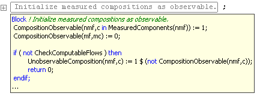

.. _sec:exec.flow:

Flow Control Statements
=======================

.. rubric:: Six forms of flow control

Execution statements such as assignment statements, ``SOLVE`` statements
or data management statements are normally executed in their order of
appearance in the body of a procedure. However, the presence of control
flow statements can redirect the flow of execution as the need arises.
AIMMS provides six forms of flow control:

-  the ``IF-THEN-ELSE`` statement for conditional execution,

-  the ``WHILE`` statement for repetitive conditional execution,

-  the ``REPEAT`` statement for repetitive unconditional execution,

-  the ``FOR`` statement for repetitive domain-driven execution,

-  the ``SWITCH`` statement for branching on set and integer values,

-  the ``HALT`` and ``RETURN`` statement for terminating the current
   execution,

-  the ``SKIP`` and ``BREAK`` statements for terminating the current
   repetitive execution, and

-  the ``BLOCK`` statement for visually grouping together multiple
   statements.

.. _flow-control-statement:

.. rubric:: Syntax

*flow-control-statement:*

.. raw:: html

	
	<?xml version="1.0" encoding="UTF-8" standalone="no"?>
	<svg
	   xmlns:dc="http://purl.org/dc/elements/1.1/"
	   xmlns:cc="http://creativecommons.org/ns#"
	   xmlns:rdf="http://www.w3.org/1999/02/22-rdf-syntax-ns#"
	   xmlns:svg="http://www.w3.org/2000/svg"
	   xmlns="http://www.w3.org/2000/svg"
	   viewBox="0 0 248.04308 347.20532"
	   height="347.20532"
	   width="248.04308"
	   xml:space="preserve"
	   id="svg2"
	   version="1.1"><metadata
	     id="metadata8"><rdf:RDF><cc:Work
	         rdf:about=""><dc:format>image/svg+xml</dc:format><dc:type
	           rdf:resource="http://purl.org/dc/dcmitype/StillImage" /></cc:Work></rdf:RDF></metadata><defs
	     id="defs6" /><g
	     transform="matrix(1.3333333,0,0,-1.3333333,0,2280.2671)"
	     id="g10"><g
	       transform="scale(0.1)"
	       id="g12"><g
	         transform="scale(1.04294)"
	         id="g14"><path
	           id="path16"
	           style="fill:#ffffff;fill-opacity:1;fill-rule:nonzero;stroke:none"
	           d="m 115.059,16300 -19.1766,-47.9 h 38.3526" /></g><path
	         id="path18"
	         style="fill:#000000;fill-opacity:1;fill-rule:nonzero;stroke:none"
	         d="m 320,14900 -50,20 v -40" /><g
	         transform="scale(10)"
	         id="g20"><text
	           id="text24"
	           style="font-style:italic;font-variant:normal;font-size:11px;font-family:'Lucida Sans';-inkscape-font-specification:LucidaSans-Italic;writing-mode:lr-tb;fill:#d22d2d;fill-opacity:1;fill-rule:nonzero;stroke:none"
	           transform="matrix(1,0,0,-1,37,1486)"><tspan
	             id="tspan22"
	             y="0"
	             x="0"><a href="https://documentation.aimms.com/language-reference/procedural-language-components/execution-statements/flow-control-statements.html#skip-break-statement">skip-break-statement</a></tspan></text>
	</g><path
	         id="path26"
	         style="fill:#ffffff;fill-opacity:1;fill-rule:nonzero;stroke:none"
	         d="m 1540.32,14900 50,-20 v 40" /><g
	         transform="scale(1.04294)"
	         id="g28"><path
	           id="path30"
	           style="fill:#000000;fill-opacity:1;fill-rule:nonzero;stroke:none"
	           d="m 1668.66,16300 -19.18,-47.9 h 38.36" /></g><g
	         transform="scale(1.04417)"
	         id="g32"><path
	           id="path34"
	           style="fill:#000000;fill-opacity:1;fill-rule:nonzero;stroke:none"
	           d="m 287.272,16280.8 -47.885,19.2 v -38.3" /></g><g
	         transform="scale(10)"
	         id="g36"><text
	           id="text40"
	           style="font-style:italic;font-variant:normal;font-size:11px;font-family:'Lucida Sans';-inkscape-font-specification:LucidaSans-Italic;writing-mode:lr-tb;fill:#d22d2d;fill-opacity:1;fill-rule:nonzero;stroke:none"
	           transform="matrix(1,0,0,-1,34.9961,1696)"><tspan
	             id="tspan38"
	             y="0"
	             x="0"><a href="https://documentation.aimms.com/language-reference/procedural-language-components/execution-statements/flow-control-statements.html#if-then-else-statement">if-then-else-statement</a></tspan></text>
	</g><g
	         transform="scale(1.04417)"
	         id="g42"><path
	           id="path44"
	           style="fill:#ffffff;fill-opacity:1;fill-rule:nonzero;stroke:none"
	           d="m 1494.35,16280.8 47.89,-19.1 v 38.3" /></g><g
	         transform="scale(1.04294)"
	         id="g46"><path
	           id="path48"
	           style="fill:#ffffff;fill-opacity:1;fill-rule:nonzero;stroke:none"
	           d="m 115.059,16300 -19.1766,-47.9 h 38.3526" /></g><g
	         transform="scale(1.02577)"
	         id="g50"><path
	           id="path52"
	           style="fill:#000000;fill-opacity:1;fill-rule:nonzero;stroke:none"
	           d="m 448.483,16280.5 -48.744,19.5 v -39" /></g><g
	         transform="scale(10)"
	         id="g54"><text
	           id="text58"
	           style="font-style:italic;font-variant:normal;font-size:11px;font-family:'Lucida Sans';-inkscape-font-specification:LucidaSans-Italic;writing-mode:lr-tb;fill:#d22d2d;fill-opacity:1;fill-rule:nonzero;stroke:none"
	           transform="matrix(1,0,0,-1,51.0039,1666)"><tspan
	             id="tspan56"
	             y="0"
	             x="0"><a href="https://documentation.aimms.com/language-reference/procedural-language-components/execution-statements/flow-control-statements.html#while-statement">while-statement</a></tspan></text>
	</g><g
	         transform="scale(1.02577)"
	         id="g60"><path
	           id="path62"
	           style="fill:#ffffff;fill-opacity:1;fill-rule:nonzero;stroke:none"
	           d="m 1365.1,16280.5 48.75,-19.5 v 39" /></g><g
	         transform="scale(1.04294)"
	         id="g64"><path
	           id="path66"
	           style="fill:#000000;fill-opacity:1;fill-rule:nonzero;stroke:none"
	           d="m 1668.66,16300 -19.18,-47.9 h 38.36" /></g><g
	         transform="scale(1.04294)"
	         id="g68"><path
	           id="path70"
	           style="fill:#ffffff;fill-opacity:1;fill-rule:nonzero;stroke:none"
	           d="m 115.059,16300 -19.1766,-47.9 h 38.3526" /></g><g
	         transform="scale(1.00736)"
	         id="g72"><path
	           id="path74"
	           style="fill:#000000;fill-opacity:1;fill-rule:nonzero;stroke:none"
	           d="m 423.503,16280.1 -49.634,19.9 v -39.7" /></g><g
	         transform="scale(10)"
	         id="g76"><text
	           id="text80"
	           style="font-style:italic;font-variant:normal;font-size:11px;font-family:'Lucida Sans';-inkscape-font-specification:LucidaSans-Italic;writing-mode:lr-tb;fill:#d22d2d;fill-opacity:1;fill-rule:nonzero;stroke:none"
	           transform="matrix(1,0,0,-1,47.6621,1636)"><tspan
	             id="tspan78"
	             y="0"
	             x="0"><a href="https://documentation.aimms.com/language-reference/procedural-language-components/execution-statements/flow-control-statements.html#repeat-statement">repeat-statement</a></tspan></text>
	</g><g
	         transform="scale(1.00736)"
	         id="g82"><path
	           id="path84"
	           style="fill:#ffffff;fill-opacity:1;fill-rule:nonzero;stroke:none"
	           d="m 1423.22,16280.1 49.64,-19.8 v 39.7" /></g><g
	         transform="scale(1.04294)"
	         id="g86"><path
	           id="path88"
	           style="fill:#000000;fill-opacity:1;fill-rule:nonzero;stroke:none"
	           d="m 1668.66,16300 -19.18,-47.9 h 38.36" /></g><g
	         transform="scale(1.04294)"
	         id="g90"><path
	           id="path92"
	           style="fill:#ffffff;fill-opacity:1;fill-rule:nonzero;stroke:none"
	           d="m 115.059,16300 -19.1766,-47.9 h 38.3526" /></g><path
	         id="path94"
	         style="fill:#000000;fill-opacity:1;fill-rule:nonzero;stroke:none"
	         d="m 526.699,16100 -50,20 v -40" /><g
	         transform="scale(10)"
	         id="g96"><text
	           id="text100"
	           style="font-style:italic;font-variant:normal;font-size:11px;font-family:'Lucida Sans';-inkscape-font-specification:LucidaSans-Italic;writing-mode:lr-tb;fill:#d22d2d;fill-opacity:1;fill-rule:nonzero;stroke:none"
	           transform="matrix(1,0,0,-1,57.6699,1606)"><tspan
	             id="tspan98"
	             y="0"
	             x="0"><a href="https://documentation.aimms.com/language-reference/procedural-language-components/execution-statements/flow-control-statements.html#for-statement">for-statement</a></tspan></text>
	</g><path
	         id="path102"
	         style="fill:#ffffff;fill-opacity:1;fill-rule:nonzero;stroke:none"
	         d="m 1333.62,16100 50,-20 v 40" /><g
	         transform="scale(1.04294)"
	         id="g104"><path
	           id="path106"
	           style="fill:#000000;fill-opacity:1;fill-rule:nonzero;stroke:none"
	           d="m 1668.66,16300 -19.18,-47.9 h 38.36" /></g><g
	         transform="scale(1.04294)"
	         id="g108"><path
	           id="path110"
	           style="fill:#ffffff;fill-opacity:1;fill-rule:nonzero;stroke:none"
	           d="m 115.059,16300 -19.1766,-47.9 h 38.3526" /></g><path
	         id="path112"
	         style="fill:#000000;fill-opacity:1;fill-rule:nonzero;stroke:none"
	         d="m 430.039,15800 -50,20 v -40" /><g
	         transform="scale(10)"
	         id="g114"><text
	           id="text118"
	           style="font-style:italic;font-variant:normal;font-size:11px;font-family:'Lucida Sans';-inkscape-font-specification:LucidaSans-Italic;writing-mode:lr-tb;fill:#d22d2d;fill-opacity:1;fill-rule:nonzero;stroke:none"
	           transform="matrix(1,0,0,-1,48.0039,1576)"><tspan
	             id="tspan116"
	             y="0"
	             x="0"><a href="https://documentation.aimms.com/language-reference/procedural-language-components/execution-statements/flow-control-statements.html#switch-statement">switch-statement</a></tspan></text>
	</g><path
	         id="path120"
	         style="fill:#ffffff;fill-opacity:1;fill-rule:nonzero;stroke:none"
	         d="m 1430.28,15800 50,-20 v 40" /><g
	         transform="scale(1.04294)"
	         id="g122"><path
	           id="path124"
	           style="fill:#000000;fill-opacity:1;fill-rule:nonzero;stroke:none"
	           d="m 1668.66,16300 -19.18,-47.9 h 38.36" /></g><g
	         transform="scale(1.04294)"
	         id="g126"><path
	           id="path128"
	           style="fill:#ffffff;fill-opacity:1;fill-rule:nonzero;stroke:none"
	           d="m 115.059,16300 -19.1766,-47.9 h 38.3526" /></g><path
	         id="path130"
	         style="fill:#000000;fill-opacity:1;fill-rule:nonzero;stroke:none"
	         d="m 500,15500 -50,20 v -40" /><g
	         transform="scale(10)"
	         id="g132"><text
	           id="text136"
	           style="font-style:italic;font-variant:normal;font-size:11px;font-family:'Lucida Sans';-inkscape-font-specification:LucidaSans-Italic;writing-mode:lr-tb;fill:#d22d2d;fill-opacity:1;fill-rule:nonzero;stroke:none"
	           transform="matrix(1,0,0,-1,55,1546)"><tspan
	             id="tspan134"
	             y="0"
	             x="0"><a href="https://documentation.aimms.com/language-reference/procedural-language-components/execution-statements/flow-control-statements.html#halt-statement">halt-statement</a></tspan></text>
	</g><path
	         id="path138"
	         style="fill:#ffffff;fill-opacity:1;fill-rule:nonzero;stroke:none"
	         d="m 1360.32,15500 50,-20 v 40" /><g
	         transform="scale(1.04294)"
	         id="g140"><path
	           id="path142"
	           style="fill:#000000;fill-opacity:1;fill-rule:nonzero;stroke:none"
	           d="m 1668.66,16300 -19.18,-47.9 h 38.36" /></g><g
	         transform="scale(1.04294)"
	         id="g144"><path
	           id="path146"
	           style="fill:#ffffff;fill-opacity:1;fill-rule:nonzero;stroke:none"
	           d="m 115.059,16300 -19.1766,-47.9 h 38.3526" /></g><path
	         id="path148"
	         style="fill:#000000;fill-opacity:1;fill-rule:nonzero;stroke:none"
	         d="m 440,15200 -50,20 v -40" /><g
	         transform="scale(10)"
	         id="g150"><text
	           id="text154"
	           style="font-style:italic;font-variant:normal;font-size:11px;font-family:'Lucida Sans';-inkscape-font-specification:LucidaSans-Italic;writing-mode:lr-tb;fill:#d22d2d;fill-opacity:1;fill-rule:nonzero;stroke:none"
	           transform="matrix(1,0,0,-1,49,1516)"><tspan
	             id="tspan152"
	             y="0"
	             x="0"><a href="https://documentation.aimms.com/language-reference/procedural-language-components/procedures-and-functions/internal-procedures.html#return-statement">return-statement</a></tspan></text>
	</g><path
	         id="path156"
	         style="fill:#ffffff;fill-opacity:1;fill-rule:nonzero;stroke:none"
	         d="m 1420.32,15200 50,-20 v 40" /><g
	         transform="scale(1.04294)"
	         id="g158"><path
	           id="path160"
	           style="fill:#000000;fill-opacity:1;fill-rule:nonzero;stroke:none"
	           d="m 1668.66,16300 -19.18,-47.9 h 38.36" /></g><g
	         transform="scale(1.04294)"
	         id="g162"><path
	           id="path164"
	           style="fill:#ffffff;fill-opacity:1;fill-rule:nonzero;stroke:none"
	           d="m 115.059,16300 -19.1766,-47.9 h 38.3526" /></g><path
	         id="path166"
	         style="fill:#000000;fill-opacity:1;fill-rule:nonzero;stroke:none"
	         d="m 456.68,14600 -50,20 v -40" /><g
	         transform="scale(10)"
	         id="g168"><text
	           id="text172"
	           style="font-style:italic;font-variant:normal;font-size:11px;font-family:'Lucida Sans';-inkscape-font-specification:LucidaSans-Italic;writing-mode:lr-tb;fill:#d22d2d;fill-opacity:1;fill-rule:nonzero;stroke:none"
	           transform="matrix(1,0,0,-1,50.668,1456)"><tspan
	             id="tspan170"
	             y="0"
	             x="0"><a href="https://documentation.aimms.com/language-reference/procedural-language-components/execution-statements/flow-control-statements.html#block-statement">block-statement</a></tspan></text>
	</g><path
	         id="path174"
	         style="fill:#ffffff;fill-opacity:1;fill-rule:nonzero;stroke:none"
	         d="m 1403.64,14600 50,-20 v 40" /><g
	         transform="scale(1.04294)"
	         id="g176"><path
	           id="path178"
	           style="fill:#000000;fill-opacity:1;fill-rule:nonzero;stroke:none"
	           d="m 1668.66,16300 -19.18,-47.9 h 38.36" /></g><g
	         transform="scale(1.04417)"
	         id="g180"><path
	           id="path182"
	           style="fill:#000000;fill-opacity:1;fill-rule:nonzero;stroke:none"
	           d="m 1781.62,16280.8 -47.88,19.2 v -38.3" /></g><g
	         transform="scale(1.04908)"
	         id="g184"><path
	           id="path186"
	           style="fill:none;stroke:#000000;stroke-width:3.81287003;stroke-linecap:butt;stroke-linejoin:round;stroke-miterlimit:10;stroke-dasharray:none;stroke-opacity:1"
	           d="m 0,16204.7 h 114.386 m 0,0 v -1906.5 c 0,-52.6 42.679,-95.3 95.322,-95.3 v 0 h 95.321 v 95.3 H 1468.23 v -95.3 -95.3 H 305.029 v 95.3 m 1163.231,0 h 95.32 v 0 c 52.64,0 95.32,42.7 95.32,95.3 v 1906.5 m -1544.514,0 h 95.322 -19.102 95.322 v 95.3 H 1487.33 v -95.3 -95.3 H 285.928 v 95.3 m 1201.432,0 h 95.32 76.22 m -1544.514,0 V 16014 c 0,-52.6 42.679,-95.3 95.322,-95.3 h 133.487 95.322 v 95.3 h 896.223 v -95.3 -95.3 H 438.517 v 95.3 m 896.253,0 h 95.32 133.49 c 52.64,0 95.32,42.7 95.32,95.3 v 190.7 m -1544.514,0 v -476.6 c 0,-52.7 42.679,-95.4 95.322,-95.4 h 101.633 95.321 v 95.4 h 959.948 v -95.4 -95.3 H 406.662 v 95.3 m 959.968,0 h 95.32 101.63 c 52.64,0 95.32,42.7 95.32,95.4 v 476.6 m -1544.514,0 v -762.6 c 0,-52.6 42.679,-95.3 95.322,-95.3 h 197.029 95.321 v 95.3 h 769.152 v -95.3 -95.3 H 502.058 v 95.3 m 769.172,0 h 95.32 197.03 c 52.64,0 95.32,42.7 95.32,95.3 v 762.6 m -1544.514,0 v -1048.6 c 0,-52.6 42.679,-95.3 95.322,-95.3 h 104.891 95.321 v 95.3 h 953.43 v -95.3 -95.3 H 409.92 v 95.3 m 953.44,0 h 95.33 104.89 c 52.64,0 95.32,42.7 95.32,95.3 v 1048.6 m -1544.514,0 v -1334.5 c 0,-52.7 42.679,-95.3 95.322,-95.3 h 171.579 95.321 v 95.3 h 820.052 v -95.3 -95.4 H 476.608 v 95.4 m 820.072,0 h 95.32 171.58 c 52.64,0 95.32,42.6 95.32,95.3 v 1334.5 m -1544.514,0 v -1620.5 c 0,-52.6 42.679,-95.3 95.322,-95.3 h 114.386 95.321 v 95.3 h 934.435 v -95.3 -95.3 H 419.415 v 95.3 m 934.455,0 h 95.32 114.39 c 52.64,0 95.32,42.7 95.32,95.3 v 1620.5 m -1544.514,0 v -2192.4 c 0,-52.7 42.679,-95.3 95.322,-95.3 h 130.285 95.322 v 95.3 h 902.635 v -95.3 -95.4 H 435.315 v 95.4 m 902.655,0 h 95.32 130.29 c 52.64,0 95.32,42.6 95.32,95.3 v 2192.4 h 114.39" /></g></g></g></svg>

.. rubric:: Flow control statements and special numbers

In the condition of flow control statements such as ``IF-THEN-ELSE``,
``WHILE`` and ``REPEAT`` it is needed to know whether the result is
equal to ``0.0`` or not in order to take the appropriate branch of
execution. The special number ``NA`` has the interpretation "not yet
available" thus it is also not yet known whether it is equal to 0.0 or
not. The special number ``UNDF`` is the result of an illegal operation,
so its value cannot be known. Therefor, AIMMS will issue an error
message if the result of a condition in these statements evaluates to
``NA`` or ``UNDF``. Special numbers and their interpretation as logical
values are discussed in full detail in :ref:`sec:expr.num.arith-ext` and
:ref:`sec:expr.logic`.

.. _sec:exec.flow.if:

The ``IF-THEN-ELSE`` Statement
------------------------------

.. _if:

.. _then:

.. _else:

.. _endif:

The conditional ``IF-THEN-ELSE`` statement is used to choose between the
execution of several groups of statements depending on the outcome of
one or more logical conditions. The syntax of the ``IF-THEN-ELSE``
statement is given in the following diagram.

.. _if-then-else-statement:

.. rubric:: Syntax

*if-then-else-statement:*

.. raw:: html

	
	<?xml version="1.0" encoding="UTF-8" standalone="no"?>
	<svg
	   xmlns:dc="http://purl.org/dc/elements/1.1/"
	   xmlns:cc="http://creativecommons.org/ns#"
	   xmlns:rdf="http://www.w3.org/1999/02/22-rdf-syntax-ns#"
	   xmlns:svg="http://www.w3.org/2000/svg"
	   xmlns="http://www.w3.org/2000/svg"
	   viewBox="0 0 572.65603 193.86666"
	   height="193.86667"
	   width="572.65601"
	   xml:space="preserve"
	   id="svg2"
	   version="1.1"><metadata
	     id="metadata8"><rdf:RDF><cc:Work
	         rdf:about=""><dc:format>image/svg+xml</dc:format><dc:type
	           rdf:resource="http://purl.org/dc/dcmitype/StillImage" /></cc:Work></rdf:RDF></metadata><defs
	     id="defs6" /><g
	     transform="matrix(1.3333333,0,0,-1.3333333,0,806.93331)"
	     id="g10"><g
	       transform="scale(0.1)"
	       id="g12"><path
	         id="path14"
	         style="fill:#000000;fill-opacity:1;fill-rule:nonzero;stroke:none"
	         d="m 120,5500 -50,20 v -40" /><g
	         transform="scale(10)"
	         id="g16"><text
	           id="text20"
	           style="font-variant:normal;font-size:12px;font-family:'Courier New';-inkscape-font-specification:LucidaSans-Typewriter;writing-mode:lr-tb;fill:#000000;fill-opacity:1;fill-rule:nonzero;stroke:none"
	           transform="matrix(1,0,0,-1,17,546)"><tspan
	             id="tspan18"
	             y="0"
	             x="0">IF</tspan></text>
	</g><path
	         id="path22"
	         style="fill:#ffffff;fill-opacity:1;fill-rule:nonzero;stroke:none"
	         d="m 364,5500 50,-20 v 40" /><path
	         id="path24"
	         style="fill:#000000;fill-opacity:1;fill-rule:nonzero;stroke:none"
	         d="m 604,5500 -50,20 v -40" /><g
	         transform="scale(10)"
	         id="g26"><text
	           id="text30"
	           style="font-style:italic;font-variant:normal;font-size:11px;font-family:'Lucida Sans';-inkscape-font-specification:LucidaSans-Italic;writing-mode:lr-tb;fill:#d22d2d;fill-opacity:1;fill-rule:nonzero;stroke:none"
	           transform="matrix(1,0,0,-1,65.4,546)"><tspan
	             id="tspan28"
	             y="0"
	             x="0"><a href="https://documentation.aimms.com/language-reference/non-procedural-language-components/numerical-and-logical-expressions/logical-expressions.html#logical-expression">logical-expression</a></tspan></text>
	</g><path
	         id="path32"
	         style="fill:#ffffff;fill-opacity:1;fill-rule:nonzero;stroke:none"
	         d="m 1664.24,5500 50,-20 v 40" /><path
	         id="path34"
	         style="fill:#000000;fill-opacity:1;fill-rule:nonzero;stroke:none"
	         d="m 1784.24,5500 -50,20 v -40" /><g
	         transform="scale(10)"
	         id="g36"><text
	           id="text40"
	           style="font-variant:normal;font-size:12px;font-family:'Courier New';-inkscape-font-specification:LucidaSans-Typewriter;writing-mode:lr-tb;fill:#000000;fill-opacity:1;fill-rule:nonzero;stroke:none"
	           transform="matrix(1,0,0,-1,183.424,546)"><tspan
	             id="tspan38"
	             y="0"
	             x="0">THEN</tspan></text>
	</g><path
	         id="path42"
	         style="fill:#ffffff;fill-opacity:1;fill-rule:nonzero;stroke:none"
	         d="m 2172.24,5500 50,-20 v 40" /><path
	         id="path44"
	         style="fill:#000000;fill-opacity:1;fill-rule:nonzero;stroke:none"
	         d="m 2372.24,5500 -50,20 v -40" /><g
	         transform="scale(10)"
	         id="g46"><text
	           id="text50"
	           style="font-style:italic;font-variant:normal;font-size:11px;font-family:'Lucida Sans';-inkscape-font-specification:LucidaSans-Italic;writing-mode:lr-tb;fill:#d22d2d;fill-opacity:1;fill-rule:nonzero;stroke:none"
	           transform="matrix(1,0,0,-1,242.224,546)"><tspan
	             id="tspan48"
	             y="0"
	             x="0"><a href="https://documentation.aimms.com/language-reference/procedural-language-components/execution-statements/procedural-and-nonprocedural-execution.html#statement">statement</a></tspan></text>
	</g><path
	         id="path52"
	         style="fill:#ffffff;fill-opacity:1;fill-rule:nonzero;stroke:none"
	         d="m 2999.16,5500 50,-20 v 40" /><path
	         id="path54"
	         style="fill:#000000;fill-opacity:1;fill-rule:nonzero;stroke:none"
	         d="m 2292.24,5500 20,50 h -40" /><path
	         id="path56"
	         style="fill:#ffffff;fill-opacity:1;fill-rule:nonzero;stroke:none"
	         d="m 3079.16,5500 20,50 h -40" /><path
	         id="path58"
	         style="fill:#000000;fill-opacity:1;fill-rule:nonzero;stroke:none"
	         d="m 484,5500 20,50 h -40" /><path
	         id="path60"
	         style="fill:#ffffff;fill-opacity:1;fill-rule:nonzero;stroke:none"
	         d="m 1575.58,5950 -50,20 v -40" /><g
	         transform="scale(10)"
	         id="g62"><text
	           id="text66"
	           style="font-variant:normal;font-size:12px;font-family:'Courier New';-inkscape-font-specification:LucidaSans-Typewriter;writing-mode:lr-tb;fill:#000000;fill-opacity:1;fill-rule:nonzero;stroke:none"
	           transform="matrix(1,0,0,-1,162.558,591)"><tspan
	             id="tspan64"
	             y="0"
	             x="0">ELSEIF</tspan></text>
	</g><path
	         id="path68"
	         style="fill:#000000;fill-opacity:1;fill-rule:nonzero;stroke:none"
	         d="m 2107.58,5950 50,-20 v 40" /><path
	         id="path70"
	         style="fill:#ffffff;fill-opacity:1;fill-rule:nonzero;stroke:none"
	         d="m 3199.16,5500 20,50 h -40" /><path
	         id="path72"
	         style="fill:none;stroke:#000000;stroke-width:4;stroke-linecap:butt;stroke-linejoin:round;stroke-miterlimit:10;stroke-dasharray:40, 20;stroke-dashoffset:0;stroke-opacity:1"
	         d="m 3319.16,5500 h 240" /><path
	         id="path74"
	         style="fill:none;stroke:#000000;stroke-width:4;stroke-linecap:butt;stroke-linejoin:round;stroke-miterlimit:10;stroke-dasharray:40, 20;stroke-dashoffset:0;stroke-opacity:1"
	         d="m 1500,4900 h 240" /><path
	         id="path76"
	         style="fill:#000000;fill-opacity:1;fill-rule:nonzero;stroke:none"
	         d="m 1940,4900 -50,20 v -40" /><g
	         transform="scale(10)"
	         id="g78"><text
	           id="text82"
	           style="font-variant:normal;font-size:12px;font-family:'Courier New';-inkscape-font-specification:LucidaSans-Typewriter;writing-mode:lr-tb;fill:#000000;fill-opacity:1;fill-rule:nonzero;stroke:none"
	           transform="matrix(1,0,0,-1,199,486)"><tspan
	             id="tspan80"
	             y="0"
	             x="0">ELSE</tspan></text>
	</g><path
	         id="path84"
	         style="fill:#ffffff;fill-opacity:1;fill-rule:nonzero;stroke:none"
	         d="m 2328,4900 50,-20 v 40" /><path
	         id="path86"
	         style="fill:#000000;fill-opacity:1;fill-rule:nonzero;stroke:none"
	         d="m 2488,4900 -50,20 v -40" /><g
	         transform="scale(10)"
	         id="g88"><text
	           id="text92"
	           style="font-style:italic;font-variant:normal;font-size:11px;font-family:'Lucida Sans';-inkscape-font-specification:LucidaSans-Italic;writing-mode:lr-tb;fill:#d22d2d;fill-opacity:1;fill-rule:nonzero;stroke:none"
	           transform="matrix(1,0,0,-1,253.8,486)"><tspan
	             id="tspan90"
	             y="0"
	             x="0"><a href="https://documentation.aimms.com/language-reference/procedural-language-components/execution-statements/procedural-and-nonprocedural-execution.html#statement">statement</a></tspan></text>
	</g><path
	         id="path94"
	         style="fill:#ffffff;fill-opacity:1;fill-rule:nonzero;stroke:none"
	         d="m 3114.92,4900 50,-20 v 40" /><path
	         id="path96"
	         style="fill:#000000;fill-opacity:1;fill-rule:nonzero;stroke:none"
	         d="m 2408,4900 20,50 h -40" /><path
	         id="path98"
	         style="fill:#ffffff;fill-opacity:1;fill-rule:nonzero;stroke:none"
	         d="m 3194.92,4900 20,50 h -40" /><path
	         id="path100"
	         style="fill:#ffffff;fill-opacity:1;fill-rule:nonzero;stroke:none"
	         d="m 1860,4900 -20,-50 h 40" /><path
	         id="path102"
	         style="fill:#000000;fill-opacity:1;fill-rule:nonzero;stroke:none"
	         d="m 3274.92,4900 -20,-50 h 40" /><path
	         id="path104"
	         style="fill:#000000;fill-opacity:1;fill-rule:nonzero;stroke:none"
	         d="m 3394.92,4900 -50,20 v -40" /><g
	         transform="scale(10)"
	         id="g106"><text
	           id="text110"
	           style="font-variant:normal;font-size:12px;font-family:'Courier New';-inkscape-font-specification:LucidaSans-Typewriter;writing-mode:lr-tb;fill:#000000;fill-opacity:1;fill-rule:nonzero;stroke:none"
	           transform="matrix(1,0,0,-1,344.492,486)"><tspan
	             id="tspan108"
	             y="0"
	             x="0">ENDIF</tspan></text>
	</g><path
	         id="path112"
	         style="fill:#ffffff;fill-opacity:1;fill-rule:nonzero;stroke:none"
	         d="m 3854.92,4900 50,-20 v 40" /><path
	         id="path114"
	         style="fill:#000000;fill-opacity:1;fill-rule:nonzero;stroke:none"
	         d="m 3974.92,4900 -50,20 v -40" /><g
	         transform="scale(10)"
	         id="g116"><text
	           id="text120"
	           style="font-variant:normal;font-size:12px;font-family:'Courier New';-inkscape-font-specification:LucidaSans-Typewriter;writing-mode:lr-tb;fill:#000000;fill-opacity:1;fill-rule:nonzero;stroke:none"
	           transform="matrix(1,0,0,-1,403.892,486)"><tspan
	             id="tspan118"
	             y="0"
	             x="0">;</tspan></text>
	</g><path
	         id="path122"
	         style="fill:#ffffff;fill-opacity:1;fill-rule:nonzero;stroke:none"
	         d="m 4174.92,4900 50,-20 v 40" /><path
	         id="path124"
	         style="fill:#000000;fill-opacity:1;fill-rule:nonzero;stroke:none"
	         d="m 4294.92,4900 -50,20 v -40" /><path
	         id="path126"
	         style="fill:none;stroke:#000000;stroke-width:4;stroke-linecap:butt;stroke-linejoin:round;stroke-miterlimit:10;stroke-dasharray:none;stroke-opacity:1"
	         d="m 0,5500 h 120 v 0 c 0,55.23 44.773,100 100,100 h 44 c 55.227,0 100,-44.77 100,-100 v 0 0 c 0,-55.23 -44.773,-100 -100,-100 h -44 c -55.227,0 -100,44.77 -100,100 v 0 m 244,0 h 120 m 0,0 v 0 h 120 v 100 H 1664.21 V 5500 5400 H 604 v 100 m 1060.24,0 h 120 v 0 c 0,55.23 44.77,100 100,100 h 188 c 55.22,0 100,-44.77 100,-100 v 0 0 c 0,-55.23 -44.78,-100 -100,-100 h -188 c -55.23,0 -100,44.77 -100,100 v 0 m 388,0 h 120 m 0,0 v 0 h 80 v 100 h 626.91 v -100 -100 h -626.91 v 100 m 626.92,0 h 80 m -786.92,0 v 200 c 0,55.23 44.77,100 100,100 h 253.46 80 253.46 c 55.23,0 100,-44.77 100,-100 v -200 h 120 M 484,5500 v 350 c 0,55.23 44.773,100 100,100 h 871.58 120 v 0 c 0,55.23 44.78,100 100,100 h 332 c 55.23,0 100,-44.77 100,-100 v 0 0 c 0,-55.23 -44.77,-100 -100,-100 h -332 c -55.22,0 -100,44.77 -100,100 v 0 m 532,0 h 120 871.58 c 55.23,0 100,-44.77 100,-100 v -350 h 120 M 1740,4900 h 120 m 0,0 v 0 h 80 v 0 c 0,55.23 44.77,100 100,100 h 188 c 55.23,0 100,-44.77 100,-100 v 0 0 c 0,-55.23 -44.77,-100 -100,-100 h -188 c -55.23,0 -100,44.77 -100,100 v 0 m 388,0 h 80 m 0,0 v 0 h 80 v 100 h 626.91 V 4900 4800 H 2488 v 100 m 626.92,0 h 80 m -786.92,0 v 200 c 0,55.23 44.77,100 100,100 h 253.46 80 253.46 c 55.23,0 100,-44.77 100,-100 v -200 h 80 M 1860,4900 v -200 c 0,-55.23 44.77,-100 100,-100 h 567.46 80 567.46 c 55.23,0 100,44.77 100,100 v 200 h 120 v 0 c 0,55.23 44.78,100 100,100 h 260 c 55.23,0 100,-44.77 100,-100 v 0 0 c 0,-55.23 -44.77,-100 -100,-100 h -260 c -55.22,0 -100,44.77 -100,100 v 0 m 460,0 h 120 v 0 c 0,55.23 44.78,100 100,100 v 0 c 55.23,0 100,-44.77 100,-100 v 0 0 c 0,-55.23 -44.77,-100 -100,-100 v 0 c -55.22,0 -100,44.77 -100,100 v 0 m 200,0 h 120" /></g></g></svg>

AIMMS will evaluate all logical conditions in succession and stops at
the first condition that is satisfied. The statements associated with
that particular branch are executed. If none of the conditions is
satisfied, the statements of the ``ELSE`` branch, if present, will be
executed.

.. rubric:: Example

The following code illustrates the use of the ``IF-THEN-ELSE``
statement.

.. code-block:: aimms

	if ( not SupplyDepot ) then
	    DialogMessage( "Select a supply depot before solving the model" );
	elseif ( Exists[ p, Supply(SupplyDepot,p) < Sum( i, Demand(i,p) ) ] ) then
	    DialogMessage( "The selected supply depot has insufficient capacity" );
	else
	    solve TransportModel ;
	endif ;

Note that in this particular example the evaluation of the ``ELSEIF``
condition only makes sense when a ``SupplyDepot`` exists. This is
automatically enforced because the ``IF`` condition is not satisfied.
Similarly, successful execution of the ``ELSE`` branch apparently
depends on the failure of both the ``IF`` and ``ELSEIF`` conditions.

.. _sec:exec.flow.while-repeat:

The ``WHILE`` and ``REPEAT`` Statements
---------------------------------------

.. _while:

.. _endwhile:

.. _repeat:

.. _endrepeat:

The ``WHILE`` and ``REPEAT`` statements group a series of execution
statements and execute them repeatedly. The execution of the repetitive
loop can be terminated by a logical condition that is part of the
``WHILE`` statement, or by means of a ``BREAK`` statement from within
both the ``WHILE`` and ``REPEAT`` statements.

.. _while-statement:

.. rubric:: Syntax

*while-statement:*

.. raw:: html

	
	<?xml version="1.0" encoding="UTF-8" standalone="no"?>
	<svg
	   xmlns:dc="http://purl.org/dc/elements/1.1/"
	   xmlns:cc="http://creativecommons.org/ns#"
	   xmlns:rdf="http://www.w3.org/1999/02/22-rdf-syntax-ns#"
	   xmlns:svg="http://www.w3.org/2000/svg"
	   xmlns="http://www.w3.org/2000/svg"
	   viewBox="0 0 595.05599 133.86666"
	   height="133.86667"
	   width="595.05597"
	   xml:space="preserve"
	   id="svg2"
	   version="1.1"><metadata
	     id="metadata8"><rdf:RDF><cc:Work
	         rdf:about=""><dc:format>image/svg+xml</dc:format><dc:type
	           rdf:resource="http://purl.org/dc/dcmitype/StillImage" /></cc:Work></rdf:RDF></metadata><defs
	     id="defs6" /><g
	     transform="matrix(1.3333333,0,0,-1.3333333,0,813.59998)"
	     id="g10"><g
	       transform="scale(0.1)"
	       id="g12"><path
	         id="path14"
	         style="fill:#000000;fill-opacity:1;fill-rule:nonzero;stroke:none"
	         d="m 120,6000 -50,20 v -40" /><g
	         transform="scale(10)"
	         id="g16"><text
	           id="text20"
	           style="font-variant:normal;font-size:12px;font-family:'Courier New';-inkscape-font-specification:LucidaSans-Typewriter;writing-mode:lr-tb;fill:#000000;fill-opacity:1;fill-rule:nonzero;stroke:none"
	           transform="matrix(1,0,0,-1,17,596)"><tspan
	             id="tspan18"
	             y="0"
	             x="0">WHILE</tspan></text>
	</g><path
	         id="path22"
	         style="fill:#ffffff;fill-opacity:1;fill-rule:nonzero;stroke:none"
	         d="m 580,6000 50,-20 v 40" /><path
	         id="path24"
	         style="fill:#000000;fill-opacity:1;fill-rule:nonzero;stroke:none"
	         d="m 700,6000 -50,20 v -40" /><g
	         transform="scale(10)"
	         id="g26"><text
	           id="text30"
	           style="font-style:italic;font-variant:normal;font-size:11px;font-family:'Lucida Sans';-inkscape-font-specification:LucidaSans-Italic;writing-mode:lr-tb;fill:#d22d2d;fill-opacity:1;fill-rule:nonzero;stroke:none"
	           transform="matrix(1,0,0,-1,75,596)"><tspan
	             id="tspan28"
	             y="0"
	             x="0"><a href="https://documentation.aimms.com/language-reference/non-procedural-language-components/numerical-and-logical-expressions/logical-expressions.html#logical-expression">logical-expression</a></tspan></text>
	</g><path
	         id="path32"
	         style="fill:#ffffff;fill-opacity:1;fill-rule:nonzero;stroke:none"
	         d="m 1760.24,6000 50,-20 v 40" /><path
	         id="path34"
	         style="fill:#000000;fill-opacity:1;fill-rule:nonzero;stroke:none"
	         d="m 1880.24,6000 -50,20 v -40" /><g
	         transform="scale(10)"
	         id="g36"><text
	           id="text40"
	           style="font-variant:normal;font-size:12px;font-family:'Courier New';-inkscape-font-specification:LucidaSans-Typewriter;writing-mode:lr-tb;fill:#000000;fill-opacity:1;fill-rule:nonzero;stroke:none"
	           transform="matrix(1,0,0,-1,193.024,596)"><tspan
	             id="tspan38"
	             y="0"
	             x="0">DO</tspan></text>
	</g><path
	         id="path42"
	         style="fill:#ffffff;fill-opacity:1;fill-rule:nonzero;stroke:none"
	         d="m 2124.24,6000 50,-20 v 40" /><path
	         id="path44"
	         style="fill:#000000;fill-opacity:1;fill-rule:nonzero;stroke:none"
	         d="m 2364.24,6000 -50,20 v -40" /><g
	         transform="scale(10)"
	         id="g46"><text
	           id="text50"
	           style="font-style:italic;font-variant:normal;font-size:11px;font-family:'Lucida Sans';-inkscape-font-specification:LucidaSans-Italic;writing-mode:lr-tb;fill:#d22d2d;fill-opacity:1;fill-rule:nonzero;stroke:none"
	           transform="matrix(1,0,0,-1,241.424,596)"><tspan
	             id="tspan48"
	             y="0"
	             x="0"><a href="https://documentation.aimms.com/language-reference/procedural-language-components/execution-statements/flow-control-statements.html#loop-string">loop-string</a></tspan></text>
	</g><path
	         id="path52"
	         style="fill:#ffffff;fill-opacity:1;fill-rule:nonzero;stroke:none"
	         d="m 3024.4,6000 50,-20 v 40" /><path
	         id="path54"
	         style="fill:#ffffff;fill-opacity:1;fill-rule:nonzero;stroke:none"
	         d="m 2244.24,6000 -20,-50 h 40" /><path
	         id="path56"
	         style="fill:#000000;fill-opacity:1;fill-rule:nonzero;stroke:none"
	         d="m 3144.4,6000 -20,-50 h 40" /><path
	         id="path58"
	         style="fill:none;stroke:#000000;stroke-width:4;stroke-linecap:butt;stroke-linejoin:round;stroke-miterlimit:10;stroke-dasharray:40, 20;stroke-dashoffset:0;stroke-opacity:1"
	         d="m 3264.4,6000 h 240" /><path
	         id="path60"
	         style="fill:none;stroke:#000000;stroke-width:4;stroke-linecap:butt;stroke-linejoin:round;stroke-miterlimit:10;stroke-dasharray:40, 20;stroke-dashoffset:0;stroke-opacity:1"
	         d="m 2000,5200 h 240" /><path
	         id="path62"
	         style="fill:#000000;fill-opacity:1;fill-rule:nonzero;stroke:none"
	         d="m 2480,5200 -50,20 v -40" /><g
	         transform="scale(10)"
	         id="g64"><text
	           id="text68"
	           style="font-style:italic;font-variant:normal;font-size:11px;font-family:'Lucida Sans';-inkscape-font-specification:LucidaSans-Italic;writing-mode:lr-tb;fill:#d22d2d;fill-opacity:1;fill-rule:nonzero;stroke:none"
	           transform="matrix(1,0,0,-1,253,516)"><tspan
	             id="tspan66"
	             y="0"
	             x="0"><a href="https://documentation.aimms.com/language-reference/procedural-language-components/execution-statements/procedural-and-nonprocedural-execution.html#statement">statement</a></tspan></text>
	</g><path
	         id="path70"
	         style="fill:#ffffff;fill-opacity:1;fill-rule:nonzero;stroke:none"
	         d="m 3106.92,5200 50,-20 v 40" /><path
	         id="path72"
	         style="fill:#000000;fill-opacity:1;fill-rule:nonzero;stroke:none"
	         d="m 2360,5200 20,50 h -40" /><path
	         id="path74"
	         style="fill:#ffffff;fill-opacity:1;fill-rule:nonzero;stroke:none"
	         d="m 3226.92,5200 20,50 h -40" /><path
	         id="path76"
	         style="fill:#000000;fill-opacity:1;fill-rule:nonzero;stroke:none"
	         d="m 3346.92,5200 -50,20 v -40" /><g
	         transform="scale(10)"
	         id="g78"><text
	           id="text82"
	           style="font-variant:normal;font-size:12px;font-family:'Courier New';-inkscape-font-specification:LucidaSans-Typewriter;writing-mode:lr-tb;fill:#000000;fill-opacity:1;fill-rule:nonzero;stroke:none"
	           transform="matrix(1,0,0,-1,339.692,516)"><tspan
	             id="tspan80"
	             y="0"
	             x="0">ENDWHILE</tspan></text>
	</g><path
	         id="path84"
	         style="fill:#ffffff;fill-opacity:1;fill-rule:nonzero;stroke:none"
	         d="m 4022.92,5200 50,-20 v 40" /><path
	         id="path86"
	         style="fill:#000000;fill-opacity:1;fill-rule:nonzero;stroke:none"
	         d="m 4142.92,5200 -50,20 v -40" /><g
	         transform="scale(10)"
	         id="g88"><text
	           id="text92"
	           style="font-variant:normal;font-size:12px;font-family:'Courier New';-inkscape-font-specification:LucidaSans-Typewriter;writing-mode:lr-tb;fill:#000000;fill-opacity:1;fill-rule:nonzero;stroke:none"
	           transform="matrix(1,0,0,-1,420.692,516)"><tspan
	             id="tspan90"
	             y="0"
	             x="0">;</tspan></text>
	</g><path
	         id="path94"
	         style="fill:#ffffff;fill-opacity:1;fill-rule:nonzero;stroke:none"
	         d="m 4342.92,5200 50,-20 v 40" /><path
	         id="path96"
	         style="fill:#000000;fill-opacity:1;fill-rule:nonzero;stroke:none"
	         d="m 4462.92,5200 -50,20 v -40" /><path
	         id="path98"
	         style="fill:none;stroke:#000000;stroke-width:4;stroke-linecap:butt;stroke-linejoin:round;stroke-miterlimit:10;stroke-dasharray:none;stroke-opacity:1"
	         d="m 0,6000 h 120 v 0 c 0,55.23 44.773,100 100,100 h 260 c 55.227,0 100,-44.77 100,-100 v 0 0 c 0,-55.23 -44.773,-100 -100,-100 H 220 c -55.227,0 -100,44.77 -100,100 v 0 m 460,0 h 120 v 100 H 1760.21 V 6000 5900 H 700 v 100 m 1060.24,0 h 120 v 0 c 0,55.23 44.77,100 100,100 h 44 c 55.22,0 100,-44.77 100,-100 v 0 0 c 0,-55.23 -44.78,-100 -100,-100 h -44 c -55.23,0 -100,44.77 -100,100 v 0 m 244,0 h 120 m 0,0 v 0 h 120 v 100 h 660.14 v -100 -100 h -660.14 v 100 m 660.16,0 h 120 m -900.16,0 v -200 c 0,-55.23 44.77,-100 100,-100 h 290.08 120 290.08 c 55.23,0 100,44.77 100,100 v 200 h 120 M 2240,5200 h 120 m 0,0 v 0 h 120 v 100 h 626.91 V 5200 5100 H 2480 v 100 m 626.92,0 h 120 m -866.92,0 v 200 c 0,55.23 44.77,100 100,100 h 273.46 120 273.46 c 55.23,0 100,-44.77 100,-100 v -200 h 120 v 0 c 0,55.23 44.78,100 100,100 h 476 c 55.23,0 100,-44.77 100,-100 v 0 0 c 0,-55.23 -44.77,-100 -100,-100 h -476 c -55.22,0 -100,44.77 -100,100 v 0 m 676,0 h 120 v 0 c 0,55.23 44.78,100 100,100 v 0 c 55.23,0 100,-44.77 100,-100 v 0 0 c 0,-55.23 -44.77,-100 -100,-100 v 0 c -55.22,0 -100,44.77 -100,100 v 0 m 200,0 h 120" /></g></g></svg>

.. _repeat-statement:

*repeat-statement:*

.. raw:: html

	
	<?xml version="1.0" encoding="UTF-8" standalone="no"?>
	<svg
	   xmlns:dc="http://purl.org/dc/elements/1.1/"
	   xmlns:cc="http://creativecommons.org/ns#"
	   xmlns:rdf="http://www.w3.org/1999/02/22-rdf-syntax-ns#"
	   xmlns:svg="http://www.w3.org/2000/svg"
	   xmlns="http://www.w3.org/2000/svg"
	   viewBox="0 0 528.94399 80.533332"
	   height="80.533333"
	   width="528.94397"
	   xml:space="preserve"
	   id="svg2"
	   version="1.1"><metadata
	     id="metadata8"><rdf:RDF><cc:Work
	         rdf:about=""><dc:format>image/svg+xml</dc:format><dc:type
	           rdf:resource="http://purl.org/dc/dcmitype/StillImage" /></cc:Work></rdf:RDF></metadata><defs
	     id="defs6" /><g
	     transform="matrix(1.3333333,0,0,-1.3333333,0,306.93333)"
	     id="g10"><g
	       transform="scale(0.1)"
	       id="g12"><path
	         id="path14"
	         style="fill:#000000;fill-opacity:1;fill-rule:nonzero;stroke:none"
	         d="m 120,2000 -50,20 v -40" /><g
	         transform="scale(10)"
	         id="g16"><text
	           id="text20"
	           style="font-variant:normal;font-size:12px;font-family:'Courier New';-inkscape-font-specification:LucidaSans-Typewriter;writing-mode:lr-tb;fill:#000000;fill-opacity:1;fill-rule:nonzero;stroke:none"
	           transform="matrix(1,0,0,-1,17,196)"><tspan
	             id="tspan18"
	             y="0"
	             x="0">REPEAT</tspan></text>
	</g><path
	         id="path22"
	         style="fill:#ffffff;fill-opacity:1;fill-rule:nonzero;stroke:none"
	         d="m 652,2000 50,-20 v 40" /><path
	         id="path24"
	         style="fill:#000000;fill-opacity:1;fill-rule:nonzero;stroke:none"
	         d="m 892,2000 -50,20 v -40" /><g
	         transform="scale(10)"
	         id="g26"><text
	           id="text30"
	           style="font-style:italic;font-variant:normal;font-size:11px;font-family:'Lucida Sans';-inkscape-font-specification:LucidaSans-Italic;writing-mode:lr-tb;fill:#d22d2d;fill-opacity:1;fill-rule:nonzero;stroke:none"
	           transform="matrix(1,0,0,-1,94.2,196)"><tspan
	             id="tspan28"
	             y="0"
	             x="0"><a href="https://documentation.aimms.com/language-reference/procedural-language-components/execution-statements/flow-control-statements.html#loop-string">loop-string</a></tspan></text>
	</g><path
	         id="path32"
	         style="fill:#ffffff;fill-opacity:1;fill-rule:nonzero;stroke:none"
	         d="m 1552.16,2000 50,-20 v 40" /><path
	         id="path34"
	         style="fill:#ffffff;fill-opacity:1;fill-rule:nonzero;stroke:none"
	         d="m 772,2000 -20,-50 h 40" /><path
	         id="path36"
	         style="fill:#000000;fill-opacity:1;fill-rule:nonzero;stroke:none"
	         d="m 1672.16,2000 -20,-50 h 40" /><path
	         id="path38"
	         style="fill:#000000;fill-opacity:1;fill-rule:nonzero;stroke:none"
	         d="m 1912.16,2000 -50,20 v -40" /><g
	         transform="scale(10)"
	         id="g40"><text
	           id="text44"
	           style="font-style:italic;font-variant:normal;font-size:11px;font-family:'Lucida Sans';-inkscape-font-specification:LucidaSans-Italic;writing-mode:lr-tb;fill:#d22d2d;fill-opacity:1;fill-rule:nonzero;stroke:none"
	           transform="matrix(1,0,0,-1,196.216,196)"><tspan
	             id="tspan42"
	             y="0"
	             x="0"><a href="https://documentation.aimms.com/language-reference/procedural-language-components/execution-statements/procedural-and-nonprocedural-execution.html#statement">statement</a></tspan></text>
	</g><path
	         id="path46"
	         style="fill:#ffffff;fill-opacity:1;fill-rule:nonzero;stroke:none"
	         d="m 2539.08,2000 50,-20 v 40" /><path
	         id="path48"
	         style="fill:#000000;fill-opacity:1;fill-rule:nonzero;stroke:none"
	         d="m 1792.16,2000 20,50 h -40" /><path
	         id="path50"
	         style="fill:#ffffff;fill-opacity:1;fill-rule:nonzero;stroke:none"
	         d="m 2659.08,2000 20,50 h -40" /><path
	         id="path52"
	         style="fill:#000000;fill-opacity:1;fill-rule:nonzero;stroke:none"
	         d="m 2779.08,2000 -50,20 v -40" /><g
	         transform="scale(10)"
	         id="g54"><text
	           id="text58"
	           style="font-variant:normal;font-size:12px;font-family:'Courier New';-inkscape-font-specification:LucidaSans-Typewriter;writing-mode:lr-tb;fill:#000000;fill-opacity:1;fill-rule:nonzero;stroke:none"
	           transform="matrix(1,0,0,-1,282.908,196)"><tspan
	             id="tspan56"
	             y="0"
	             x="0">ENDREPEAT</tspan></text>
	</g><path
	         id="path60"
	         style="fill:#ffffff;fill-opacity:1;fill-rule:nonzero;stroke:none"
	         d="m 3527.08,2000 50,-20 v 40" /><path
	         id="path62"
	         style="fill:#000000;fill-opacity:1;fill-rule:nonzero;stroke:none"
	         d="m 3647.08,2000 -50,20 v -40" /><g
	         transform="scale(10)"
	         id="g64"><text
	           id="text68"
	           style="font-variant:normal;font-size:12px;font-family:'Courier New';-inkscape-font-specification:LucidaSans-Typewriter;writing-mode:lr-tb;fill:#000000;fill-opacity:1;fill-rule:nonzero;stroke:none"
	           transform="matrix(1,0,0,-1,371.108,196)"><tspan
	             id="tspan66"
	             y="0"
	             x="0">;</tspan></text>
	</g><path
	         id="path70"
	         style="fill:#ffffff;fill-opacity:1;fill-rule:nonzero;stroke:none"
	         d="m 3847.08,2000 50,-20 v 40" /><path
	         id="path72"
	         style="fill:#000000;fill-opacity:1;fill-rule:nonzero;stroke:none"
	         d="m 3967.08,2000 -50,20 v -40" /><path
	         id="path74"
	         style="fill:none;stroke:#000000;stroke-width:4;stroke-linecap:butt;stroke-linejoin:round;stroke-miterlimit:10;stroke-dasharray:none;stroke-opacity:1"
	         d="m 0,2000 h 120 v 0 c 0,55.23 44.773,100 100,100 h 332 c 55.227,0 100,-44.77 100,-100 v 0 0 c 0,-55.23 -44.773,-100 -100,-100 H 220 c -55.227,0 -100,44.77 -100,100 v 0 m 532,0 h 120 m 0,0 v 0 h 120 v 100 h 660.14 V 2000 1900 H 892 v 100 m 660.16,0 h 120 M 772,2000 v -200 c 0,-55.23 44.773,-100 100,-100 h 290.08 120 290.08 c 55.23,0 100,44.77 100,100 v 200 h 120 m 0,0 v 0 h 120 v 100 h 626.91 v -100 -100 h -626.91 v 100 m 626.92,0 h 120 m -866.92,0 v 200 c 0,55.23 44.77,100 100,100 h 273.46 120 273.46 c 55.23,0 100,-44.77 100,-100 v -200 h 120 v 0 c 0,55.23 44.78,100 100,100 h 548 c 55.23,0 100,-44.77 100,-100 v 0 0 c 0,-55.23 -44.77,-100 -100,-100 h -548 c -55.22,0 -100,44.77 -100,100 v 0 m 748,0 h 120 v 0 c 0,55.23 44.78,100 100,100 v 0 c 55.23,0 100,-44.77 100,-100 v 0 0 c 0,-55.23 -44.77,-100 -100,-100 v 0 c -55.22,0 -100,44.77 -100,100 v 0 m 200,0 h 120" /></g></g></svg>

Loop strings are discussed in :ref:`sec:exec.flow.while-repeat-adv`.

.. rubric:: Termination by ``WHILE`` condition

The execution of a ``WHILE`` statement is subject to a logical condition
that is verified each time the statements in the loop are executed. If
the condition is false initially, the statements in the loop will never
be executed. In case the ``WHILE`` loop does not contain a ``BREAK``,
``HALT`` or ``RETURN`` statement, the statements inside the loop must in
some way influence the outcome of the logical condition for the loop to
terminate.

.. _break:

.. rubric:: Termination by a ``BREAK`` statement

An alternative way to terminate a ``WHILE`` or ``REPEAT`` statement is
the use of a ``BREAK`` statement inside the loop. ``BREAK`` statements
make it possible to abort the execution at any position inside the loop.
This freedom allows you to formulate more natural termination conditions
than would otherwise be possible with just the logical condition in the
``WHILE`` statement. After aborting the loop, AIMMS will continue with
the first statement following it.

.. _skip:

.. rubric:: Skipping the remainder of a loop

In addition to the ``BREAK`` statement, AIMMS also offers a ``SKIP``
statement. With it you instruct AIMMS to skip the remaining statements
inside the current iteration of the loop, and immediately return to the
top of the ``WHILE`` or ``REPEAT`` statement to execute the next
iteration. The ``SKIP`` statement is an elegant alternative to placing
the statements inside the loop following the ``SKIP`` statement in a
conditional ``IF`` statement.

.. _skip-break-statement:

.. rubric:: Syntax

*skip-break-statement:*

.. raw:: html

	
	<?xml version="1.0" encoding="UTF-8" standalone="no"?>
	<svg
	   xmlns:dc="http://purl.org/dc/elements/1.1/"
	   xmlns:cc="http://creativecommons.org/ns#"
	   xmlns:rdf="http://www.w3.org/1999/02/22-rdf-syntax-ns#"
	   xmlns:svg="http://www.w3.org/2000/svg"
	   xmlns="http://www.w3.org/2000/svg"
	   viewBox="0 0 569.12002 67.199997"
	   height="67.199997"
	   width="569.12"
	   xml:space="preserve"
	   id="svg2"
	   version="1.1"><metadata
	     id="metadata8"><rdf:RDF><cc:Work
	         rdf:about=""><dc:format>image/svg+xml</dc:format><dc:type
	           rdf:resource="http://purl.org/dc/dcmitype/StillImage" /></cc:Work></rdf:RDF></metadata><defs
	     id="defs6" /><g
	     transform="matrix(1.3333333,0,0,-1.3333333,0,413.59999)"
	     id="g10"><g
	       transform="scale(0.1)"
	       id="g12"><path
	         id="path14"
	         style="fill:#ffffff;fill-opacity:1;fill-rule:nonzero;stroke:none"
	         d="m 120,3000 -20,-50 h 40" /><path
	         id="path16"
	         style="fill:#000000;fill-opacity:1;fill-rule:nonzero;stroke:none"
	         d="m 320,2700 -50,20 v -40" /><g
	         transform="scale(10)"
	         id="g18"><text
	           id="text22"
	           style="font-variant:normal;font-size:12px;font-family:'Courier New';-inkscape-font-specification:LucidaSans-Typewriter;writing-mode:lr-tb;fill:#000000;fill-opacity:1;fill-rule:nonzero;stroke:none"
	           transform="matrix(1,0,0,-1,37,266)"><tspan
	             id="tspan20"
	             y="0"
	             x="0">BREAK</tspan></text>
	</g><path
	         id="path24"
	         style="fill:#ffffff;fill-opacity:1;fill-rule:nonzero;stroke:none"
	         d="m 780,2700 50,-20 v 40" /><path
	         id="path26"
	         style="fill:#000000;fill-opacity:1;fill-rule:nonzero;stroke:none"
	         d="m 980,3000 -20,-50 h 40" /><path
	         id="path28"
	         style="fill:#000000;fill-opacity:1;fill-rule:nonzero;stroke:none"
	         d="m 356,3000 -50,20 v -40" /><g
	         transform="scale(10)"
	         id="g30"><text
	           id="text34"
	           style="font-variant:normal;font-size:12px;font-family:'Courier New';-inkscape-font-specification:LucidaSans-Typewriter;writing-mode:lr-tb;fill:#000000;fill-opacity:1;fill-rule:nonzero;stroke:none"
	           transform="matrix(1,0,0,-1,40.6,296)"><tspan
	             id="tspan32"
	             y="0"
	             x="0">SKIP</tspan></text>
	</g><path
	         id="path36"
	         style="fill:#ffffff;fill-opacity:1;fill-rule:nonzero;stroke:none"
	         d="m 744,3000 50,-20 v 40" /><path
	         id="path38"
	         style="fill:#000000;fill-opacity:1;fill-rule:nonzero;stroke:none"
	         d="m 1200,3000 -50,20 v -40" /><g
	         transform="scale(10)"
	         id="g40"><text
	           id="text44"
	           style="font-style:italic;font-variant:normal;font-size:11px;font-family:'Lucida Sans';-inkscape-font-specification:LucidaSans-Italic;writing-mode:lr-tb;fill:#d22d2d;fill-opacity:1;fill-rule:nonzero;stroke:none"
	           transform="matrix(1,0,0,-1,125,296)"><tspan
	             id="tspan42"
	             y="0"
	             x="0"><a href="https://documentation.aimms.com/language-reference/procedural-language-components/execution-statements/flow-control-statements.html#loop-string">loop-string</a></tspan></text>
	</g><path
	         id="path46"
	         style="fill:#ffffff;fill-opacity:1;fill-rule:nonzero;stroke:none"
	         d="m 1860.16,3000 50,-20 v 40" /><path
	         id="path48"
	         style="fill:#ffffff;fill-opacity:1;fill-rule:nonzero;stroke:none"
	         d="m 1100,3000 -20,-50 h 40" /><path
	         id="path50"
	         style="fill:#000000;fill-opacity:1;fill-rule:nonzero;stroke:none"
	         d="m 1960.16,3000 -20,-50 h 40" /><path
	         id="path52"
	         style="fill:#000000;fill-opacity:1;fill-rule:nonzero;stroke:none"
	         d="m 2180.16,3000 -50,20 v -40" /><g
	         transform="scale(10)"
	         id="g54"><text
	           id="text58"
	           style="font-variant:normal;font-size:12px;font-family:'Courier New';-inkscape-font-specification:LucidaSans-Typewriter;writing-mode:lr-tb;fill:#000000;fill-opacity:1;fill-rule:nonzero;stroke:none"
	           transform="matrix(1,0,0,-1,223.016,296)"><tspan
	             id="tspan56"
	             y="0"
	             x="0">WHEN</tspan></text>
	</g><path
	         id="path60"
	         style="fill:#ffffff;fill-opacity:1;fill-rule:nonzero;stroke:none"
	         d="m 2568.16,3000 50,-20 v 40" /><path
	         id="path62"
	         style="fill:#000000;fill-opacity:1;fill-rule:nonzero;stroke:none"
	         d="m 2668.16,3000 -50,20 v -40" /><g
	         transform="scale(10)"
	         id="g64"><text
	           id="text68"
	           style="font-style:italic;font-variant:normal;font-size:11px;font-family:'Lucida Sans';-inkscape-font-specification:LucidaSans-Italic;writing-mode:lr-tb;fill:#d22d2d;fill-opacity:1;fill-rule:nonzero;stroke:none"
	           transform="matrix(1,0,0,-1,271.816,296)"><tspan
	             id="tspan66"
	             y="0"
	             x="0"><a href="https://documentation.aimms.com/language-reference/non-procedural-language-components/numerical-and-logical-expressions/logical-expressions.html#logical-expression">logical-expression</a></tspan></text>
	</g><path
	         id="path70"
	         style="fill:#ffffff;fill-opacity:1;fill-rule:nonzero;stroke:none"
	         d="m 3728.4,3000 50,-20 v 40" /><path
	         id="path72"
	         style="fill:#ffffff;fill-opacity:1;fill-rule:nonzero;stroke:none"
	         d="m 2080.16,3000 -20,-50 h 40" /><path
	         id="path74"
	         style="fill:#000000;fill-opacity:1;fill-rule:nonzero;stroke:none"
	         d="m 3828.4,3000 -20,-50 h 40" /><path
	         id="path76"
	         style="fill:#000000;fill-opacity:1;fill-rule:nonzero;stroke:none"
	         d="m 3948.4,3000 -50,20 v -40" /><g
	         transform="scale(10)"
	         id="g78"><text
	           id="text82"
	           style="font-variant:normal;font-size:12px;font-family:'Courier New';-inkscape-font-specification:LucidaSans-Typewriter;writing-mode:lr-tb;fill:#000000;fill-opacity:1;fill-rule:nonzero;stroke:none"
	           transform="matrix(1,0,0,-1,401.24,296)"><tspan
	             id="tspan80"
	             y="0"
	             x="0">;</tspan></text>
	</g><path
	         id="path84"
	         style="fill:#ffffff;fill-opacity:1;fill-rule:nonzero;stroke:none"
	         d="m 4148.4,3000 50,-20 v 40" /><path
	         id="path86"
	         style="fill:#000000;fill-opacity:1;fill-rule:nonzero;stroke:none"
	         d="m 4268.4,3000 -50,20 v -40" /><path
	         id="path88"
	         style="fill:none;stroke:#000000;stroke-width:4;stroke-linecap:butt;stroke-linejoin:round;stroke-miterlimit:10;stroke-dasharray:none;stroke-opacity:1"
	         d="m 0,3000 h 120 m 0,0 v -200 c 0,-55.23 44.773,-100 100,-100 v 0 h 100 v 0 c 0,55.23 44.773,100 100,100 h 260 c 55.227,0 100,-44.77 100,-100 v 0 0 c 0,-55.23 -44.773,-100 -100,-100 H 420 c -55.227,0 -100,44.77 -100,100 v 0 m 460,0 h 100 v 0 c 55.227,0 100,44.77 100,100 v 200 m -860,0 h 100 36 100 v 0 c 0,55.23 44.773,100 100,100 h 188 c 55.227,0 100,-44.77 100,-100 v 0 0 c 0,-55.23 -44.773,-100 -100,-100 H 456 c -55.227,0 -100,44.77 -100,100 v 0 m 388,0 h 100 136 120 m 0,0 v 0 h 100 v 100 h 660.14 V 3000 2900 H 1200 v 100 m 660.16,0 h 100 m -860.16,0 v -200 c 0,-55.23 44.77,-100 100,-100 h 280.08 100 280.08 c 55.23,0 100,44.77 100,100 v 200 h 120 m 0,0 v 0 h 100 v 0 c 0,55.23 44.77,100 100,100 h 188 c 55.23,0 100,-44.77 100,-100 v 0 0 c 0,-55.23 -44.77,-100 -100,-100 h -188 c -55.23,0 -100,44.77 -100,100 v 0 m 388,0 h 100 v 100 H 3728.37 V 3000 2900 H 2668.16 v 100 m 1060.24,0 h 100 m -1748.24,0 v -200 c 0,-55.23 44.77,-100 100,-100 h 724.12 100 724.12 c 55.23,0 100,44.77 100,100 v 200 h 120 v 0 c 0,55.23 44.77,100 100,100 v 0 c 55.23,0 100,-44.77 100,-100 v 0 0 c 0,-55.23 -44.77,-100 -100,-100 v 0 c -55.23,0 -100,44.77 -100,100 v 0 m 200,0 h 120" /></g></g></svg>

.. _when:

.. rubric:: The ``WHEN`` clause

By adding a ``WHEN`` clause to either a ``BREAK`` or ``SKIP`` statement,
you make its execution conditional to a logical expression. In practice,
the execution of a ``BREAK`` or ``SKIP`` statement is almost always
subject to some condition.

.. rubric:: Example ``WHILE`` statement

This example computes the *machine epsilon*, which is the smallest
number that, when added to 1.0, gives a value different from 1.0. It is
a measure of the accuracy of the floating point arithmetic, and it is
machine dependent. We assume that ``meps`` is a scalar parameter, and
that the numeric comparison tolerances are set to zero (see also
:ref:`sec:expr.logic.num-rel`).

.. code-block:: aimms

	meps := 1.0;

	while (1.0 + meps/2 > 1.0) do
	    meps /= 2;
	endwhile;

Since the parameter ``meps`` is determined iteratively, and the loop
condition will eventually be satisfied, this example illustrates an
appropriate use of the ``WHILE`` loop.

.. rubric:: Example ``REPEAT`` statement

By applying a ``BREAK`` statement, the machine epsilon can be computed
equivalently using the following ``REPEAT`` statement.

.. code-block:: aimms

	meps := 1.0;

	repeat
	    break when (1.0 + meps/2 = 1.0) ;
	    meps /= 2;
	endrepeat;

The ``BREAK`` statement could also have been formulated in an equivalent
but less elegant manner without a ``WHEN`` clause:

.. code-block:: aimms

	if (1.0 + meps/2 = 1.0) then
	   break;
	endif;

.. _sec:exec.flow.while-repeat-adv:

Advanced Use of ``WHILE`` and ``REPEAT``
----------------------------------------

.. rubric:: Advanced uses

Next to the common use of the ``WHILE`` and ``REPEAT`` statements
described in the previous section, AIMMS offers some special constructs
that help you

-  keep track of the number executed iterations automatically, and

-  control nested arrangements of ``WHILE`` and ``REPEAT`` statements.

.. rubric:: Nonconvergent loops

There are practical examples in which the terminating condition of a
repetitive statement may not be met at all or at least not within a
reasonable amount of work or time. A good example of this behavior are
solution algorithms for which convergence is likely but not guaranteed.
In these cases, it is common practice to terminate the execution of the
loop when the total number of iterations exceeds a certain limit.

.. _loopcount:

In AIMMS, such conditions can be formulated easily without the need to

-  introduce an additional parameter,

-  add a statement to initialize it, and

-  increase the parameter every iteration of the loop.

Each repetitive statement keeps track of its iteration count
automatically and makes the number of times the loop is entered
available by means of the predefined operator ``LoopCount``. Upon
entering a repetitive statement AIMMS will set its value to 1, and will
increase it by 1 at the end of every iteration.

.. rubric:: Example

Whether the following sequence will converge depends on the initial
value of ``x``. In the case where there is no convergence or if
convergence is too slow, the loop in the following example will
terminate after 100 iterations.

.. code-block:: aimms

	while ( Abs(x-OldValue) >= Tolerance and LoopCount <= 100 ) do
	    OldValue := x ;
	    x        := x^2 - x ;
	endwhile ;

.. rubric:: Naming nested loops

So far, we have considered single loops. However, in practice it is
quite common that repetitive statements appear in nested arrangements.
To provide finer control over the flow of execution in such situations,
AIMMS allows you to label a particular repetitive statement with a *loop
string*.

.. _loop-string:

.. rubric:: Use of loop strings

Using a loop string in conjunction with the ``BREAK`` and ``SKIP``
statements, it is possible to break out from several nested repetitive
statements with a single ``BREAK`` statement. The loop string argument
can also be supplied to the ``LoopCount`` operator so the break can be
conditional on the number of iterations of any loop. Without specifying
a loop string, ``BREAK``, ``SKIP`` and ``LoopCount`` refer to the
current loop by default.

.. rubric:: Example

The following example illustrates the use of loop strings and the
``LoopCount`` operator in nested repetitive statements. It outlines an
algorithm in which the domain of definition of a particular problem is
extended in every loop based on the current solution, after which the
new problem is solved by means of a sequential solution process.

.. code-block:: aimms

	repeat "OuterLoop"
	     ... ! Determine initial settings for sequential solution process

	    while( Abs( Solution - OldSolution ) <= Tolerance ) do
	        OldSolution := Solution ;

	        ... ! Set up and solve next sequential step ...

	        ! ... but terminate algorithm when convergence is too slow
	        break "OuterLoop" when LoopCount >= LoopCount("OuterLoop")^2 ;
	    endwhile;

	    ... ! Extend the domain of definition based on current solution,
	        ! or break from the loop when no extension is possible anymore.
	endrepeat;

.. _sec:exec.flow.for:

The ``FOR`` Statement
---------------------

.. _for:

.. _endfor:

The ``FOR`` statement is related to the use of iterative operators in
expressions. An iterative operator such as ``SUM`` or ``MIN`` applies a
particular operation to all expressions defined over a particular
domain. Similarly, the ``FOR`` statement executes a group of execution
statements for all elements in its domain. The syntax of the ``FOR``
statement is given in the following diagram.

.. _for-statement:

.. rubric:: Syntax

*for-statement:*

.. raw:: html

	
	<?xml version="1.0" encoding="UTF-8" standalone="no"?>
	<svg
	   xmlns:dc="http://purl.org/dc/elements/1.1/"
	   xmlns:cc="http://creativecommons.org/ns#"
	   xmlns:rdf="http://www.w3.org/1999/02/22-rdf-syntax-ns#"
	   xmlns:svg="http://www.w3.org/2000/svg"
	   xmlns="http://www.w3.org/2000/svg"
	   viewBox="0 0 646.46401 190.53333"
	   height="190.53333"
	   width="646.46399"
	   xml:space="preserve"
	   id="svg2"
	   version="1.1"><metadata
	     id="metadata8"><rdf:RDF><cc:Work
	         rdf:about=""><dc:format>image/svg+xml</dc:format><dc:type
	           rdf:resource="http://purl.org/dc/dcmitype/StillImage" /></cc:Work></rdf:RDF></metadata><defs
	     id="defs6" /><g
	     transform="matrix(1.3333333,0,0,-1.3333333,0,870.26664)"
	     id="g10"><g
	       transform="scale(0.1)"
	       id="g12"><path
	         id="path14"
	         style="fill:#ffffff;fill-opacity:1;fill-rule:nonzero;stroke:none"
	         d="m 160,6000 -20,-50 h 40" /><path
	         id="path16"
	         style="fill:#000000;fill-opacity:1;fill-rule:nonzero;stroke:none"
	         d="m 340,5700 -50,20 v -40" /><g
	         transform="scale(10)"
	         id="g18"><text
	           id="text22"
	           style="font-variant:normal;font-size:12px;font-family:'Courier New';-inkscape-font-specification:LucidaSans-Typewriter;writing-mode:lr-tb;fill:#000000;fill-opacity:1;fill-rule:nonzero;stroke:none"
	           transform="matrix(1,0,0,-1,39,566)"><tspan
	             id="tspan20"
	             y="0"
	             x="0">UNORDERED</tspan></text>
	</g><path
	         id="path24"
	         style="fill:#ffffff;fill-opacity:1;fill-rule:nonzero;stroke:none"
	         d="m 1088,5700 50,-20 v 40" /><path
	         id="path26"
	         style="fill:#000000;fill-opacity:1;fill-rule:nonzero;stroke:none"
	         d="m 1268,6000 -20,-50 h 40" /><path
	         id="path28"
	         style="fill:#000000;fill-opacity:1;fill-rule:nonzero;stroke:none"
	         d="m 448,6000 -50,20 v -40" /><g
	         transform="scale(10)"
	         id="g30"><text
	           id="text34"
	           style="font-variant:normal;font-size:12px;font-family:'Courier New';-inkscape-font-specification:LucidaSans-Typewriter;writing-mode:lr-tb;fill:#000000;fill-opacity:1;fill-rule:nonzero;stroke:none"
	           transform="matrix(1,0,0,-1,49.8,596)"><tspan
	             id="tspan32"
	             y="0"
	             x="0">SPARSE</tspan></text>
	</g><path
	         id="path36"
	         style="fill:#ffffff;fill-opacity:1;fill-rule:nonzero;stroke:none"
	         d="m 980,6000 50,-20 v 40" /><path
	         id="path38"
	         style="fill:#ffffff;fill-opacity:1;fill-rule:nonzero;stroke:none"
	         d="m 160,6000 20,50 h -40" /><path
	         id="path40"
	         style="fill:#000000;fill-opacity:1;fill-rule:nonzero;stroke:none"
	         d="m 412,6300 -50,20 v -40" /><g
	         transform="scale(10)"
	         id="g42"><text
	           id="text46"
	           style="font-variant:normal;font-size:12px;font-family:'Courier New';-inkscape-font-specification:LucidaSans-Typewriter;writing-mode:lr-tb;fill:#000000;fill-opacity:1;fill-rule:nonzero;stroke:none"
	           transform="matrix(1,0,0,-1,46.2,626)"><tspan
	             id="tspan44"
	             y="0"
	             x="0">ORDERED</tspan></text>
	</g><path
	         id="path48"
	         style="fill:#ffffff;fill-opacity:1;fill-rule:nonzero;stroke:none"
	         d="m 1016,6300 50,-20 v 40" /><path
	         id="path50"
	         style="fill:#000000;fill-opacity:1;fill-rule:nonzero;stroke:none"
	         d="m 1268,6000 20,50 h -40" /><path
	         id="path52"
	         style="fill:#ffffff;fill-opacity:1;fill-rule:nonzero;stroke:none"
	         d="m 80,6000 20,50 H 60" /><path
	         id="path54"
	         style="fill:#000000;fill-opacity:1;fill-rule:nonzero;stroke:none"
	         d="m 1348,6000 20,50 h -40" /><path
	         id="path56"
	         style="fill:#000000;fill-opacity:1;fill-rule:nonzero;stroke:none"
	         d="m 1428,6000 -50,20 v -40" /><g
	         transform="scale(10)"
	         id="g58"><text
	           id="text62"
	           style="font-variant:normal;font-size:12px;font-family:'Courier New';-inkscape-font-specification:LucidaSans-Typewriter;writing-mode:lr-tb;fill:#000000;fill-opacity:1;fill-rule:nonzero;stroke:none"
	           transform="matrix(1,0,0,-1,147.8,596)"><tspan
	             id="tspan60"
	             y="0"
	             x="0">FOR</tspan></text>
	</g><path
	         id="path64"
	         style="fill:#ffffff;fill-opacity:1;fill-rule:nonzero;stroke:none"
	         d="m 1744,6000 50,-20 v 40" /><path
	         id="path66"
	         style="fill:#000000;fill-opacity:1;fill-rule:nonzero;stroke:none"
	         d="m 1824,6000 -50,20 v -40" /><g
	         transform="scale(10)"
	         id="g68"><text
	           id="text72"
	           style="font-variant:normal;font-size:12px;font-family:'Courier New';-inkscape-font-specification:LucidaSans-Typewriter;writing-mode:lr-tb;fill:#000000;fill-opacity:1;fill-rule:nonzero;stroke:none"
	           transform="matrix(1,0,0,-1,188.8,596)"><tspan
	             id="tspan70"
	             y="0"
	             x="0">(</tspan></text>
	</g><path
	         id="path74"
	         style="fill:#ffffff;fill-opacity:1;fill-rule:nonzero;stroke:none"
	         d="m 2024,6000 50,-20 v 40" /><path
	         id="path76"
	         style="fill:#000000;fill-opacity:1;fill-rule:nonzero;stroke:none"
	         d="m 2104,6000 -50,20 v -40" /><g
	         transform="scale(10)"
	         id="g78"><text
	           id="text82"
	           style="font-style:italic;font-variant:normal;font-size:11px;font-family:'Lucida Sans';-inkscape-font-specification:LucidaSans-Italic;writing-mode:lr-tb;fill:#d22d2d;fill-opacity:1;fill-rule:nonzero;stroke:none"
	           transform="matrix(1,0,0,-1,215.4,596)"><tspan
	             id="tspan80"
	             y="0"
	             x="0"><a href="https://documentation.aimms.com/language-reference/non-procedural-language-components/set-set-element-and-string-expressions/set-expressions.html#binding-domain">binding-domain</a></tspan></text>
	</g><path
	         id="path84"
	         style="fill:#ffffff;fill-opacity:1;fill-rule:nonzero;stroke:none"
	         d="m 3024.32,6000 50,-20 v 40" /><path
	         id="path86"
	         style="fill:#000000;fill-opacity:1;fill-rule:nonzero;stroke:none"
	         d="m 3104.32,6000 -50,20 v -40" /><g
	         transform="scale(10)"
	         id="g88"><text
	           id="text92"
	           style="font-variant:normal;font-size:12px;font-family:'Courier New';-inkscape-font-specification:LucidaSans-Typewriter;writing-mode:lr-tb;fill:#000000;fill-opacity:1;fill-rule:nonzero;stroke:none"
	           transform="matrix(1,0,0,-1,316.832,596)"><tspan
	             id="tspan90"
	             y="0"
	             x="0">)</tspan></text>
	</g><path
	         id="path94"
	         style="fill:#ffffff;fill-opacity:1;fill-rule:nonzero;stroke:none"
	         d="m 3304.32,6000 50,-20 v 40" /><path
	         id="path96"
	         style="fill:#000000;fill-opacity:1;fill-rule:nonzero;stroke:none"
	         d="m 3384.32,6000 -50,20 v -40" /><g
	         transform="scale(10)"
	         id="g98"><text
	           id="text102"
	           style="font-variant:normal;font-size:12px;font-family:'Courier New';-inkscape-font-specification:LucidaSans-Typewriter;writing-mode:lr-tb;fill:#000000;fill-opacity:1;fill-rule:nonzero;stroke:none"
	           transform="matrix(1,0,0,-1,343.432,596)"><tspan
	             id="tspan100"
	             y="0"
	             x="0">DO</tspan></text>
	</g><path
	         id="path104"
	         style="fill:#ffffff;fill-opacity:1;fill-rule:nonzero;stroke:none"
	         d="m 3628.32,6000 50,-20 v 40" /><path
	         id="path106"
	         style="fill:#000000;fill-opacity:1;fill-rule:nonzero;stroke:none"
	         d="m 3788.32,6000 -50,20 v -40" /><g
	         transform="scale(10)"
	         id="g108"><text
	           id="text112"
	           style="font-style:italic;font-variant:normal;font-size:11px;font-family:'Lucida Sans';-inkscape-font-specification:LucidaSans-Italic;writing-mode:lr-tb;fill:#d22d2d;fill-opacity:1;fill-rule:nonzero;stroke:none"
	           transform="matrix(1,0,0,-1,383.832,596)"><tspan
	             id="tspan110"
	             y="0"
	             x="0"><a href="https://documentation.aimms.com/language-reference/procedural-language-components/execution-statements/flow-control-statements.html#loop-string">loop-string</a></tspan></text>
	</g><path
	         id="path114"
	         style="fill:#ffffff;fill-opacity:1;fill-rule:nonzero;stroke:none"
	         d="m 4448.48,6000 50,-20 v 40" /><path
	         id="path116"
	         style="fill:#ffffff;fill-opacity:1;fill-rule:nonzero;stroke:none"
	         d="m 3708.32,6000 -20,-50 h 40" /><path
	         id="path118"
	         style="fill:#000000;fill-opacity:1;fill-rule:nonzero;stroke:none"
	         d="m 4528.48,6000 -20,-50 h 40" /><path
	         id="path120"
	         style="fill:none;stroke:#000000;stroke-width:4;stroke-linecap:butt;stroke-linejoin:round;stroke-miterlimit:10;stroke-dasharray:40, 20;stroke-dashoffset:0;stroke-opacity:1"
	         d="m 4608.48,6000 h 240" /><path
	         id="path122"
	         style="fill:none;stroke:#000000;stroke-width:4;stroke-linecap:butt;stroke-linejoin:round;stroke-miterlimit:10;stroke-dasharray:40, 20;stroke-dashoffset:0;stroke-opacity:1"
	         d="m 2000,5200 h 240" /><path
	         id="path124"
	         style="fill:#000000;fill-opacity:1;fill-rule:nonzero;stroke:none"
	         d="m 2400,5200 -50,20 v -40" /><g
	         transform="scale(10)"
	         id="g126"><text
	           id="text130"
	           style="font-style:italic;font-variant:normal;font-size:11px;font-family:'Lucida Sans';-inkscape-font-specification:LucidaSans-Italic;writing-mode:lr-tb;fill:#d22d2d;fill-opacity:1;fill-rule:nonzero;stroke:none"
	           transform="matrix(1,0,0,-1,245,516)"><tspan
	             id="tspan128"
	             y="0"
	             x="0"><a href="https://documentation.aimms.com/language-reference/procedural-language-components/execution-statements/procedural-and-nonprocedural-execution.html#statement">statement</a></tspan></text>
	</g><path
	         id="path132"
	         style="fill:#ffffff;fill-opacity:1;fill-rule:nonzero;stroke:none"
	         d="m 3026.92,5200 50,-20 v 40" /><path
	         id="path134"
	         style="fill:#000000;fill-opacity:1;fill-rule:nonzero;stroke:none"
	         d="m 2320,5200 20,50 h -40" /><path
	         id="path136"
	         style="fill:#ffffff;fill-opacity:1;fill-rule:nonzero;stroke:none"
	         d="m 3106.92,5200 20,50 h -40" /><path
	         id="path138"
	         style="fill:#000000;fill-opacity:1;fill-rule:nonzero;stroke:none"
	         d="m 3186.92,5200 -50,20 v -40" /><g
	         transform="scale(10)"
	         id="g140"><text
	           id="text144"
	           style="font-variant:normal;font-size:12px;font-family:'Courier New';-inkscape-font-specification:LucidaSans-Typewriter;writing-mode:lr-tb;fill:#000000;fill-opacity:1;fill-rule:nonzero;stroke:none"
	           transform="matrix(1,0,0,-1,323.692,516)"><tspan
	             id="tspan142"
	             y="0"
	             x="0">ENDFOR</tspan></text>
	</g><path
	         id="path146"
	         style="fill:#ffffff;fill-opacity:1;fill-rule:nonzero;stroke:none"
	         d="m 3718.92,5200 50,-20 v 40" /><path
	         id="path148"
	         style="fill:#000000;fill-opacity:1;fill-rule:nonzero;stroke:none"
	         d="m 3798.92,5200 -50,20 v -40" /><g
	         transform="scale(10)"
	         id="g150"><text
	           id="text154"
	           style="font-variant:normal;font-size:12px;font-family:'Courier New';-inkscape-font-specification:LucidaSans-Typewriter;writing-mode:lr-tb;fill:#000000;fill-opacity:1;fill-rule:nonzero;stroke:none"
	           transform="matrix(1,0,0,-1,386.292,516)"><tspan
	             id="tspan152"
	             y="0"
	             x="0">;</tspan></text>
	</g><path
	         id="path156"
	         style="fill:#ffffff;fill-opacity:1;fill-rule:nonzero;stroke:none"
	         d="m 3998.92,5200 50,-20 v 40" /><path
	         id="path158"
	         style="fill:#000000;fill-opacity:1;fill-rule:nonzero;stroke:none"
	         d="m 4078.92,5200 -50,20 v -40" /><path
	         id="path160"
	         style="fill:none;stroke:#000000;stroke-width:4;stroke-linecap:butt;stroke-linejoin:round;stroke-miterlimit:10;stroke-dasharray:none;stroke-opacity:1"
	         d="m 0,6000 h 80 m 0,0 v 0 h 80 m 0,0 v -200 c 0,-55.23 44.773,-100 100,-100 v 0 h 80 v 0 c 0,55.23 44.773,100 100,100 h 548 c 55.23,0 100,-44.77 100,-100 v 0 0 c 0,-55.23 -44.77,-100 -100,-100 H 440 c -55.227,0 -100,44.77 -100,100 v 0 m 748,0 h 80 v 0 c 55.23,0 100,44.77 100,100 v 200 m -1108,0 h 100 108 80 v 0 c 0,55.23 44.773,100 100,100 h 332 c 55.227,0 100,-44.77 100,-100 v 0 0 c 0,-55.23 -44.773,-100 -100,-100 H 548 c -55.227,0 -100,44.77 -100,100 v 0 m 532,0 h 80 208 m -1108,0 v 200 c 0,55.23 44.773,100 100,100 h 72 80 v 0 c 0,55.23 44.773,100 100,100 h 404 c 55.227,0 100,-44.77 100,-100 v 0 0 c 0,-55.23 -44.773,-100 -100,-100 H 512 c -55.227,0 -100,44.77 -100,100 v 0 m 604,0 h 80 72 c 55.23,0 100,-44.77 100,-100 v -200 h 80 m -1268,0 v 425 c 0,55.23 44.773,100 100,100 h 494 80 494 c 55.23,0 100,-44.77 100,-100 v -425 h 80 v 0 c 0,55.23 44.77,100 100,100 h 116 c 55.23,0 100,-44.77 100,-100 v 0 0 c 0,-55.23 -44.77,-100 -100,-100 h -116 c -55.23,0 -100,44.77 -100,100 v 0 m 316,0 h 80 v 0 c 0,55.23 44.77,100 100,100 v 0 c 55.23,0 100,-44.77 100,-100 v 0 0 c 0,-55.23 -44.77,-100 -100,-100 v 0 c -55.23,0 -100,44.77 -100,100 v 0 m 200,0 h 80 v 100 h 920.29 V 6000 5900 H 2104 v 100 m 920.32,0 h 80 v 0 c 0,55.23 44.77,100 100,100 v 0 c 55.23,0 100,-44.77 100,-100 v 0 0 c 0,-55.23 -44.77,-100 -100,-100 v 0 c -55.23,0 -100,44.77 -100,100 v 0 m 200,0 h 80 v 0 c 0,55.23 44.77,100 100,100 h 44 c 55.23,0 100,-44.77 100,-100 v 0 0 c 0,-55.23 -44.77,-100 -100,-100 h -44 c -55.23,0 -100,44.77 -100,100 v 0 m 244,0 h 80 m 0,0 v 0 h 80 v 100 h 660.14 v -100 -100 h -660.14 v 100 m 660.16,0 h 80 m -820.16,0 v -200 c 0,-55.23 44.77,-100 100,-100 h 270.08 80 270.08 c 55.23,0 100,44.77 100,100 v 200 h 80 M 2240,5200 h 80 m 0,0 v 0 h 80 v 100 h 626.91 V 5200 5100 H 2400 v 100 m 626.92,0 h 80 m -786.92,0 v 200 c 0,55.23 44.77,100 100,100 h 253.46 80 253.46 c 55.23,0 100,-44.77 100,-100 v -200 h 80 v 0 c 0,55.23 44.78,100 100,100 h 332 c 55.23,0 100,-44.77 100,-100 v 0 0 c 0,-55.23 -44.77,-100 -100,-100 h -332 c -55.22,0 -100,44.77 -100,100 v 0 m 532,0 h 80 v 0 c 0,55.23 44.78,100 100,100 v 0 c 55.23,0 100,-44.77 100,-100 v 0 0 c 0,-55.23 -44.77,-100 -100,-100 v 0 c -55.22,0 -100,44.77 -100,100 v 0 m 200,0 h 80" /></g></g></svg>

.. rubric:: Execution is sequential

The binding domain of a ``FOR`` statement can only contain free indices,
which are then bound by the statement. All statements inside a ``FOR``
statement are executed in sequence for the specific elements in the
binding domain. Unless specified otherwise, the ordering of elements in
the binding domain, and hence the execution order of the ``FOR``
statement, is the same as the order of the corresponding binding set(s).

.. rubric:: Integer domains

``FOR`` statements with an integer domain in the form of an enumerated
set behave in a similar manner as the ``FOR`` statement in programming
languages like ``C`` or Pascal. Like the example below, ``FOR``
statements of this type are mostly of an algorithmic nature, and the
indices bound by the ``FOR`` statement typically serve as an iteration
count.

.. rubric:: Example

.. code-block:: aimms

	for ( n in { 1 .. MaxPriority } ) do

	    x.NonVar( i | x.Priority(i) < n ) := 1;
	    x.Relax ( i | x.Priority(i) = n ) := 0;
	    x.Relax ( i | x.Priority(i) > n ) := 1;

	    Solve IntegerModel;
	endfor;

This example tries to solve a mixed-integer mathematical program
heuristically in stages. The algorithm first only solves for those
integer variables that have a particular integer priority, and then
changes them to non-variables before going on to the next priority. The
suffices used in this example are discussed in :ref:`sec:var.var`.

.. rubric:: Non-integer domains

``FOR`` statements with non-integer binding domains are typically used
to process the data of a model for all elements in a data-related
domain. The use of a ``FOR`` statement in such a situation is only
necessary if the statements inside it form a unit, for which sequential
execution for each element in the domain of the entire group of
statements is essential. An example follows.

.. rubric:: Example

.. code-block:: aimms

	for ( i in Cities ) do
	    SmallestTransportCity := ArgMin( j, Transport(i,j) ) ;
	    DiscardedTransports   += Transport( i, SmallestTransportCity ) ;
	    Transport( i, SmallestTransportCity ) := 0 ;
	endfor;

In this example the three assignments form an inseparable unit. For each
particular value of ``i``, the second and third assignment depend on the
correct value of ``SmallestTransport`` in the first assignment.

.. rubric:: Use ``FOR`` only when needed

If you are familiar with programming language like PASCAL and ``C``,
then the use of ``FOR`` statements will seem quite natural. In AIMMS,
however, ``FOR`` statements are often not needed, especially in the
context of indexed assignments. Indexed assignments bind the free
indices in their domain implicitly, resulting in sequential execution of
that particular assignment for all elements in its domain. In general,
such an index binding assignment is executed much more efficiently than
the same assignment placed inside an equivalent ``FOR`` statement. In
general, you should use ``FOR`` statements only when really necessary.

.. rubric:: AIMMS issues a warning

AIMMS will provide a warning when it detects unnecessary ``FOR``
statements in your model. Typically ``FOR`` statement are not required
when the loop only contains assignments that do not refer to scalar
identifiers (either numeric or element-valued) to which assignments have
been made inside the loop as well. For instance, in the last example the
``FOR`` statement is essential, because the assignment and use of the
element parameter ``LargestTransportCity`` is inside the loop.

.. rubric:: Example

The following example shows an unnecessary use of the ``FOR`` statement.

.. code-block:: aimms

	solve OptimizationModel;

	! Mark variables with large marginal values
	for (i) do
	    if ( Abs[x.Marginal(i)] > HighPrice ) then
	        Mark(i) := x.Marginal(i);
	    else
	        Mark(i) := 0.0;
	    endif;
	endfor;

While this statement may seem very natural to ``C`` or Pascal
programmers, in a sparse execution language like AIMMS it should
preferably be written by the following simpler, and faster, assignment
statement.

.. code-block:: aimms

	Mark(i) := x.Marginal(i) OnlyIf ( Abs[x.Marginal(i)] > HighPrice );

.. _sparse:

.. _ordered:

.. _unordered:

.. rubric:: The ``SPARSE``, ``ORDERED`` and ``UNORDERED`` keywords

With the optional keywords ``SPARSE``, ``ORDERED`` and ``UNORDERED`` you
can indicate that AIMMS should follow one of three possible strategies
to execute the ``FOR`` statement. If you do not explicitly specify a
strategy, AIMMS will follow the ``SPARSE`` strategy by default, and
issue a warning when this strategy leads to severe inefficiencies. You
can find an explanation of each of the strategies, as well as a
description of the cases in which you may want to choose a specific
strategy in :ref:`sec:eff.set.for`.

.. rubric:: ``FOR`` as a repetitive statement

Like the ``WHILE`` and the ``REPEAT`` statements, ``FOR`` is a
repetitive statement. Thus, you can use the ``SKIP`` and ``BREAK``
statements and the ``LoopCount`` operator. In addition, you can identify
a ``FOR`` statement with a loop string thereby controlling execution in
nested arrangements as discussed in the previous section.

.. rubric:: Use of ``SKIP`` and ``BREAK``

The ``SKIP`` statement skips the remaining statements in the ``FOR``
loop and continues to execute the loop for the next element in the
binding domain. The ``BREAK`` statement will abort the execution of the
``FOR`` statement all together.

.. _sec:exec.flow.switch:

The ``SWITCH`` Statement
------------------------

.. _switch:

.. _endswitch:

.. rubric:: The ``SWITCH`` statement

The ``SWITCH`` statement is used to choose between the execution of
different groups of statements depending on the value of a scalar
parameter reference. The syntax of the ``SWITCH`` statement is given in
the following two diagrams.

.. _switch-statement:

.. rubric:: Syntax

*switch-statement:*

.. raw:: html

	
	<?xml version="1.0" encoding="UTF-8" standalone="no"?>
	<svg
	   xmlns:dc="http://purl.org/dc/elements/1.1/"
	   xmlns:cc="http://creativecommons.org/ns#"
	   xmlns:rdf="http://www.w3.org/1999/02/22-rdf-syntax-ns#"
	   xmlns:svg="http://www.w3.org/2000/svg"
	   xmlns="http://www.w3.org/2000/svg"
	   viewBox="0 0 661.06667 153.86667"
	   height="153.86667"
	   width="661.06665"
	   xml:space="preserve"
	   id="svg2"
	   version="1.1"><metadata
	     id="metadata8"><rdf:RDF><cc:Work
	         rdf:about=""><dc:format>image/svg+xml</dc:format><dc:type
	           rdf:resource="http://purl.org/dc/dcmitype/StillImage" /></cc:Work></rdf:RDF></metadata><defs
	     id="defs6" /><g
	     transform="matrix(1.3333333,0,0,-1.3333333,0,593.59999)"
	     id="g10"><g
	       transform="scale(0.1)"
	       id="g12"><path
	         id="path14"
	         style="fill:#000000;fill-opacity:1;fill-rule:nonzero;stroke:none"
	         d="m 90,4000 -50,20 v -40" /><g
	         transform="scale(10)"
	         id="g16"><text
	           id="text20"
	           style="font-variant:normal;font-size:12px;font-family:'Courier New';-inkscape-font-specification:LucidaSans-Typewriter;writing-mode:lr-tb;fill:#000000;fill-opacity:1;fill-rule:nonzero;stroke:none"
	           transform="matrix(1,0,0,-1,14,396)"><tspan
	             id="tspan18"
	             y="0"
	             x="0">SWITCH</tspan></text>
	</g><path
	         id="path22"
	         style="fill:#ffffff;fill-opacity:1;fill-rule:nonzero;stroke:none"
	         d="m 622,4000 50,-20 v 40" /><path
	         id="path24"
	         style="fill:#000000;fill-opacity:1;fill-rule:nonzero;stroke:none"
	         d="m 712,4000 -50,20 v -40" /><g
	         transform="scale(10)"
	         id="g26"><text
	           id="text30"
	           style="font-style:italic;font-variant:normal;font-size:11px;font-family:'Lucida Sans';-inkscape-font-specification:LucidaSans-Italic;writing-mode:lr-tb;fill:#d22d2d;fill-opacity:1;fill-rule:nonzero;stroke:none"
	           transform="matrix(1,0,0,-1,76.2,396)"><tspan
	             id="tspan28"
	             y="0"
	             x="0"><a href="https://documentation.aimms.com/language-reference/non-procedural-language-components/numerical-and-logical-expressions/numerical-expressions.html#reference">reference</a></tspan></text>
	</g><path
	         id="path32"
	         style="fill:#ffffff;fill-opacity:1;fill-rule:nonzero;stroke:none"
	         d="m 1318.88,4000 50,-20 v 40" /><path
	         id="path34"
	         style="fill:#000000;fill-opacity:1;fill-rule:nonzero;stroke:none"
	         d="m 1408.88,4000 -50,20 v -40" /><g
	         transform="scale(10)"
	         id="g36"><text
	           id="text40"
	           style="font-variant:normal;font-size:12px;font-family:'Courier New';-inkscape-font-specification:LucidaSans-Typewriter;writing-mode:lr-tb;fill:#000000;fill-opacity:1;fill-rule:nonzero;stroke:none"
	           transform="matrix(1,0,0,-1,145.888,396)"><tspan
	             id="tspan38"
	             y="0"
	             x="0">DO</tspan></text>
	</g><path
	         id="path42"
	         style="fill:#ffffff;fill-opacity:1;fill-rule:nonzero;stroke:none"
	         d="m 1652.88,4000 50,-20 v 40" /><path
	         id="path44"
	         style="fill:#000000;fill-opacity:1;fill-rule:nonzero;stroke:none"
	         d="m 1842.88,4000 -50,20 v -40" /><g
	         transform="scale(10)"
	         id="g46"><text
	           id="text50"
	           style="font-style:italic;font-variant:normal;font-size:11px;font-family:'Lucida Sans';-inkscape-font-specification:LucidaSans-Italic;writing-mode:lr-tb;fill:#d22d2d;fill-opacity:1;fill-rule:nonzero;stroke:none"
	           transform="matrix(1,0,0,-1,189.288,396)"><tspan
	             id="tspan48"
	             y="0"
	             x="0"><a href="https://documentation.aimms.com/language-reference/procedural-language-components/execution-statements/flow-control-statements.html#selector">selector</a></tspan></text>
	</g><path
	         id="path52"
	         style="fill:#ffffff;fill-opacity:1;fill-rule:nonzero;stroke:none"
	         d="m 2363,4000 50,-20 v 40" /><path
	         id="path54"
	         style="fill:#000000;fill-opacity:1;fill-rule:nonzero;stroke:none"
	         d="m 2463,4000 -50,20 v -40" /><g
	         transform="scale(10)"
	         id="g56"><text
	           id="text60"
	           style="font-variant:normal;font-size:12px;font-family:'Courier New';-inkscape-font-specification:LucidaSans-Typewriter;writing-mode:lr-tb;fill:#000000;fill-opacity:1;fill-rule:nonzero;stroke:none"
	           transform="matrix(1,0,0,-1,252.7,396)"><tspan
	             id="tspan58"
	             y="0"
	             x="0">:</tspan></text>
	</g><path
	         id="path62"
	         style="fill:#ffffff;fill-opacity:1;fill-rule:nonzero;stroke:none"
	         d="m 2663,4000 50,-20 v 40" /><path
	         id="path64"
	         style="fill:#000000;fill-opacity:1;fill-rule:nonzero;stroke:none"
	         d="m 2853,4000 -50,20 v -40" /><g
	         transform="scale(10)"
	         id="g66"><text
	           id="text70"
	           style="font-style:italic;font-variant:normal;font-size:11px;font-family:'Lucida Sans';-inkscape-font-specification:LucidaSans-Italic;writing-mode:lr-tb;fill:#d22d2d;fill-opacity:1;fill-rule:nonzero;stroke:none"
	           transform="matrix(1,0,0,-1,290.3,396)"><tspan
	             id="tspan68"
	             y="0"
	             x="0"><a href="https://documentation.aimms.com/language-reference/procedural-language-components/execution-statements/procedural-and-nonprocedural-execution.html#statement">statement</a></tspan></text>
	</g><path
	         id="path72"
	         style="fill:#ffffff;fill-opacity:1;fill-rule:nonzero;stroke:none"
	         d="m 3479.92,4000 50,-20 v 40" /><path
	         id="path74"
	         style="fill:#000000;fill-opacity:1;fill-rule:nonzero;stroke:none"
	         d="m 2763,4000 20,50 h -40" /><path
	         id="path76"
	         style="fill:#ffffff;fill-opacity:1;fill-rule:nonzero;stroke:none"
	         d="m 3569.92,4000 20,50 h -40" /><path
	         id="path78"
	         style="fill:#000000;fill-opacity:1;fill-rule:nonzero;stroke:none"
	         d="m 1742.88,4000 20,50 h -40" /><path
	         id="path80"
	         style="fill:#ffffff;fill-opacity:1;fill-rule:nonzero;stroke:none"
	         d="m 3669.92,4000 20,50 h -40" /><path
	         id="path82"
	         style="fill:none;stroke:#000000;stroke-width:4;stroke-linecap:butt;stroke-linejoin:round;stroke-miterlimit:10;stroke-dasharray:40, 20;stroke-dashoffset:0;stroke-opacity:1"
	         d="m 3759.92,4000 h 240" /><path
	         id="path84"
	         style="fill:none;stroke:#000000;stroke-width:4;stroke-linecap:butt;stroke-linejoin:round;stroke-miterlimit:10;stroke-dasharray:40, 20;stroke-dashoffset:0;stroke-opacity:1"
	         d="m 3500,3400 h 240" /><path
	         id="path86"
	         style="fill:#000000;fill-opacity:1;fill-rule:nonzero;stroke:none"
	         d="m 3830,3400 -50,20 v -40" /><g
	         transform="scale(10)"
	         id="g88"><text
	           id="text92"
	           style="font-variant:normal;font-size:12px;font-family:'Courier New';-inkscape-font-specification:LucidaSans-Typewriter;writing-mode:lr-tb;fill:#000000;fill-opacity:1;fill-rule:nonzero;stroke:none"
	           transform="matrix(1,0,0,-1,388,336)"><tspan
	             id="tspan90"
	             y="0"
	             x="0">ENDSWITCH</tspan></text>
	</g><path
	         id="path94"
	         style="fill:#ffffff;fill-opacity:1;fill-rule:nonzero;stroke:none"
	         d="m 4578,3400 50,-20 v 40" /><path
	         id="path96"
	         style="fill:#000000;fill-opacity:1;fill-rule:nonzero;stroke:none"
	         d="m 4668,3400 -50,20 v -40" /><g
	         transform="scale(10)"
	         id="g98"><text
	           id="text102"
	           style="font-variant:normal;font-size:12px;font-family:'Courier New';-inkscape-font-specification:LucidaSans-Typewriter;writing-mode:lr-tb;fill:#000000;fill-opacity:1;fill-rule:nonzero;stroke:none"
	           transform="matrix(1,0,0,-1,473.2,336)"><tspan
	             id="tspan100"
	             y="0"
	             x="0">;</tspan></text>
	</g><path
	         id="path104"
	         style="fill:#ffffff;fill-opacity:1;fill-rule:nonzero;stroke:none"
	         d="m 4868,3400 50,-20 v 40" /><path
	         id="path106"
	         style="fill:#000000;fill-opacity:1;fill-rule:nonzero;stroke:none"
	         d="m 4958,3400 -50,20 v -40" /><path
	         id="path108"
	         style="fill:none;stroke:#000000;stroke-width:4;stroke-linecap:butt;stroke-linejoin:round;stroke-miterlimit:10;stroke-dasharray:none;stroke-opacity:1"
	         d="m 0,4000 h 90 v 0 c 0,55.23 44.773,100 100,100 h 332 c 55.227,0 100,-44.77 100,-100 v 0 0 c 0,-55.23 -44.773,-100 -100,-100 H 190 c -55.227,0 -100,44.77 -100,100 v 0 m 532,0 h 90 v 100 h 606.87 V 4000 3900 H 712 v 100 m 606.88,0 h 90 v 0 c 0,55.23 44.77,100 100,100 h 44 c 55.23,0 100,-44.77 100,-100 v 0 0 c 0,-55.23 -44.77,-100 -100,-100 h -44 c -55.23,0 -100,44.77 -100,100 v 0 m 244,0 h 90 m 0,0 v 0 h 100 v 100 h 520.11 v -100 -100 h -520.11 v 100 m 520.12,0 h 100 v 0 c 0,55.23 44.77,100 100,100 v 0 c 55.23,0 100,-44.77 100,-100 v 0 0 c 0,-55.23 -44.77,-100 -100,-100 v 0 c -55.23,0 -100,44.77 -100,100 v 0 m 200,0 h 100 m 0,0 v 0 h 90 v 100 h 626.91 V 4000 3900 H 2853 v 100 m 626.92,0 h 90 m -806.92,0 v 200 c 0,55.23 44.77,100 100,100 h 258.46 90 258.46 c 55.23,0 100,-44.77 100,-100 v -200 h 100 m -1927.04,0 v 350 c 0,55.23 44.77,100 100,100 h 813.52 100 813.52 c 55.23,0 100,-44.77 100,-100 v -350 h 90 M 3740,3400 h 90 v 0 c 0,55.23 44.77,100 100,100 h 548 c 55.23,0 100,-44.77 100,-100 v 0 0 c 0,-55.23 -44.77,-100 -100,-100 h -548 c -55.23,0 -100,44.77 -100,100 v 0 m 748,0 h 90 v 0 c 0,55.23 44.77,100 100,100 v 0 c 55.23,0 100,-44.77 100,-100 v 0 0 c 0,-55.23 -44.77,-100 -100,-100 v 0 c -55.23,0 -100,44.77 -100,100 v 0 m 200,0 h 90" /></g></g></svg>

.. _selector:

*selector:*

.. raw:: html

	
	<?xml version="1.0" encoding="UTF-8" standalone="no"?>
	<svg
	   xmlns:dc="http://purl.org/dc/elements/1.1/"
	   xmlns:cc="http://creativecommons.org/ns#"
	   xmlns:rdf="http://www.w3.org/1999/02/22-rdf-syntax-ns#"
	   xmlns:svg="http://www.w3.org/2000/svg"
	   xmlns="http://www.w3.org/2000/svg"
	   viewBox="0 0 217.83601 187.2"
	   height="187.2"
	   width="217.836"
	   xml:space="preserve"
	   id="svg2"
	   version="1.1"><metadata
	     id="metadata8"><rdf:RDF><cc:Work
	         rdf:about=""><dc:format>image/svg+xml</dc:format><dc:type
	           rdf:resource="http://purl.org/dc/dcmitype/StillImage" /></cc:Work></rdf:RDF></metadata><defs
	     id="defs6" /><g
	     transform="matrix(1.3333333,0,0,-1.3333333,0,986.93331)"
	     id="g10"><g
	       transform="scale(0.1)"
	       id="g12"><path
	         id="path14"
	         style="fill:#ffffff;fill-opacity:1;fill-rule:nonzero;stroke:none"
	         d="m 170,7000 -20,-50 h 40" /><path
	         id="path16"
	         style="fill:#000000;fill-opacity:1;fill-rule:nonzero;stroke:none"
	         d="m 350,6700 -50,20 v -40" /><g
	         transform="scale(10)"
	         id="g18"><text
	           id="text22"
	           style="font-style:italic;font-variant:normal;font-size:11px;font-family:'Lucida Sans';-inkscape-font-specification:LucidaSans-Italic;writing-mode:lr-tb;fill:#d22d2d;fill-opacity:1;fill-rule:nonzero;stroke:none"
	           transform="matrix(1,0,0,-1,40,666)"><tspan
	             id="tspan20"
	             y="0"
	             x="0"><a href="https://documentation.aimms.com/language-reference/preliminaries/language-preliminaries/lexical-conventions.html#quoted-element">quoted-element</a></tspan></text>
	</g><path
	         id="path24"
	         style="fill:#ffffff;fill-opacity:1;fill-rule:nonzero;stroke:none"
	         d="m 1283.76,6700 50,-20 v 40" /><path
	         id="path26"
	         style="fill:#000000;fill-opacity:1;fill-rule:nonzero;stroke:none"
	         d="m 1463.76,7000 -20,-50 h 40" /><path
	         id="path28"
	         style="fill:#000000;fill-opacity:1;fill-rule:nonzero;stroke:none"
	         d="m 583.461,7000 -50,20 v -40" /><g
	         transform="scale(10)"
	         id="g30"><text
	           id="text34"
	           style="font-style:italic;font-variant:normal;font-size:11px;font-family:'Lucida Sans';-inkscape-font-specification:LucidaSans-Italic;writing-mode:lr-tb;fill:#d22d2d;fill-opacity:1;fill-rule:nonzero;stroke:none"
	           transform="matrix(1,0,0,-1,63.3461,696)"><tspan
	             id="tspan32"
	             y="0"
	             x="0"><a href="https://documentation.aimms.com/language-reference/preliminaries/language-preliminaries/lexical-conventions.html#integer">integer</a></tspan></text>
	</g><path
	         id="path36"
	         style="fill:#ffffff;fill-opacity:1;fill-rule:nonzero;stroke:none"
	         d="m 1050.3,7000 50,-20 v 40" /><path
	         id="path38"
	         style="fill:#ffffff;fill-opacity:1;fill-rule:nonzero;stroke:none"
	         d="m 170,7000 -20,-50 h 40" /><path
	         id="path40"
	         style="fill:#000000;fill-opacity:1;fill-rule:nonzero;stroke:none"
	         d="m 380.063,6400 -50,20 v -40" /><g
	         transform="scale(10)"
	         id="g42"><text
	           id="text46"
	           style="font-style:italic;font-variant:normal;font-size:11px;font-family:'Lucida Sans';-inkscape-font-specification:LucidaSans-Italic;writing-mode:lr-tb;fill:#d22d2d;fill-opacity:1;fill-rule:nonzero;stroke:none"
	           transform="matrix(1,0,0,-1,43.0063,636)"><tspan
	             id="tspan44"
	             y="0"
	             x="0"><a href="https://documentation.aimms.com/language-reference/non-procedural-language-components/set-set-element-and-string-expressions/set-expressions.html#element-range">element-range</a></tspan></text>
	</g><path
	         id="path48"
	         style="fill:#ffffff;fill-opacity:1;fill-rule:nonzero;stroke:none"
	         d="m 1253.7,6400 50,-20 v 40" /><path
	         id="path50"
	         style="fill:#000000;fill-opacity:1;fill-rule:nonzero;stroke:none"
	         d="m 1463.76,7000 -20,-50 h 40" /><path
	         id="path52"
	         style="fill:#ffffff;fill-opacity:1;fill-rule:nonzero;stroke:none"
	         d="m 170,7000 -20,-50 h 40" /><path
	         id="path54"
	         style="fill:#000000;fill-opacity:1;fill-rule:nonzero;stroke:none"
	         d="m 514.883,6100 -50,20 v -40" /><g
	         transform="scale(10)"
	         id="g56"><text
	           id="text60"
	           style="font-variant:normal;font-size:12px;font-family:'Courier New';-inkscape-font-specification:LucidaSans-Typewriter;writing-mode:lr-tb;fill:#000000;fill-opacity:1;fill-rule:nonzero;stroke:none"
	           transform="matrix(1,0,0,-1,56.4883,606)"><tspan
	             id="tspan58"
	             y="0"
	             x="0">DEFAULT</tspan></text>
	</g><path
	         id="path62"
	         style="fill:#ffffff;fill-opacity:1;fill-rule:nonzero;stroke:none"
	         d="m 1118.88,6100 50,-20 v 40" /><path
	         id="path64"
	         style="fill:#000000;fill-opacity:1;fill-rule:nonzero;stroke:none"
	         d="m 1463.76,7000 -20,-50 h 40" /><path
	         id="path66"
	         style="fill:#000000;fill-opacity:1;fill-rule:nonzero;stroke:none"
	         d="m 100,7000 20,50 H 80" /><path
	         id="path68"
	         style="fill:#ffffff;fill-opacity:1;fill-rule:nonzero;stroke:none"
	         d="m 716.883,7300 -50,20 v -40" /><g
	         transform="scale(10)"
	         id="g70"><text
	           id="text74"
	           style="font-variant:normal;font-size:12px;font-family:'Courier New';-inkscape-font-specification:LucidaSans-Typewriter;writing-mode:lr-tb;fill:#000000;fill-opacity:1;fill-rule:nonzero;stroke:none"
	           transform="matrix(1,0,0,-1,78.0883,726)"><tspan
	             id="tspan72"
	             y="0"
	             x="0">,</tspan></text>
	</g><path
	         id="path76"
	         style="fill:#000000;fill-opacity:1;fill-rule:nonzero;stroke:none"
	         d="m 916.883,7300 50,-20 v 40" /><path
	         id="path78"
	         style="fill:#ffffff;fill-opacity:1;fill-rule:nonzero;stroke:none"
	         d="m 1533.77,7000 20,50 h -40" /><path
	         id="path80"
	         style="fill:#000000;fill-opacity:1;fill-rule:nonzero;stroke:none"
	         d="m 1633.77,7000 -50,20 v -40" /><path
	         id="path82"
	         style="fill:none;stroke:#000000;stroke-width:4;stroke-linecap:butt;stroke-linejoin:round;stroke-miterlimit:10;stroke-dasharray:none;stroke-opacity:1"
	         d="m 0,7000 h 100 m 0,0 v 0 h 70 m 0,0 v -200 c 0,-55.23 44.773,-100 100,-100 v 0 h 80 v 100 h 933.74 V 6700 6600 H 350 v 100 m 933.76,0 h 80 v 0 c 55.23,0 100,44.77 100,100 v 200 M 170,7000 h 100 233.461 80 v 100 H 1050.29 V 7000 6900 H 583.461 v 100 m 466.839,0 h 80 333.46 M 170,7000 v -500 c 0,-55.23 44.773,-100 100,-100 h 30.063 80 v 100 H 1253.68 V 6400 6300 H 380.063 v 100 m 873.637,0 h 80 30.06 c 55.23,0 100,44.77 100,100 v 500 M 170,7000 v -800 c 0,-55.23 44.773,-100 100,-100 h 164.883 80 v 0 c 0,55.23 44.773,100 100,100 h 403.997 c 55.23,0 100,-44.77 100,-100 v 0 0 c 0,-55.23 -44.77,-100 -100,-100 H 614.883 c -55.227,0 -100,44.77 -100,100 v 0 m 603.997,0 h 80 164.88 c 55.23,0 100,44.77 100,100 v 800 h 70 M 100,7000 v 200 c 0,55.23 44.773,100 100,100 h 446.883 70 v 0 c 0,55.23 44.773,100 100,100 v 0 c 55.226,0 100,-44.77 100,-100 v 0 0 c 0,-55.23 -44.774,-100 -100,-100 v 0 c -55.227,0 -100,44.77 -100,100 v 0 m 200,0 h 70 446.887 c 55.22,0 100,-44.77 100,-100 v -200 h 100" /></g></g></svg>

.. rubric:: Integers and set element

The ``SWITCH`` statement can switch on two types of scalar parameter
references: set element-valued or integer-valued. When you try to switch
on references to string-valued or non-integer numerical parameters,
AIMMS will issue a compile time error

.. rubric:: Switch selectors

Each selector in a ``SWITCH`` statement must be a comma-separated list
of values or value ranges, matching the type of the selecting scalar
parameter. Expressions and ranges used in a ``SWITCH`` statement must
only contain constant integers and set elements. Set elements used in a
switch selector must be known at compile time, i.e. the data
initialization of the corresponding set must be a part of the model
description.

.. rubric:: The ``DEFAULT`` selector last

The optional ``DEFAULT`` selector matches every reference. Since AIMMS
executes only those statements associated with the *first* selector
matching the value of the scalar reference, it is clear that the
``DEFAULT`` selector should be placed last.

.. rubric:: Example

The following ``SWITCH`` statement takes different actions based on the
model status returned by a ``SOLVE`` statement.

.. code-block:: aimms

	solve OptimizationModel;

	switch OptimizationModel.ProgramStatus do
	    'Optimal', 'LocallyOptimal' :
	            ObservedModelStatus := 'Solved' ;

	    'Unbounded', 'Infeasible', 'IntegerInfeasible', 'LocallyInfeasible' :
	            ObservedModelStatus := 'Infeasible' ;

	    'IntermediateInfeasible', 'IntermediateNonInteger', 'IntermediateNonOptimal' :
	            ObservedModelStatus := 'Interrupted' ;

	    default :
	            ObservedModelStatus := 'Not solved' ;
	endswitch ;

.. _sec:exec.flow.halt:

The ``HALT`` Statement
----------------------

.. _halt:

.. rubric:: Terminating execution

With a ``HALT`` statement you can stop the current execution. You can
use it, for example, if your model has run into an unrecoverable error
condition during its execution, or if you simply want to skip the
remaining statements because they are no longer relevant in a particular
situation.

.. rubric:: Compare to ``RETURN``

Instead of the ``HALT`` statement you can also use the ``RETURN``
statement (see also :ref:`sec:intern.proc`) to terminate the current
execution. The ``HALT`` statement directly jumps back to the user
interface, but a ``RETURN`` statement in a procedure only passes back
control to the calling procedure and continues execution from there.

.. rubric:: Syntax

The syntax of the ``HALT`` statement follows.

.. _halt-statement:

*halt-statement:*

.. raw:: html

	
	<?xml version="1.0" encoding="UTF-8" standalone="no"?>
	<svg
	   xmlns:dc="http://purl.org/dc/elements/1.1/"
	   xmlns:cc="http://creativecommons.org/ns#"
	   xmlns:rdf="http://www.w3.org/1999/02/22-rdf-syntax-ns#"
	   xmlns:svg="http://www.w3.org/2000/svg"
	   xmlns="http://www.w3.org/2000/svg"
	   viewBox="0 0 575.70669 80.533333"
	   height="80.533333"
	   width="575.70667"
	   xml:space="preserve"
	   id="svg2"
	   version="1.1"><metadata
	     id="metadata8"><rdf:RDF><cc:Work
	         rdf:about=""><dc:format>image/svg+xml</dc:format><dc:type
	           rdf:resource="http://purl.org/dc/dcmitype/StillImage" /></cc:Work></rdf:RDF></metadata><defs
	     id="defs6" /><g
	     transform="matrix(1.3333333,0,0,-1.3333333,0,306.93333)"
	     id="g10"><g
	       transform="scale(0.1)"
	       id="g12"><path
	         id="path14"
	         style="fill:#000000;fill-opacity:1;fill-rule:nonzero;stroke:none"
	         d="m 80,2000 -50,20 v -40" /><g
	         transform="scale(10)"
	         id="g16"><text
	           id="text20"
	           style="font-variant:normal;font-size:12px;font-family:'Courier New';-inkscape-font-specification:LucidaSans-Typewriter;writing-mode:lr-tb;fill:#000000;fill-opacity:1;fill-rule:nonzero;stroke:none"
	           transform="matrix(1,0,0,-1,13,196)"><tspan
	             id="tspan18"
	             y="0"
	             x="0">HALT</tspan></text>
	</g><path
	         id="path22"
	         style="fill:#ffffff;fill-opacity:1;fill-rule:nonzero;stroke:none"
	         d="m 468,2000 50,-20 v 40" /><path
	         id="path24"
	         style="fill:#000000;fill-opacity:1;fill-rule:nonzero;stroke:none"
	         d="m 628,2000 -50,20 v -40" /><g
	         transform="scale(10)"
	         id="g26"><text
	           id="text30"
	           style="font-variant:normal;font-size:12px;font-family:'Courier New';-inkscape-font-specification:LucidaSans-Typewriter;writing-mode:lr-tb;fill:#000000;fill-opacity:1;fill-rule:nonzero;stroke:none"
	           transform="matrix(1,0,0,-1,67.8,196)"><tspan
	             id="tspan28"
	             y="0"
	             x="0">WITH</tspan></text>
	</g><path
	         id="path32"
	         style="fill:#ffffff;fill-opacity:1;fill-rule:nonzero;stroke:none"
	         d="m 1016,2000 50,-20 v 40" /><path
	         id="path34"
	         style="fill:#000000;fill-opacity:1;fill-rule:nonzero;stroke:none"
	         d="m 1096,2000 -50,20 v -40" /><g
	         transform="scale(10)"
	         id="g36"><text
	           id="text40"
	           style="font-style:italic;font-variant:normal;font-size:11px;font-family:'Lucida Sans';-inkscape-font-specification:LucidaSans-Italic;writing-mode:lr-tb;fill:#d22d2d;fill-opacity:1;fill-rule:nonzero;stroke:none"
	           transform="matrix(1,0,0,-1,114.6,196)"><tspan
	             id="tspan38"
	             y="0"
	             x="0"><a href="https://documentation.aimms.com/language-reference/non-procedural-language-components/set-set-element-and-string-expressions/string-expressions.html#string-expression">string-expression</a></tspan></text>
	</g><path
	         id="path42"
	         style="fill:#ffffff;fill-opacity:1;fill-rule:nonzero;stroke:none"
	         d="m 2109.56,2000 50,-20 v 40" /><path
	         id="path44"
	         style="fill:#ffffff;fill-opacity:1;fill-rule:nonzero;stroke:none"
	         d="m 548,2000 20,50 h -40" /><path
	         id="path46"
	         style="fill:#000000;fill-opacity:1;fill-rule:nonzero;stroke:none"
	         d="m 2189.56,2000 20,50 h -40" /><path
	         id="path48"
	         style="fill:#000000;fill-opacity:1;fill-rule:nonzero;stroke:none"
	         d="m 2349.56,2000 -50,20 v -40" /><g
	         transform="scale(10)"
	         id="g50"><text
	           id="text54"
	           style="font-variant:normal;font-size:12px;font-family:'Courier New';-inkscape-font-specification:LucidaSans-Typewriter;writing-mode:lr-tb;fill:#000000;fill-opacity:1;fill-rule:nonzero;stroke:none"
	           transform="matrix(1,0,0,-1,239.956,196)"><tspan
	             id="tspan52"
	             y="0"
	             x="0">WHEN</tspan></text>
	</g><path
	         id="path56"
	         style="fill:#ffffff;fill-opacity:1;fill-rule:nonzero;stroke:none"
	         d="m 2737.56,2000 50,-20 v 40" /><path
	         id="path58"
	         style="fill:#000000;fill-opacity:1;fill-rule:nonzero;stroke:none"
	         d="m 2817.56,2000 -50,20 v -40" /><g
	         transform="scale(10)"
	         id="g60"><text
	           id="text64"
	           style="font-style:italic;font-variant:normal;font-size:11px;font-family:'Lucida Sans';-inkscape-font-specification:LucidaSans-Italic;writing-mode:lr-tb;fill:#d22d2d;fill-opacity:1;fill-rule:nonzero;stroke:none"
	           transform="matrix(1,0,0,-1,286.756,196)"><tspan
	             id="tspan62"
	             y="0"
	             x="0"><a href="https://documentation.aimms.com/language-reference/non-procedural-language-components/numerical-and-logical-expressions/logical-expressions.html#logical-expression">logical-expression</a></tspan></text>
	</g><path
	         id="path66"
	         style="fill:#ffffff;fill-opacity:1;fill-rule:nonzero;stroke:none"
	         d="m 3877.8,2000 50,-20 v 40" /><path
	         id="path68"
	         style="fill:#ffffff;fill-opacity:1;fill-rule:nonzero;stroke:none"
	         d="m 2269.56,2000 -20,-50 h 40" /><path
	         id="path70"
	         style="fill:#000000;fill-opacity:1;fill-rule:nonzero;stroke:none"
	         d="m 3957.8,2000 -20,-50 h 40" /><path
	         id="path72"
	         style="fill:#000000;fill-opacity:1;fill-rule:nonzero;stroke:none"
	         d="m 4037.8,2000 -50,20 v -40" /><g
	         transform="scale(10)"
	         id="g74"><text
	           id="text78"
	           style="font-variant:normal;font-size:12px;font-family:'Courier New';-inkscape-font-specification:LucidaSans-Typewriter;writing-mode:lr-tb;fill:#000000;fill-opacity:1;fill-rule:nonzero;stroke:none"
	           transform="matrix(1,0,0,-1,410.18,196)"><tspan
	             id="tspan76"
	             y="0"
	             x="0">;</tspan></text>
	</g><path
	         id="path80"
	         style="fill:#ffffff;fill-opacity:1;fill-rule:nonzero;stroke:none"
	         d="m 4237.8,2000 50,-20 v 40" /><path
	         id="path82"
	         style="fill:#000000;fill-opacity:1;fill-rule:nonzero;stroke:none"
	         d="m 4317.8,2000 -50,20 v -40" /><path
	         id="path84"
	         style="fill:none;stroke:#000000;stroke-width:4;stroke-linecap:butt;stroke-linejoin:round;stroke-miterlimit:10;stroke-dasharray:none;stroke-opacity:1"
	         d="m 0,2000 h 80 v 0 c 0,55.23 44.773,100 100,100 h 188 c 55.227,0 100,-44.77 100,-100 v 0 0 c 0,-55.23 -44.773,-100 -100,-100 H 180 c -55.227,0 -100,44.77 -100,100 v 0 m 388,0 h 80 m 0,0 v 0 h 80 v 0 c 0,55.23 44.773,100 100,100 h 188 c 55.227,0 100,-44.77 100,-100 v 0 0 c 0,-55.23 -44.773,-100 -100,-100 H 728 c -55.227,0 -100,44.77 -100,100 v 0 m 388,0 h 80 v 100 H 2109.54 V 2000 1900 H 1096 v 100 m 1013.56,0 h 80 M 548,2000 v 200 c 0,55.23 44.773,100 100,100 h 680.78 80 680.78 c 55.23,0 100,-44.77 100,-100 v -200 h 80 m 0,0 v 0 h 80 v 0 c 0,55.23 44.77,100 100,100 h 188 c 55.23,0 100,-44.77 100,-100 v 0 0 c 0,-55.23 -44.77,-100 -100,-100 h -188 c -55.23,0 -100,44.77 -100,100 v 0 m 388,0 h 80 v 100 H 3877.77 V 2000 1900 H 2817.56 v 100 m 1060.24,0 h 80 m -1688.24,0 v -200 c 0,-55.23 44.77,-100 100,-100 h 704.12 80 704.12 c 55.22,0 100,44.77 100,100 v 200 h 80 v 0 c 0,55.23 44.77,100 100,100 v 0 c 55.22,0 100,-44.77 100,-100 v 0 0 c 0,-55.23 -44.78,-100 -100,-100 v 0 c -55.23,0 -100,44.77 -100,100 v 0 m 200,0 h 80" /></g></g></svg>

.. rubric:: Printing a message

You can optionally specify a string in the ``HALT`` statement that will
be printed in a message dialog box when execution has stopped. This is
useful, for instance, to pass on an appropriate message to the user when
a particular error condition has occurred.

.. rubric:: The ``WHEN`` clause

You can make the execution of the ``HALT`` statement conditional on a
``WHEN`` clause. If present, the current run will only be aborted if the
condition after the ``WHEN`` clause is satisfied.

.. rubric:: Example

The following example terminates the current run if the ``SOLVE``
statement does not solve to optimality. When aborting, the user will be
notified with an explanatory message.

.. code-block:: aimms

	solve LinearOptimizationModel;

	halt with "Execution aborted: model not solved to optimality"
	     when OptimizationModel.ProgramStatus <> 'Optimal' ;

.. rubric:: Alternative

Note that the type of model termination initiated by calling the
``HALT`` statement cannot be guarded against using AIMMS' error handling
facilities (see :ref:`sec:exec.error`). An alternative to the ``HALT``
statement, which enables error handling, is the ``RAISE`` statement
discussed in :ref:`sec:exec.error.raising`. When you want to let the
``HALT`` act as a ``RAISE`` statement, you can switch the option
``halt_acts_as_raise_error`` on.

.. _sec:exec.flow.block:

The ``BLOCK`` Statement
-----------------------

.. _block:

.. _endblock:

.. rubric:: The ``BLOCK`` statement

A sequence of statements can be grouped together into a single statement
using the ``BLOCK`` statement, possibly serving one or more of the
following purposes:

-  to emphasize the logical structure of the model,

-  to execute a group of statements with different option settings, or

-  to permit error handling on a group of statements (see
   :ref:`sec:exec.error`).

The syntax of the ``BLOCK`` statement is as follows.

.. _block-statement:

.. rubric:: Syntax

*block-statement:*

.. raw:: html

	
	<?xml version="1.0" encoding="UTF-8" standalone="no"?>
	<svg
	   xmlns:dc="http://purl.org/dc/elements/1.1/"
	   xmlns:cc="http://creativecommons.org/ns#"
	   xmlns:rdf="http://www.w3.org/1999/02/22-rdf-syntax-ns#"
	   xmlns:svg="http://www.w3.org/2000/svg"
	   xmlns="http://www.w3.org/2000/svg"
	   viewBox="0 0 567.376 333.86666"
	   height="333.86667"
	   width="567.37598"
	   xml:space="preserve"
	   id="svg2"
	   version="1.1"><metadata
	     id="metadata8"><rdf:RDF><cc:Work
	         rdf:about=""><dc:format>image/svg+xml</dc:format><dc:type
	           rdf:resource="http://purl.org/dc/dcmitype/StillImage" /></cc:Work></rdf:RDF></metadata><defs
	     id="defs6" /><g
	     transform="matrix(1.3333333,0,0,-1.3333333,0,1920.2666)"
	     id="g10"><g
	       transform="scale(0.1)"
	       id="g12"><path
	         id="path14"
	         style="fill:#000000;fill-opacity:1;fill-rule:nonzero;stroke:none"
	         d="m 100,14000 -50,20 v -40" /><g
	         transform="scale(10)"
	         id="g16"><text
	           id="text20"
	           style="font-variant:normal;font-size:12px;font-family:'Courier New';-inkscape-font-specification:LucidaSans-Typewriter;writing-mode:lr-tb;fill:#000000;fill-opacity:1;fill-rule:nonzero;stroke:none"
	           transform="matrix(1,0,0,-1,15,1396)"><tspan
	             id="tspan18"
	             y="0"
	             x="0">BLOCK</tspan></text>
	</g><path
	         id="path22"
	         style="fill:#ffffff;fill-opacity:1;fill-rule:nonzero;stroke:none"
	         d="m 560,14000 50,-20 v 40" /><path
	         id="path24"
	         style="fill:#000000;fill-opacity:1;fill-rule:nonzero;stroke:none"
	         d="m 760,14000 -50,20 v -40" /><g
	         transform="scale(10)"
	         id="g26"><text
	           id="text30"
	           style="font-variant:normal;font-size:12px;font-family:'Courier New';-inkscape-font-specification:LucidaSans-Typewriter;writing-mode:lr-tb;fill:#000000;fill-opacity:1;fill-rule:nonzero;stroke:none"
	           transform="matrix(1,0,0,-1,81,1396)"><tspan
	             id="tspan28"
	             y="0"
	             x="0">WHERE</tspan></text>
	</g><path
	         id="path32"
	         style="fill:#ffffff;fill-opacity:1;fill-rule:nonzero;stroke:none"
	         d="m 1220,14000 50,-20 v 40" /><path
	         id="path34"
	         style="fill:#000000;fill-opacity:1;fill-rule:nonzero;stroke:none"
	         d="m 1420,14000 -50,20 v -40" /><g
	         transform="scale(10)"
	         id="g36"><text
	           id="text40"
	           style="font-style:italic;font-variant:normal;font-size:11px;font-family:'Lucida Sans';-inkscape-font-specification:LucidaSans-Italic;writing-mode:lr-tb;fill:#d22d2d;fill-opacity:1;fill-rule:nonzero;stroke:none"
	           transform="matrix(1,0,0,-1,147,1396)"><tspan
	             id="tspan38"
	             y="0"
	             x="0"><a href="https://documentation.aimms.com/language-reference/procedural-language-components/execution-statements/the-option-and-property-statements.html#option">option</a></tspan></text>
	</g><path
	         id="path42"
	         style="fill:#ffffff;fill-opacity:1;fill-rule:nonzero;stroke:none"
	         d="m 1846.88,14000 50,-20 v 40" /><path
	         id="path44"
	         style="fill:#000000;fill-opacity:1;fill-rule:nonzero;stroke:none"
	         d="m 1946.88,14000 -50,20 v -40" /><g
	         transform="scale(10)"
	         id="g46"><text
	           id="text50"
	           style="font-variant:normal;font-size:12px;font-family:'Courier New';-inkscape-font-specification:LucidaSans-Typewriter;writing-mode:lr-tb;fill:#000000;fill-opacity:1;fill-rule:nonzero;stroke:none"
	           transform="matrix(1,0,0,-1,199.688,1396)"><tspan
	             id="tspan48"
	             y="0"
	             x="0">:=</tspan></text>
	</g><path
	         id="path52"
	         style="fill:#ffffff;fill-opacity:1;fill-rule:nonzero;stroke:none"
	         d="m 2190.88,14000 50,-20 v 40" /><path
	         id="path54"
	         style="fill:#000000;fill-opacity:1;fill-rule:nonzero;stroke:none"
	         d="m 2290.88,14000 -50,20 v -40" /><g
	         transform="scale(10)"
	         id="g56"><text
	           id="text60"
	           style="font-style:italic;font-variant:normal;font-size:11px;font-family:'Lucida Sans';-inkscape-font-specification:LucidaSans-Italic;writing-mode:lr-tb;fill:#d22d2d;fill-opacity:1;fill-rule:nonzero;stroke:none"
	           transform="matrix(1,0,0,-1,234.088,1396)"><tspan
	             id="tspan58"
	             y="0"
	             x="0"><a href="https://documentation.aimms.com/language-reference/non-procedural-language-components/set-set-element-and-string-expressions/index.html#expression">expression</a></tspan></text>
	</g><path
	         id="path62"
	         style="fill:#ffffff;fill-opacity:1;fill-rule:nonzero;stroke:none"
	         d="m 2971.08,14000 50,-20 v 40" /><path
	         id="path64"
	         style="fill:#000000;fill-opacity:1;fill-rule:nonzero;stroke:none"
	         d="m 1320,14000 20,50 h -40" /><path
	         id="path66"
	         style="fill:#ffffff;fill-opacity:1;fill-rule:nonzero;stroke:none"
	         d="m 2095.54,14300 -50,20 v -40" /><g
	         transform="scale(10)"
	         id="g68"><text
	           id="text72"
	           style="font-variant:normal;font-size:12px;font-family:'Courier New';-inkscape-font-specification:LucidaSans-Typewriter;writing-mode:lr-tb;fill:#000000;fill-opacity:1;fill-rule:nonzero;stroke:none"
	           transform="matrix(1,0,0,-1,215.954,1426)"><tspan
	             id="tspan70"
	             y="0"
	             x="0">,</tspan></text>
	</g><path
	         id="path74"
	         style="fill:#000000;fill-opacity:1;fill-rule:nonzero;stroke:none"
	         d="m 2295.54,14300 50,-20 v 40" /><path
	         id="path76"
	         style="fill:#ffffff;fill-opacity:1;fill-rule:nonzero;stroke:none"
	         d="m 3071.08,14000 20,50 h -40" /><path
	         id="path78"
	         style="fill:#000000;fill-opacity:1;fill-rule:nonzero;stroke:none"
	         d="m 3171.08,14000 -50,20 v -40" /><g
	         transform="scale(10)"
	         id="g80"><text
	           id="text84"
	           style="font-variant:normal;font-size:12px;font-family:'Courier New';-inkscape-font-specification:LucidaSans-Typewriter;writing-mode:lr-tb;fill:#000000;fill-opacity:1;fill-rule:nonzero;stroke:none"
	           transform="matrix(1,0,0,-1,323.508,1396)"><tspan
	             id="tspan82"
	             y="0"
	             x="0">;</tspan></text>
	</g><path
	         id="path86"
	         style="fill:#ffffff;fill-opacity:1;fill-rule:nonzero;stroke:none"
	         d="m 3371.08,14000 50,-20 v 40" /><path
	         id="path88"
	         style="fill:#ffffff;fill-opacity:1;fill-rule:nonzero;stroke:none"
	         d="m 660,14000 -20,-50 h 40" /><path
	         id="path90"
	         style="fill:#000000;fill-opacity:1;fill-rule:nonzero;stroke:none"
	         d="m 3471.08,14000 -20,-50 h 40" /><path
	         id="path92"
	         style="fill:none;stroke:#000000;stroke-width:4;stroke-linecap:butt;stroke-linejoin:round;stroke-miterlimit:10;stroke-dasharray:40, 20;stroke-dashoffset:0;stroke-opacity:1"
	         d="m 3571.08,14000 h 240" /><path
	         id="path94"
	         style="fill:none;stroke:#000000;stroke-width:4;stroke-linecap:butt;stroke-linejoin:round;stroke-miterlimit:10;stroke-dasharray:40, 20;stroke-dashoffset:0;stroke-opacity:1"
	         d="M 100,12900 H 340" /><path
	         id="path96"
	         style="fill:#000000;fill-opacity:1;fill-rule:nonzero;stroke:none"
	         d="m 520,12900 -50,20 v -40" /><g
	         transform="scale(10)"
	         id="g98"><text
	           id="text102"
	           style="font-style:italic;font-variant:normal;font-size:11px;font-family:'Lucida Sans';-inkscape-font-specification:LucidaSans-Italic;writing-mode:lr-tb;fill:#d22d2d;fill-opacity:1;fill-rule:nonzero;stroke:none"
	           transform="matrix(1,0,0,-1,57,1286)"><tspan
	             id="tspan100"
	             y="0"
	             x="0"><a href="https://documentation.aimms.com/language-reference/procedural-language-components/execution-statements/procedural-and-nonprocedural-execution.html#statement">statement</a></tspan></text>
	</g><path
	         id="path104"
	         style="fill:#ffffff;fill-opacity:1;fill-rule:nonzero;stroke:none"
	         d="m 1146.92,12900 50,-20 v 40" /><path
	         id="path106"
	         style="fill:#000000;fill-opacity:1;fill-rule:nonzero;stroke:none"
	         d="m 440,12900 20,50 h -40" /><path
	         id="path108"
	         style="fill:#ffffff;fill-opacity:1;fill-rule:nonzero;stroke:none"
	         d="m 1226.92,12900 20,50 h -40" /><path
	         id="path110"
	         style="fill:#000000;fill-opacity:1;fill-rule:nonzero;stroke:none"
	         d="m 1406.92,12900 -50,20 v -40" /><g
	         transform="scale(10)"
	         id="g112"><text
	           id="text116"
	           style="font-variant:normal;font-size:12px;font-family:'Courier New';-inkscape-font-specification:LucidaSans-Typewriter;writing-mode:lr-tb;fill:#000000;fill-opacity:1;fill-rule:nonzero;stroke:none"
	           transform="matrix(1,0,0,-1,145.692,1286)"><tspan
	             id="tspan114"
	             y="0"
	             x="0">ONERROR</tspan></text>
	</g><path
	         id="path118"
	         style="fill:#ffffff;fill-opacity:1;fill-rule:nonzero;stroke:none"
	         d="m 2010.92,12900 50,-20 v 40" /><path
	         id="path120"
	         style="fill:#000000;fill-opacity:1;fill-rule:nonzero;stroke:none"
	         d="m 2090.92,12900 -50,20 v -40" /><g
	         transform="scale(10)"
	         id="g122"><text
	           id="text126"
	           style="font-style:italic;font-variant:normal;font-size:11px;font-family:'Lucida Sans';-inkscape-font-specification:LucidaSans-Italic;writing-mode:lr-tb;fill:#d22d2d;fill-opacity:1;fill-rule:nonzero;stroke:none"
	           transform="matrix(1,0,0,-1,214.092,1286)"><tspan
	             id="tspan124"
	             y="0"
	             x="0"><a href="https://documentation.aimms.com/language-reference/preliminaries/language-preliminaries/identifier-declarations.html#identifier">identifier</a></tspan></text>
	</g><path
	         id="path128"
	         style="fill:#ffffff;fill-opacity:1;fill-rule:nonzero;stroke:none"
	         d="m 2644.4,12900 50,-20 v 40" /><path
	         id="path130"
	         style="fill:#000000;fill-opacity:1;fill-rule:nonzero;stroke:none"
	         d="m 2724.4,12900 -50,20 v -40" /><g
	         transform="scale(10)"
	         id="g132"><text
	           id="text136"
	           style="font-variant:normal;font-size:12px;font-family:'Courier New';-inkscape-font-specification:LucidaSans-Typewriter;writing-mode:lr-tb;fill:#000000;fill-opacity:1;fill-rule:nonzero;stroke:none"
	           transform="matrix(1,0,0,-1,277.44,1286)"><tspan
	             id="tspan134"
	             y="0"
	             x="0">DO</tspan></text>
	</g><path
	         id="path138"
	         style="fill:#ffffff;fill-opacity:1;fill-rule:nonzero;stroke:none"
	         d="m 2968.4,12900 50,-20 v 40" /><path
	         id="path140"
	         style="fill:#000000;fill-opacity:1;fill-rule:nonzero;stroke:none"
	         d="m 3128.4,12900 -50,20 v -40" /><g
	         transform="scale(10)"
	         id="g142"><text
	           id="text146"
	           style="font-style:italic;font-variant:normal;font-size:11px;font-family:'Lucida Sans';-inkscape-font-specification:LucidaSans-Italic;writing-mode:lr-tb;fill:#d22d2d;fill-opacity:1;fill-rule:nonzero;stroke:none"
	           transform="matrix(1,0,0,-1,317.84,1286)"><tspan
	             id="tspan144"
	             y="0"
	             x="0"><a href="https://documentation.aimms.com/language-reference/procedural-language-components/execution-statements/procedural-and-nonprocedural-execution.html#statement">statement</a></tspan></text>
	</g><path
	         id="path148"
	         style="fill:#ffffff;fill-opacity:1;fill-rule:nonzero;stroke:none"
	         d="m 3755.32,12900 50,-20 v 40" /><path
	         id="path150"
	         style="fill:#000000;fill-opacity:1;fill-rule:nonzero;stroke:none"
	         d="m 3048.4,12900 20,50 h -40" /><path
	         id="path152"
	         style="fill:#ffffff;fill-opacity:1;fill-rule:nonzero;stroke:none"
	         d="m 3835.32,12900 20,50 h -40" /><path
	         id="path154"
	         style="fill:#ffffff;fill-opacity:1;fill-rule:nonzero;stroke:none"
	         d="m 1326.92,12900 -20,-50 h 40" /><path
	         id="path156"
	         style="fill:#000000;fill-opacity:1;fill-rule:nonzero;stroke:none"
	         d="m 3915.32,12900 -20,-50 h 40" /><path
	         id="path158"
	         style="fill:none;stroke:#000000;stroke-width:4;stroke-linecap:butt;stroke-linejoin:round;stroke-miterlimit:10;stroke-dasharray:40, 20;stroke-dashoffset:0;stroke-opacity:1"
	         d="m 4015.32,12900 h 240" /><path
	         id="path160"
	         style="fill:none;stroke:#000000;stroke-width:4;stroke-linecap:butt;stroke-linejoin:round;stroke-miterlimit:10;stroke-dasharray:40, 20;stroke-dashoffset:0;stroke-opacity:1"
	         d="M 100,12000 H 340" /><path
	         id="path162"
	         style="fill:#000000;fill-opacity:1;fill-rule:nonzero;stroke:none"
	         d="m 440,12000 -50,20 v -40" /><g
	         transform="scale(10)"
	         id="g164"><text
	           id="text168"
	           style="font-variant:normal;font-size:12px;font-family:'Courier New';-inkscape-font-specification:LucidaSans-Typewriter;writing-mode:lr-tb;fill:#000000;fill-opacity:1;fill-rule:nonzero;stroke:none"
	           transform="matrix(1,0,0,-1,49,1196)"><tspan
	             id="tspan166"
	             y="0"
	             x="0">ENDBLOCK</tspan></text>
	</g><path
	         id="path170"
	         style="fill:#ffffff;fill-opacity:1;fill-rule:nonzero;stroke:none"
	         d="m 1116,12000 50,-20 v 40" /><path
	         id="path172"
	         style="fill:#000000;fill-opacity:1;fill-rule:nonzero;stroke:none"
	         d="m 1216,12000 -50,20 v -40" /><g
	         transform="scale(10)"
	         id="g174"><text
	           id="text178"
	           style="font-variant:normal;font-size:12px;font-family:'Courier New';-inkscape-font-specification:LucidaSans-Typewriter;writing-mode:lr-tb;fill:#000000;fill-opacity:1;fill-rule:nonzero;stroke:none"
	           transform="matrix(1,0,0,-1,128,1196)"><tspan
	             id="tspan176"
	             y="0"
	             x="0">;</tspan></text>
	</g><path
	         id="path180"
	         style="fill:#ffffff;fill-opacity:1;fill-rule:nonzero;stroke:none"
	         d="m 1416,12000 50,-20 v 40" /><path
	         id="path182"
	         style="fill:#000000;fill-opacity:1;fill-rule:nonzero;stroke:none"
	         d="m 1516,12000 -50,20 v -40" /><path
	         id="path184"
	         style="fill:none;stroke:#000000;stroke-width:4;stroke-linecap:butt;stroke-linejoin:round;stroke-miterlimit:10;stroke-dasharray:none;stroke-opacity:1"
	         d="m 0,14000 h 100 v 0 c 0,55.2 44.773,100 100,100 h 260 c 55.227,0 100,-44.8 100,-100 v 0 0 c 0,-55.2 -44.773,-100 -100,-100 H 200 c -55.227,0 -100,44.8 -100,100 v 0 m 460,0 h 100 m 0,0 v 0 h 100 v 0 c 0,55.2 44.773,100 100,100 h 260 c 55.23,0 100,-44.8 100,-100 v 0 0 c 0,-55.2 -44.77,-100 -100,-100 H 860 c -55.227,0 -100,44.8 -100,100 v 0 m 460,0 h 100 m 0,0 v 0 h 100 v 100 h 426.87 v -100 -100 H 1420 v 100 m 426.88,0 h 100 v 0 c 0,55.2 44.77,100 100,100 h 44 c 55.23,0 100,-44.8 100,-100 v 0 0 c 0,-55.2 -44.77,-100 -100,-100 h -44 c -55.23,0 -100,44.8 -100,100 v 0 m 244,0 h 100 v 100 h 680.19 v -100 -100 h -680.19 v 100 m 680.2,0 h 100 m -1751.08,0 v 200 c 0,55.2 44.77,100 100,100 h 575.54 100 v 0 c 0,55.2 44.77,100 100,100 v 0 c 55.23,0 100,-44.8 100,-100 v 0 0 c 0,-55.2 -44.77,-100 -100,-100 v 0 c -55.23,0 -100,44.8 -100,100 v 0 m 200,0 h 100 575.54 c 55.22,0 100,-44.8 100,-100 v -200 h 100 v 0 c 0,55.2 44.77,100 100,100 v 0 c 55.22,0 100,-44.8 100,-100 v 0 0 c 0,-55.2 -44.78,-100 -100,-100 v 0 c -55.23,0 -100,44.8 -100,100 v 0 m 200,0 h 100 M 660,14000 v -350 c 0,-55.2 44.773,-100 100,-100 h 1255.54 100 1255.54 c 55.22,0 100,44.8 100,100 v 350 h 100 M 340,12900 h 100 m 0,0 v 0 h 80 v 100 h 626.91 v -100 -100 H 520 v 100 m 626.92,0 h 80 m -786.92,0 v 200 c 0,55.2 44.773,100 100,100 h 253.461 80 253.459 c 55.23,0 100,-44.8 100,-100 v -200 h 100 m 0,0 v 0 h 80 v 0 c 0,55.2 44.78,100 100,100 h 404 c 55.23,0 100,-44.8 100,-100 v 0 0 c 0,-55.2 -44.77,-100 -100,-100 h -404 c -55.22,0 -100,44.8 -100,100 v 0 m 604,0 h 80 v 100 h 553.46 v -100 -100 h -553.46 v 100 m 553.48,0 h 80 v 0 c 0,55.2 44.78,100 100,100 h 44 c 55.23,0 100,-44.8 100,-100 v 0 0 c 0,-55.2 -44.77,-100 -100,-100 h -44 c -55.22,0 -100,44.8 -100,100 v 0 m 244,0 h 80 m 0,0 v 0 h 80 v 100 h 626.91 v -100 -100 H 3128.4 v 100 m 626.92,0 h 80 m -786.92,0 v 200 c 0,55.2 44.78,100 100,100 h 253.46 80 253.46 c 55.23,0 100,-44.8 100,-100 v -200 h 80 m -2588.4,0 v -350 c 0,-55.2 44.78,-100 100,-100 h 1154.21 80 1154.19 c 55.23,0 100,44.8 100,100 v 350 h 100 M 340,12000 h 100 v 0 c 0,55.2 44.773,100 100,100 h 476 c 55.23,0 100,-44.8 100,-100 v 0 0 c 0,-55.2 -44.77,-100 -100,-100 H 540 c -55.227,0 -100,44.8 -100,100 v 0 m 676,0 h 100 v 0 c 0,55.2 44.77,100 100,100 v 0 c 55.23,0 100,-44.8 100,-100 v 0 0 c 0,-55.2 -44.77,-100 -100,-100 v 0 c -55.23,0 -100,44.8 -100,100 v 0 m 200,0 h 100" /></g></g></svg>

.. rubric:: Emphasizing logical structure in the model

Consider the following ``BLOCK`` statement containing a group of
statements.

.. code-block:: aimms

	block ! Initialize measured compositions as observable.
	    CompositionObservable(nmf,c in MeasuredComponents(nmf)) := 1;
	    CompositionObservable(mf,mc) := 0;

	    if ( not CheckComputableFlows ) then
	        UnobservableComposition(nmf,c) := 1$(not CompositionObservable(nmf,c));
	        return 0;
	    endif;

	    CompositionCount(pu,c) :=
	        Count((f,g) | Admissable(pu,c,f,g) and CompositionObservable(g,c));
	    NewCount := Card ( CompositionObservable );
	endblock ;

In the AIMMS syntax editor, a block can be displayed in either a
collapsed or an expanded state. When collapsed, the block will be
displayed as follows, using a single line comment following the
``BLOCK`` keyword as its description.

|image|

When in a collapsed state, AIMMS will show the contents of the block in
a tooltip if the mouse pointer is placed over the collapsed block, as
illustrated in the figure below.

|image1|

.. rubric:: Executing with different option settings

During the execution of a block statement, the options in the ``WHERE``
clause will have the specified values set at the beginning of the block
statement, and the old values restored at the end of the block
statement. More on the format of option names and value settings can be
found in :ref:`sec:exec.option`. The example below prints various
parameters using various settings of the option
``Listing_number_precision``.

.. code-block:: aimms

	! The default value of the option Listing_number_precision is 3.
	block ! Start printing numbers using 6 decimals.
	    where Listing_number_precision := 6 ;

	    display A, B ;

	    block ! Start printing numbers without decimals.
	        where Listing_number_precision := 0 ;
	        display C, D ; ! The output looks as if C and D are integers.
	    endblock ;

	    display E, F ; ! Back to printing numbers using 6 decimals.

	endblock ;

	display G, H ; ! Back to printing numbers using 3 decimals.

In the above example, a nested block statement is used to set the scope
of option settings; the inner block statement temporarily overrides the
option setting of the outer block statement, which overrides the global
option settings.

.. rubric:: The ``OnError`` clause

The ``OnError`` clause is one of the means of handling runtime errors in
AIMMS. It is discussed in detail in :ref:`sec:exec.error.handling`.

