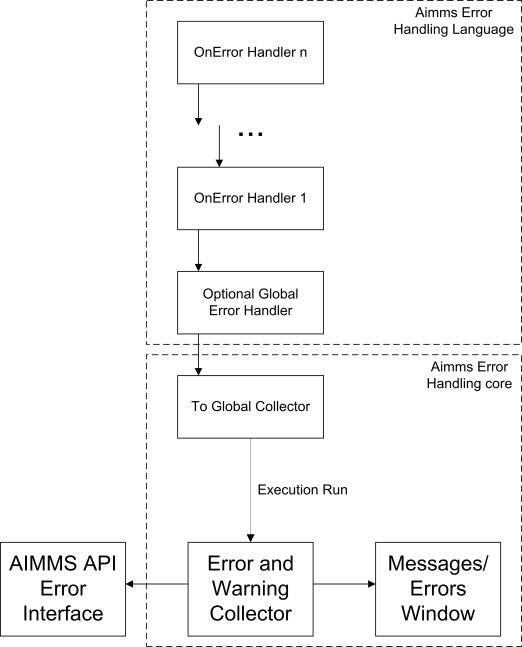

.. _sec:exec.error:

Raising and Handling Warnings and Errors
========================================

.. _onerror:

.. rubric:: Errors and warnings

During the development and deployment of an AIMMS application,
unexpected, possibly harmful, situations can arise. These situations are
divided into errors and warnings. An error is a situation that cannot be
handled by the procedure encountering it. A warning is a situation that
can be handled by the procedure encountering it, but might warrant
further inspection by the model developer or by the model user. Note
that, even when a procedure cannot handle an error itself, it should be
able to recover from that error. In this section, you will find AIMMS
facilities to

-  handle errors; to handle an error, AIMMS will give you access to the
   information therein. A handler is a piece of AIMMS code that handles
   selected errors and warnings. Errors and warnings can be communicated
   to handlers higher in the execution stack.

-  raise an error; not only AIMMS may detect situations warranting an
   error or warning message, but also the application itself. For such
   situations AIMMS provides a facility to raise custom errors from
   within your model.

-  handle a legacy situation; external and intrinsic AIMMS procedures
   may return a status code indicating success or failure. Whenever a
   failure status of an external and intrinsic procedure remains
   unnoticed, AIMMS can automatically raise an error in such situations.

-  extensively check the code; AIMMS can check your application for many
   different kinds of situations that occassionally warrant a warning.
   It is usually worthwhile to apply all these checks to your
   application.

.. tip::
    
    You may refer to our online training about error handling `following this link <https://elearning.aimms.com/course/error-handling>`__.

.. _sec:exec.error.handling:

Handling Errors
---------------

.. rubric:: Subsection overview

In this subsection you will find an introduction to both the global and
local error handling mechanisms available in AIMMS. Global error
handling, by means of specifying a single handler procedure, is used to
treat runtime errors occuring anywhere inside the entire model that are
not handled elsewhere. Local error handling, by means of the ``OnError``
clause in a ``BLOCK`` statement, allows error handling of runtime errors
occuring in a specific block of code. Global and local error handling
are the blocks on which the error handling framework in AIMMS is built.
At the end of this subsection, you will find a description of all the
intrinsic functions available for accessing and manipulating information
regarding errors.

.. _GlobalErrorHandling:

.. rubric:: Global error handling

To activate global error handling, the name of a handling procedure in
your model must be assigned to the option ``Global_error_handler``. Such
a procedure must have a single element parameter argument ``err`` in the
predeclared set :any:`errh::PendingErrors`. The global error handling
procedure will be executed for each pending error whenever an execution
run has been terminated because of errors that have not been handled
elsewhere in the model. The global error handler will also be called at
the end of a finished execution run if there are unhandled warnings. In
this context, an execution run is any call to an AIMMS procedure
initiated either through the AIMMS GUI or through the AIMMS API.

.. rubric:: Example

Below a global error handling procedure ``MyErrorHandler`` is
illustrated. The lines in the body of the procedure are numbered to
facilitate the explanation of the example.

.. code-block:: aimms

	Procedure MyErrorHandler {
	    Arguments  :  err;
	    ElementParameter  err {
	        Range      :  errh::PendingErrors;
	        Property   :  Input;
	    }
	    Body: {
	        1  if errh::Node(err) = 'DefP' then
	        2      DialogMessage(errh::Message(err) + "; resetting P to its default.");
	        3      Empty P ;
	        4      errh::MarkAsHandled(err);
	        5  elseif errh::InsideCategory(err,'IO') then
	        6      errh::Adapt(err,message:"IO error: please consult ...; "
	        7         + errh::Message(err)  ); ! Pass adapted message on to next handler.
	        8  else
	        9      ! Errors not handled will be passed on to the error/warning window.
	        10  endif
	    }
	}

.. rubric:: Example explanation

The procedure starts with declaring the argument ``err`` as an element
parameter with the predeclared set :any:`errh::PendingErrors`, with a
subset of the predeclared set :any:`Integers` as its range. During an
execution run, this set is filled with the numbers of the errors and
warnings raised. Each number refers to an error or warning with various
pieces of information therein, such as its error description, the node
in which the error or warning occurred and its severity. In addition,
each error belongs to a category. All this information can be accessed
using intrinsic functions. The body of the procedure is now explained
line by line:

line 1
   The intrinsic function :any:`errh::Node` is used to determine whether or
   not the error occurred inside the procedure ``DefP``. This intrinsic
   function returns the identifier or node in which the error occured as
   an element of the predeclared set :any:`AllSymbols`.

lines 2, 3
   If the error did happen inside the procedure ``DefP``, the
   application user is notified and ``P`` is reset to its default. The
   notification uses the original error description obtained using the
   intrinsic function ``errh::Message(err)``.

line 4
   Each handled error will be marked as such. When an error handler
   finishes, it will delete the errors that have been marked as handled
   from the predeclared set :any:`errh::PendingErrors`.

line 5
   To discern the type of an error, errors are divided into categories.
   For each error, the category to which it belongs can be obtained
   using the function ``errh::Category(err)``. The error categories form
   a nested structure. For instance, both ``IO`` and ``Generation``
   errors are ``Execution`` errors. The intrinsic function
   ``errh::InsideCategory(err)`` can be used to determine whether or not
   an error is within a particular category.

lines 6, 7
   Translate the error by adapting information. In this example, only
   the message is actually adapted, but most parts of an error can be
   adapted. Note that in this ``else`` branch, the function
   :any:`errh::MarkAsHandled` is not called, the result being that the
   adapted error message will appear in the messages/errors window.

line 8
   In this branch, the error is not handled. An error that has not been
   handled when the error handler finishes will not be deleted. Instead,
   it is being displayed in the messages/errors window.

.. rubric:: Local error handling by means of the ``OnError`` clause

The following template of a ``BLOCK`` statement illustrates local error
handling by means of the ``OnError`` clause.

.. code-block:: aimms

	1    BLOCK
	2       statement_1 ;
	3       ...
	4       statement_n ;
	5    ONERROR err DO
	6           ...
	7           ...
	8    ENDBLOCK ;

All errors occuring inside ``statement_1`` ... ``statement_n`` on lines
2 ... 4 are handled by the error handler on lines 6 and 7, where ``err``
is an element parameter of the set :any:`errh::PendingErrors`. Block
statements can be nested, either directly in a single body, or in other
procedures called from within block statements. This gives rise to a
stack of error handlers as illustrated below. A detailed example of a
local error handler is given in :ref:`sec:module.runtime`.

.. rubric:: Error flow architecture

The global error handlers and the ``OnError`` error handlers are
essential building blocks of the error handling framework of AIMMS. This
error handling framework is illustrated in :numref:`fig:errFlow.arch`.

   Error flow through handlers

.. rubric:: Construction of the error handler stack

At the start of each execution run, a new stack of error handlers is
created. At the bottom of this stack is the standard handler
``To Global Collector``. When the option ``Global_error_handler`` is
set, the specified procedure is placed on top of this new stack.
Additional handlers are placed on the stack by each ``OnError`` clause
in a nested ``BLOCK`` statement.

.. rubric:: Errors flowing through a handler stack

When raised, each error is set aside for handling by the topmost error
handler. When the number of errors set aside reaches the limit specified
by the option ``Errors_until_execution_interrupt``, the execution is
interrupted and resumes by executing the code in the topmost error
handler. When the execution is not interrupted, but there are pending
errors or warnings, the error handling code is executed after the
completion of the last statement prior to the ``BLOCK`` statement.

.. rubric:: Multiple errors may require handling

A single statement may result in multiple error messages, for instance a
solve statement or a data assignment statement with several duplicate
entries. Thus, even if the option ``Errors_until_execution_interrupt``
is 1 (its default), multiple errors may need to be handled. If multiple
errors caused by a single statement are handled inside the ``OnError``
clause of a ``BLOCK`` statement, the code within the ``OnError`` clause
will be executed unconditionally *for every single error*, unless you
explicitly break away from the\ ``OnError`` clause.

.. rubric:: Break away from handling

If you use a ``RETURN``, ``HALT``, ``BREAK`` or ``RAISE ERROR``
statement inside the ``OnError`` clause, the handling of any subsequent
errors or warnings will be stopped. You are actually indicating that
these further errors and warnings are no longer of interest and thus
they will be automatically set as handled. A plain ``BREAK`` statement
just breaks the error handling loop. If the ``Block`` statement is
inside an outer loop statement like ``FOR`` or ``WHILE`` and you want to
break from that loop, you need to use a *loop string* (see
:ref:`sec:exec.flow.while-repeat-adv`).

.. rubric:: SKIP in OnError

A plain ``Skip`` statement in the ``OnError`` clause simply skips the
remaining statements and continues with the next error that needs to be
handled. You can use a ``SKIP`` with a *loop string* to skip the
statements of an outer loop statement. This will break away from the
``OnError`` clause as described above.

.. rubric:: What to do with an error

For each error, the error handling code will decide whether to handle
that error itself, let another handler handle the error, or ignore the
error (as was already illustrated in the example above).

.. rubric:: Handling an error inside a handler

Errors may also occur during the execution of the ``OnError`` clause or
of a ``BLOCK`` statement or the global error handling procedure. These
errors are handled by the next error handler in the stack of error
handlers.

.. rubric:: Error collector

When an error reaches the handler ``To Global Collector``, it is sent to
the **Error and Warning Collector** object which collects all errors
that have fallen through the various handlers (if any). Errors in the
**Error and Warning Collector** can be queried from within the AIMMS API
or viewed from within the messages/errors window of the AIMMS GUI.

.. rubric:: The predeclared module ``ErrorHandling``

Errors to be handled can be queried using the following predeclared
identifiers and intrinsic functions from the module ``ErrorHandling``
with prefix ``errh``:

:any:`errh::PendingErrors`
   A predeclared set filled with the numbers of the errors that can be
   handled at this point.

``errh::IndexPendingErrors``
   An index of the above predeclared set.

error parts
   An error is made up of several parts; each of which can be obtained
   separately using the intrinsic functions below. Each of the functions
   below will raise an error of their own if ``err`` is not a valid
   error that can be handled at that point.

   ``errh::Severity(err)``
      An element in :any:`errh::AllErrorSeverities` is returned indicating
      the severity of the error.

   ``errh::Message(err)``
      A string containing the error description is returned. This string
      is not empty.

   ``errh::Category(err)``
      An element in :any:`errh::AllErrorCategories` is returned indicating
      the category of the error.

   ``errh::Code(err)``
      The element in :any:`errh::ErrorCodes` that is returned by this
      function identifies the message code of the error. This element
      name may be cryptic; as it is primarily used for identification of
      the error within the AIMMS system.

   ``errh::NumberOfLocations(err)``
      The number of locations relevant to this error. For compilation
      errors, there is typically only one relevant location. For an
      AIMMS initialization error there are no relevant locations. For an
      execution error the positions in all the active procedures are
      recorded. For an error during file read, at least the positions in
      the data file and the read statement are recorded. Similarly, for
      an error during the generation of a constraint, at least the
      constraint and the ``SOLVE`` statement are recorded as relevant
      positions.

   ``errh::Node(err,loc)``
      An element in :any:`AllSymbols` is returned for an error location
      inside the model. The optional argument ``loc`` defaults to 1 and
      should be in the range ``{ 1 .. NumberOfLocations }``. The element
      returned by this function is non-empty except for the first
      location when reading data from a file.

   ``errh::Attribute(err,loc)``
      An element in :any:`AllAttributeNames`.

   ``errh::Line(err,loc)``
      An integer indicating the line number of the error in the
      attribute or file, or 0 if not known.

   ``errh::Column(err)``
      An integer indicating the column position in an erroneous line
      being read from a data file. All errors when reading a data file
      are reported separately, such that the ``loc`` argument is not
      applicable.

   ``errh::Filename(err)``
      A non-empty string is returned when reading from a data file. All
      errors when reading a data file are reported separately, and so
      the ``loc`` argument is not applicable.

   ``errh::Multiplicity(err)``
      An integer indicating the number of occurrences of this error. Two
      errors are considered equal if they are equal in all of the
      following parts: ``Severity``, ``Message``, ``Category``, ``Code``
      and the first location (if available). The first location is the
      location in the file being read when the error occurs during a
      read statement, otherwise it is the statement being executed.

   ``errh::CreationTime(err,fmt)``
      A string representing the creation time of the first occurrence of
      the error, formatted according to time format ``fmt``.

``errh::InsideCategory(err,cat)``
   Returns 1 if the error code of ``err`` falls inside the category
   ``cat``.

``errh::IsMarkedAsHandled(err)``
   Returns 1 if the error is marked as handled.

``errh::Adapt(err, severity, message, category, code)`` 
   The error ``err`` is adapted with the components specified. Besides
   the mandatory argument ``err``, there should be at least one other
   argument.

``errh::MarkAsHandled(err,actually)``
   The error ``err`` is marked as handled if the argument ``actually``
   is non-zero. Marked errors will not be passed to the next error
   handler. The default of the optional argument ``actually`` is 1.
   Using 0 will remove the mark from the error.

.. rubric:: The log file ``aimms.err``

AIMMS logs all errors and warnings to the file ``aimms.err`` as they are
raised. The folder in which this file resides is controlled by the
option ``Listing_and_temporary_files``. The number of backups retained
of this file is controlled by the option ``Number_of_log_file_backups``.

.. _sec:exec.error.raising:

Raising Errors and Warnings
---------------------------

.. _raise:

.. rubric:: Raising errors

The ``RAISE`` statement is used to

-  raise an error regarding a situation that cannot be handled, or to

-  raise a warning regarding a situation that can be handled but might
   warrant further investigation.

The syntax of the ``RAISE`` statement is straightforward.

.. _raise-statement:

.. rubric:: Syntax

*raise-statement:*

.. raw:: html

	
	<?xml version="1.0" encoding="UTF-8" standalone="no"?>
	<svg
	   xmlns:dc="http://purl.org/dc/elements/1.1/"
	   xmlns:cc="http://creativecommons.org/ns#"
	   xmlns:rdf="http://www.w3.org/1999/02/22-rdf-syntax-ns#"
	   xmlns:svg="http://www.w3.org/2000/svg"
	   xmlns="http://www.w3.org/2000/svg"
	   viewBox="0 0 647.00802 133.86667"
	   height="133.86667"
	   width="647.008"
	   xml:space="preserve"
	   id="svg2"
	   version="1.1"><metadata
	     id="metadata8"><rdf:RDF><cc:Work
	         rdf:about=""><dc:format>image/svg+xml</dc:format><dc:type
	           rdf:resource="http://purl.org/dc/dcmitype/StillImage" /></cc:Work></rdf:RDF></metadata><defs
	     id="defs6" /><g
	     transform="matrix(1.3333333,0,0,-1.3333333,0,813.59998)"
	     id="g10"><g
	       transform="scale(0.1)"
	       id="g12"><path
	         id="path14"
	         style="fill:#000000;fill-opacity:1;fill-rule:nonzero;stroke:none"
	         d="m 80,6000 -50,20 v -40" /><g
	         transform="scale(10)"
	         id="g16"><text
	           id="text20"
	           style="font-variant:normal;font-size:12px;font-family:'Courier New';-inkscape-font-specification:LucidaSans-Typewriter;writing-mode:lr-tb;fill:#000000;fill-opacity:1;fill-rule:nonzero;stroke:none"
	           transform="matrix(1,0,0,-1,13,596)"><tspan
	             id="tspan18"
	             y="0"
	             x="0">RAISE</tspan></text>
	</g><path
	         id="path22"
	         style="fill:#ffffff;fill-opacity:1;fill-rule:nonzero;stroke:none"
	         d="m 540,6000 50,-20 v 40" /><path
	         id="path24"
	         style="fill:#ffffff;fill-opacity:1;fill-rule:nonzero;stroke:none"
	         d="m 620,6000 -20,-50 h 40" /><path
	         id="path26"
	         style="fill:#000000;fill-opacity:1;fill-rule:nonzero;stroke:none"
	         d="m 800,5700 -50,20 v -40" /><g
	         transform="scale(10)"
	         id="g28"><text
	           id="text32"
	           style="font-variant:normal;font-size:12px;font-family:'Courier New';-inkscape-font-specification:LucidaSans-Typewriter;writing-mode:lr-tb;fill:#000000;fill-opacity:1;fill-rule:nonzero;stroke:none"
	           transform="matrix(1,0,0,-1,85,566)"><tspan
	             id="tspan30"
	             y="0"
	             x="0">WARNING</tspan></text>
	</g><path
	         id="path34"
	         style="fill:#ffffff;fill-opacity:1;fill-rule:nonzero;stroke:none"
	         d="m 1404,5700 50,-20 v 40" /><path
	         id="path36"
	         style="fill:#000000;fill-opacity:1;fill-rule:nonzero;stroke:none"
	         d="m 1584,6000 -20,-50 h 40" /><path
	         id="path38"
	         style="fill:#000000;fill-opacity:1;fill-rule:nonzero;stroke:none"
	         d="m 872,6000 -50,20 v -40" /><g
	         transform="scale(10)"
	         id="g40"><text
	           id="text44"
	           style="font-variant:normal;font-size:12px;font-family:'Courier New';-inkscape-font-specification:LucidaSans-Typewriter;writing-mode:lr-tb;fill:#000000;fill-opacity:1;fill-rule:nonzero;stroke:none"
	           transform="matrix(1,0,0,-1,92.2,596)"><tspan
	             id="tspan42"
	             y="0"
	             x="0">ERROR</tspan></text>
	</g><path
	         id="path46"
	         style="fill:#ffffff;fill-opacity:1;fill-rule:nonzero;stroke:none"
	         d="m 1332,6000 50,-20 v 40" /><path
	         id="path48"
	         style="fill:#000000;fill-opacity:1;fill-rule:nonzero;stroke:none"
	         d="m 1664,6000 -50,20 v -40" /><g
	         transform="scale(10)"
	         id="g50"><text
	           id="text54"
	           style="font-style:italic;font-variant:normal;font-size:11px;font-family:'Lucida Sans';-inkscape-font-specification:LucidaSans-Italic;writing-mode:lr-tb;fill:#d22d2d;fill-opacity:1;fill-rule:nonzero;stroke:none"
	           transform="matrix(1,0,0,-1,171.4,596)"><tspan
	             id="tspan52"
	             y="0"
	             x="0"><a href="https://documentation.aimms.com/language-reference/non-procedural-language-components/set-set-element-and-string-expressions/string-expressions.html#string-expression">string-expression</a></tspan></text>
	</g><path
	         id="path56"
	         style="fill:#ffffff;fill-opacity:1;fill-rule:nonzero;stroke:none"
	         d="m 2677.56,6000 50,-20 v 40" /><path
	         id="path58"
	         style="fill:#000000;fill-opacity:1;fill-rule:nonzero;stroke:none"
	         d="m 2837.56,6000 -50,20 v -40" /><g
	         transform="scale(10)"
	         id="g60"><text
	           id="text64"
	           style="font-variant:normal;font-size:12px;font-family:'Courier New';-inkscape-font-specification:LucidaSans-Typewriter;writing-mode:lr-tb;fill:#000000;fill-opacity:1;fill-rule:nonzero;stroke:none"
	           transform="matrix(1,0,0,-1,288.756,596)"><tspan
	             id="tspan62"
	             y="0"
	             x="0">CODE</tspan></text>
	</g><path
	         id="path66"
	         style="fill:#ffffff;fill-opacity:1;fill-rule:nonzero;stroke:none"
	         d="m 3225.56,6000 50,-20 v 40" /><path
	         id="path68"
	         style="fill:#000000;fill-opacity:1;fill-rule:nonzero;stroke:none"
	         d="m 3305.56,6000 -50,20 v -40" /><g
	         transform="scale(10)"
	         id="g70"><text
	           id="text74"
	           style="font-style:italic;font-variant:normal;font-size:11px;font-family:'Lucida Sans';-inkscape-font-specification:LucidaSans-Italic;writing-mode:lr-tb;fill:#d22d2d;fill-opacity:1;fill-rule:nonzero;stroke:none"
	           transform="matrix(1,0,0,-1,335.556,596)"><tspan
	             id="tspan72"
	             y="0"
	             x="0"><a href="https://documentation.aimms.com/language-reference/non-procedural-language-components/set-set-element-and-string-expressions/set-element-expressions.html#element-expression">element-expression</a></tspan></text>
	</g><path
	         id="path76"
	         style="fill:#ffffff;fill-opacity:1;fill-rule:nonzero;stroke:none"
	         d="m 4452.56,6000 50,-20 v 40" /><path
	         id="path78"
	         style="fill:#ffffff;fill-opacity:1;fill-rule:nonzero;stroke:none"
	         d="m 2757.56,6000 -20,-50 h 40" /><path
	         id="path80"
	         style="fill:#000000;fill-opacity:1;fill-rule:nonzero;stroke:none"
	         d="m 4532.56,6000 -20,-50 h 40" /><path
	         id="path82"
	         style="fill:none;stroke:#000000;stroke-width:4;stroke-linecap:butt;stroke-linejoin:round;stroke-miterlimit:10;stroke-dasharray:40, 20;stroke-dashoffset:0;stroke-opacity:1"
	         d="m 4612.56,6000 h 240" /><path
	         id="path84"
	         style="fill:none;stroke:#000000;stroke-width:4;stroke-linecap:butt;stroke-linejoin:round;stroke-miterlimit:10;stroke-dasharray:40, 20;stroke-dashoffset:0;stroke-opacity:1"
	         d="M 600,5400 H 840" /><path
	         id="path86"
	         style="fill:#000000;fill-opacity:1;fill-rule:nonzero;stroke:none"
	         d="m 1000,5400 -50,20 v -40" /><g
	         transform="scale(10)"
	         id="g88"><text
	           id="text92"
	           style="font-variant:normal;font-size:12px;font-family:'Courier New';-inkscape-font-specification:LucidaSans-Typewriter;writing-mode:lr-tb;fill:#000000;fill-opacity:1;fill-rule:nonzero;stroke:none"
	           transform="matrix(1,0,0,-1,105,536)"><tspan
	             id="tspan90"
	             y="0"
	             x="0">WHEN</tspan></text>
	</g><path
	         id="path94"
	         style="fill:#ffffff;fill-opacity:1;fill-rule:nonzero;stroke:none"
	         d="m 1388,5400 50,-20 v 40" /><path
	         id="path96"
	         style="fill:#000000;fill-opacity:1;fill-rule:nonzero;stroke:none"
	         d="m 1468,5400 -50,20 v -40" /><g
	         transform="scale(10)"
	         id="g98"><text
	           id="text102"
	           style="font-style:italic;font-variant:normal;font-size:11px;font-family:'Lucida Sans';-inkscape-font-specification:LucidaSans-Italic;writing-mode:lr-tb;fill:#d22d2d;fill-opacity:1;fill-rule:nonzero;stroke:none"
	           transform="matrix(1,0,0,-1,151.8,536)"><tspan
	             id="tspan100"
	             y="0"
	             x="0"><a href="https://documentation.aimms.com/language-reference/non-procedural-language-components/set-set-element-and-string-expressions/index.html#expression">expression</a></tspan></text>
	</g><path
	         id="path104"
	         style="fill:#ffffff;fill-opacity:1;fill-rule:nonzero;stroke:none"
	         d="m 2148.2,5400 50,-20 v 40" /><path
	         id="path106"
	         style="fill:#ffffff;fill-opacity:1;fill-rule:nonzero;stroke:none"
	         d="m 920,5400 -20,-50 h 40" /><path
	         id="path108"
	         style="fill:#000000;fill-opacity:1;fill-rule:nonzero;stroke:none"
	         d="m 2228.2,5400 -20,-50 h 40" /><path
	         id="path110"
	         style="fill:#000000;fill-opacity:1;fill-rule:nonzero;stroke:none"
	         d="m 2308.2,5400 -50,20 v -40" /><g
	         transform="scale(10)"
	         id="g112"><text
	           id="text116"
	           style="font-variant:normal;font-size:12px;font-family:'Courier New';-inkscape-font-specification:LucidaSans-Typewriter;writing-mode:lr-tb;fill:#000000;fill-opacity:1;fill-rule:nonzero;stroke:none"
	           transform="matrix(1,0,0,-1,237.22,536)"><tspan
	             id="tspan114"
	             y="0"
	             x="0">;</tspan></text>
	</g><path
	         id="path118"
	         style="fill:#ffffff;fill-opacity:1;fill-rule:nonzero;stroke:none"
	         d="m 2508.2,5400 50,-20 v 40" /><path
	         id="path120"
	         style="fill:#000000;fill-opacity:1;fill-rule:nonzero;stroke:none"
	         d="m 2588.2,5400 -50,20 v -40" /><path
	         id="path122"
	         style="fill:none;stroke:#000000;stroke-width:4;stroke-linecap:butt;stroke-linejoin:round;stroke-miterlimit:10;stroke-dasharray:none;stroke-opacity:1"
	         d="m 0,6000 h 80 v 0 c 0,55.23 44.773,100 100,100 h 260 c 55.227,0 100,-44.77 100,-100 v 0 0 c 0,-55.23 -44.773,-100 -100,-100 H 180 c -55.227,0 -100,44.77 -100,100 v 0 m 460,0 h 80 m 0,0 v -200 c 0,-55.23 44.773,-100 100,-100 v 0 h 80 v 0 c 0,55.23 44.773,100 100,100 h 404 c 55.23,0 100,-44.77 100,-100 v 0 0 c 0,-55.23 -44.77,-100 -100,-100 H 900 c -55.227,0 -100,44.77 -100,100 v 0 m 604,0 h 80 v 0 c 55.23,0 100,44.77 100,100 v 200 m -964,0 h 100 72 80 v 0 c 0,55.23 44.773,100 100,100 h 260 c 55.23,0 100,-44.77 100,-100 v 0 0 c 0,-55.23 -44.77,-100 -100,-100 H 972 c -55.227,0 -100,44.77 -100,100 v 0 m 460,0 h 80 172 80 v 100 H 2677.54 V 6000 5900 H 1664 v 100 m 1013.56,0 h 80 m 0,0 v 0 h 80 v 0 c 0,55.23 44.77,100 100,100 h 188 c 55.23,0 100,-44.77 100,-100 v 0 0 c 0,-55.23 -44.77,-100 -100,-100 h -188 c -55.23,0 -100,44.77 -100,100 v 0 m 388,0 h 80 v 100 H 4452.53 V 6000 5900 H 3305.56 v 100 m 1147,0 h 80 m -1775,0 v -200 c 0,-55.23 44.77,-100 100,-100 h 747.5 80 747.5 c 55.23,0 100,44.77 100,100 v 200 h 80 M 840,5400 h 80 m 0,0 v 0 h 80 v 0 c 0,55.23 44.77,100 100,100 h 188 c 55.23,0 100,-44.77 100,-100 v 0 0 c 0,-55.23 -44.77,-100 -100,-100 h -188 c -55.23,0 -100,44.77 -100,100 v 0 m 388,0 h 80 v 100 h 680.19 V 5400 5300 H 1468 v 100 m 680.2,0 h 80 M 920,5400 v -200 c 0,-55.23 44.773,-100 100,-100 h 514.1 80 514.1 c 55.23,0 100,44.77 100,100 v 200 h 80 v 0 c 0,55.23 44.77,100 100,100 v 0 c 55.23,0 100,-44.77 100,-100 v 0 0 c 0,-55.23 -44.77,-100 -100,-100 v 0 c -55.23,0 -100,44.77 -100,100 v 0 m 200,0 h 80" /></g></g></svg>

.. rubric:: Example

In the following example an error is raised when the inflow of a node
exceeds its capacity.

.. code-block:: aimms

	if inflow > stockCap then
	    RAISE ERROR "Inflow exceeds stock capacity" CODE 'TooMuchInflow' ;
	endif ;

.. rubric:: Error code and category

In order to enable an error handler to recognize the type of error being
raised by a ``RAISE`` statement, that statement allows an optional error
code to be specified. This is an element in the set
:any:`errh::ErrorCodes`. If the specified element does not yet exist, it is
created and added to that set. The category of an error raised by the
``RAISE`` statement is fixed to ``'User'``.

.. rubric:: Position information

AIMMS uses the line/procedure in which the ``RAISE`` statement is
specified as the position information associated with the error. This
permits the messages/errors window to open the attribute window of the
procedure and place the cursor on the statement where the problematic
situation is detected.

.. rubric:: Raising warnings

Not only AIMMS itself but also procedures written in AIMMS may recognize
situations that can be handled but might warrant closer inspection by
the application user. For this purpose, the ``RAISE`` statement can
raise a warning, for example:

.. code-block:: aimms

	if card( RawMaterialTraders ) = 0 then
	   RAISE WARNING "There are no raw material traders, this may lead to " +
	                 "infeasibilities in the case of too many accepted deliveries." ;
	endif ;

The handling of warnings generated by a ``RAISE`` statement is
controlled by the option ``Warning_user``, with default
``common_warning_default``. The control of warning handling is further
explained in :ref:`sec:exec.error.warning`.

.. _sec:exec.legacy.intrinsic.procedure:

Legacy: Intrinsics with a Return Status
---------------------------------------

.. _LegacyIntrinsicsWithReturnStatus:

.. _LegacyIntrinsicProcedure:

.. rubric:: Legacy situation

AIMMS external procedures and intrinsic procedures can both return a
status code indicating whether or not they were successful. A return
value :math:`\leq 0.0` is interpreted as not successful, wheareas a
return value :math:`> 0.0` is successful. In addition, when they are not
successful, the error message is often left in :any:`CurrentErrorMessage`,
although this is only a guideline. The return value of a call to an
intrinsic procedure is either

checked
   As illustrated in the example:

   .. code-block:: aimms
   
   	retval := PageOpen(...) ;
   	if retval <= 0 then
   	   ... use CurrentErrorMessage ...
   	endif ;

not checked
   As illustrated in the example:

   .. code-block:: aimms
   
   	PageOpen(...) ;

.. rubric:: Available error handling methods

In the context of the error handling facility available in AIMMS, how
should one handle the "checked" and "not checked" procedure calls when
the return value is 0 and these procedures have not raised an error
themselves? There are five error handling methods available to choose
from:

``ignore``
   An error is never raised for an error occurring inside such a
   procedure, whether or not the return status is checked.

``raise_warning_when_not_checked``
   A warning is only raised if the return status of an intrinsic
   procedure is not checked.

``raise_when_not_checked``
   An error is only raised if the return status of an intrinsic
   procedure is not checked.

``raise_always_warning``
   A warning is raised whether or not the return status is checked.

``raise_always``
   An error is raised whether or not the return status is checked.

Which choice of error handling method is best depends on the application
and can be controlled using the options:

``Intrinsic_procedure_error_handling``
   for procedures with a return status supplied by AIMMS and

``External_procedure_error_handling``
   for externally supplied procedures.

The values of these options are the names of the error handling methods
described above. The default of both these options is
``raise_when_not_checked``. For projects created prior to the
introduction of the error handling facilities in AIMMS (i.e. created in
AIMMS 3.9 or lower), these options generate the non-default value
``raise_warning_when_not_checked`` in order to notify the model
developer but do not change the existing behavior of such projects
significantly.

.. _sec:exec.error.warning:

Warnings
--------

.. _GroupingWarningsOnSeriousness:

.. rubric:: Warnings

AIMMS recognizes and warns about several types of possibly problematic
situations. These situations might warrant further investigation. As
with most other languages, AIMMS warns against the use of identifiers
before initializing them. But unlike other languages, AIMMS also warns
against the inconsistent use of units of measurement (such as a
comparison of a volume against a weight), or of model formulations for
which AIMMS can detect either compiletime or runtime issues that lead to
sub-optimal performance or ambiguous results. A selection of
performance-related warnings is discussed in
:ref:`subsection:eff.tuning-stmts.diagnostics`.

.. rubric:: Complete flexibility

The desired handling of each of these situations depends on the
developer and the application; varying from treating it as an error to
fully ignoring it. To permit complete flexibility, there is separate
option to control the reporting of each type of problematic situation
recognized.

.. rubric:: Grouping Warning options

Although all warnings can be controlled individually, this is not the
most convenient way to employ the diagnostics provided by these
warnings. When entertaining a new idea (quick prototyping), most
modelers understandably do not want to be bothered by various warnings
and want to be able to turn them all off. To facilitate this, all the
warnings have been grouped into either common or strict warnings, and
the associated options assume default value for common and strict
warnings. Thus, all diagnostic warnings can be switched off by just
changing the options that control these defaults. For normal development
work it is advisable to at least turn the common warnings on. In
addition, we would encourage to turn on the strict warnings during
application tests.

.. rubric:: Choosing the option setting

In order to implement the above scheme and still permit full
flexibility, each option controlling the detection of a type of
problematic situation can take on one of the following values:

``error``
   The situation is marked as an error and treated as an error.

``warning_handle``
   The warning is raised in the current error handler, but does not
   count toward the interruption of normal execution.

``common_warning_default``
   The value of the option ``Common_warning_default`` is used.

``warning_collect``
   The warning is raised in the ``Global_error_collector``, bypassing
   the stack of error handlers.

``strict_warning_default``
   The value of the option ``Strict_warning_default`` is used.

``off``
   The warning is ignored.

The default of these options is either ``common_warning_default`` or
``strict_warning_default``, thereby effectively dividing these options
into common and strict groups. The range of options for
``common_warning_default`` and ``strict_warning_default`` is
``{off, warning_collect, warning_handle, error}``. The default of the
option ``common_warning_default`` is ``warning_handle`` and the default
of the option ``strict_warning_default`` is ``off``.

Train on error handling
--------------------------

You may refer to our online training about error handling `following this link <https://academy.aimms.com/course/view.php?id=50>`__ 
to apply error handling on concrete models.